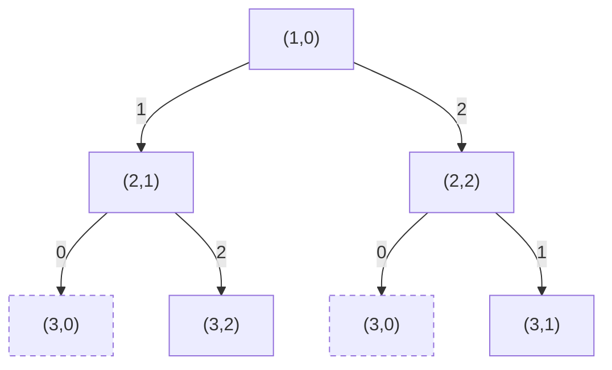
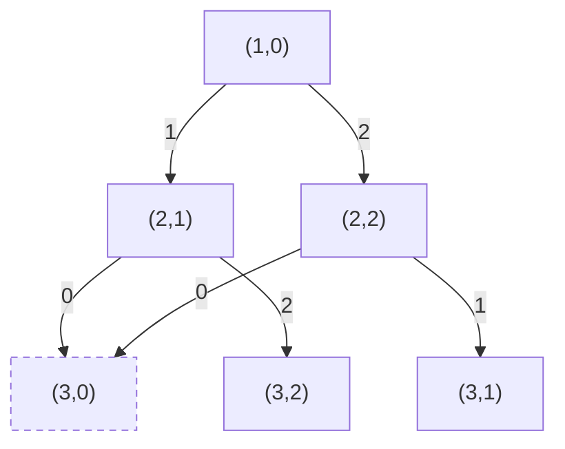

# T3 彩彩的三彩项链

---

## 题意简化

---

输入长度 $2\le n\le10^6$ 的环形珠串 $s$，每颗为 `r`、`g` 或 `b`。一次点击把一颗珠子按 $r\to g\to b\to r$ 推进一格，可反复点击。要求修改后每对相邻珠子颜色不同，包括首尾一对；输出最少点击数。

## 问题拆分

---

1. 枚举首颗修改后的颜色，得到首尾约束的基准。
2. 逐颗选择与前一颗不同的颜色，计算从原色点击到目标色的代价。
3. 末颗不得与首颗同色，在合法结果中取最小总代价。

## 部分分（独立 10 分，$n=10$）：按目标颜色搜索

---

1. 枚举首颗目标色 $3$ 次，初始化代价，每次 $O(1)$。
2. 从第二颗递归选不同于前一颗的两个目标色，更新点击代价；最多 $3\cdot2^{n-1}$ 条路径，每次扩展 $O(1)$。
3. 到第 $n$ 颗检查首尾异色，合法叶子用 $O(1)$ 更新答案。

总时间 $O(2^n)$、递归空间 $O(n)$；代入 $n=10$ 约千条路径。

### 搜索树

固定首色为 $r$，小例子有三颗珠子；节点 $(i,c)$ 表示第 $i$ 颗已选目标色 $c$。树中相同状态保留为两个叶子，因为它们来自不同历史。

**左上角图例**：$0/1/2=$ 选 $r/g/b$；条件：新色异于上一颗；代价：原色点击到新色的次数；价值：无，目标为代价最小。



**叶子**：$i=n$ 且末色异于首色为合法，返回累计点击数；末色等于首色为非法（虚线节点），不更新答案。箭头沿搜索决策方向。

### 参考代码

```cpp
#include<bits/stdc++.h>
using namespace std;

int n,original[1000010],ans = 1000000000;

void dfs(int i,int first,int last,int cost){
	if(cost >= ans) return;
	if(i == n){
		if(last != first) ans = min(ans,cost);
		return;
	}
	for(int c = 0; c < 3; c++){
		if(c == last) continue;
		int add = (c - original[i] + 3) % 3;
		dfs(i + 1,first,c,cost + add);
	}
}

int main(){
	ios::sync_with_stdio(false);
	cin.tie(nullptr);
	string s;
	cin >> n >> s;
	for(int i = 0; i < n; i++){
		if(s[i] == 'r') original[i] = 0;
		if(s[i] == 'g') original[i] = 1;
		if(s[i] == 'b') original[i] = 2;
	}
	for(int first = 0; first < 3; first++){
		int cost = (first - original[0] + 3) % 3;
		dfs(1,first,first,cost);
	}
	cout << ans << '\n';
	return 0;
}
```

## 满分做法：固定首色的三状态动态规划

---

独立 $n=10$ 档（10 分）可用下方搜索；$n=1000$、原串只有一种/两种颜色的三个 10 分档以及无额外限制的 60 分档均由 DP 程序覆盖。原串色数不会减少目标色的选择数。

1. 枚举首色共 $3$ 次，每次计算首颗点击代价并初始化三个颜色状态，单次 $O(1)$。
2. 对后续每颗珠子，从上一颗的 $3$ 种颜色向不同的新色转移；每颗至多 $9$ 次 $O(1)$ 更新，仅保留较小已付代价。
3. 在最后 $3$ 个状态中筛掉与首色相同者，取最小值；每个首色 $O(1)$。

朴素搜索至多 $3\cdot2^{n-1}$ 条路径，$n=10$ 可做，$n=10^6$ 不可行。合并未来等价的“已处理位置、末色、固定首色”状态后，转移代价为 $(\text{新色编号}-\text{原色编号}+3)\bmod3$。总时间 $O(9n)$，额外空间 $O(1)$。终态若末色等于首色必须舍弃。

### 合并后的 DP 状态图

固定首色为 $r$，$(i,c)$ 表示前 $i$ 颗已定且末色为 $c$。与上面的搜索树相比，两条历史到达同一状态时只保留最小累计代价；按 $i$ 递增更新。

**左上角图例**：$0/1/2=$ 选 $r/g/b$；条件：新色异于上一颗；代价：原色点击到新色的次数；价值：无，取最小代价。



**叶子**：$i=n,c\ne$ 首色合法，保留最小代价；$i=n,c=$ 首色非法（虚线节点），不参与答案。$(3,0)$ 的两条历史合流。

### 参考代码

```cpp
#include<bits/stdc++.h>
using namespace std;

int color(char c){
	if(c == 'r') return 0;
	if(c == 'g') return 1;
	return 2;
}

int main(){
	ios::sync_with_stdio(false);
	cin.tie(nullptr);

	int n;
	string s;
	cin >> n >> s;
	const int INF = 1000000000;
	int ans = INF;
	for(int first = 0; first < 3; first++){
		int dp[3] = {INF,INF,INF};
		dp[first] = (first - color(s[0]) + 3) % 3;
		for(int i = 1; i < n; i++){
			int next[3] = {INF,INF,INF};
			for(int last = 0; last < 3; last++){
				for(int now = 0; now < 3; now++){
					if(last == now) continue;
					int cost = (now - color(s[i]) + 3) % 3;
					next[now] = min(next[now],dp[last] + cost);
				}
			}
			for(int c = 0; c < 3; c++) dp[c] = next[c];
		}
		for(int last = 0; last < 3; last++){
			if(last != first) ans = min(ans,dp[last]);
		}
	}
	cout << ans << '\n';
	return 0;
}
```

## 知识点总结

---

环上相邻约束可枚举首状态解除首尾依赖；顺序搜索若只需记住上一状态，就可合并为常数状态的 DP。
