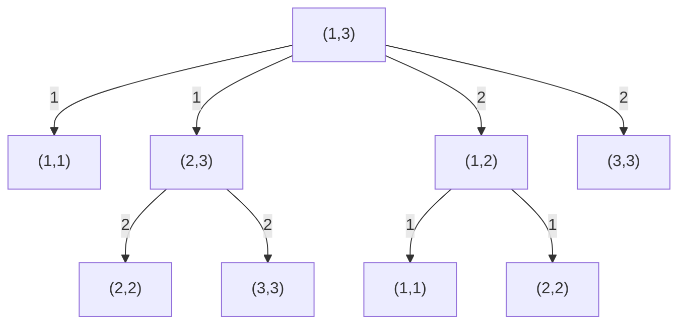

# T4 表达式（eval）

---

## 题意简化

---

从文件 `eval.in` 读入长度至多 $5000$ 的合法表达式 $S$，仅含正整数、多位数、`+` 与 `*`。只能添加合法括号，不能调整数字和运算符顺序；求可能的最大值，完整十进制写入 `eval.out`。

## 问题拆分

---

1. 按字符解析每个多位正整数及后面的运算符。
2. 利用正数与分配律确定最优括号结构：每个乘号之间的加法段先求和。
3. 把各段之和相乘，并用高精度输出完整答案。

## 部分分（短表达式，$|S|\le10$）：搜索括号树

---

1. 扫描字符串，把至多 $q\le5$ 个正整数及相邻运算符分开；$O(|S|)$ 时间、$O(q)$ 存储。
2. 在区间 $[l,r]$ 枚举最后计算的运算符位置 $j$，递归求左右区间的最大值再相加或相乘；每个区间至多 $q-1$ 个分支。正数使运算对两侧值单调，左右各取最大即可。
3. 返回全区间最大值，写入 `eval.out`。递归会重复计算同一子区间，总调用量 $O(3^q)$。

总时间 $O(|S|+3^q)$、数组与递归空间 $O(q)$；$q\le5$ 很小。完整范围的 $q$ 可达 $2500$，需要换用后面的结构结论和高精度。

### 括号树搜索图

小例子含三个数，$(l,r)$ 表示必须求值的连续数字区间。一次选择最后计算的运算符 $j$，同编号的两条箭头分别指向**都要计算**的左右子区间；重复区间在搜索树中保留两份。

**左上角图例**：边号 $j=$ 最后计算的运算符位置；条件 $l\le j<r$；代价 $0$；价值：左右返回值按第 $j$ 个运算符合并。



**叶子**：$l=r$ 合法，返回该正整数；不存在非法叶子，区间内每个 $j$ 都合法。先求两侧再合并，当前区间在所有 $j$ 的结果中取最大值。

### 参考代码

```cpp
#include<bits/stdc++.h>
using namespace std;

long long a[3005];
char op[3005];

long long solve(int l,int r){
	if(l == r) return a[l];
	long long best = 0;
	for(int j = l; j < r; j++){
		long long left = solve(l,j);
		long long right = solve(j + 1,r);
		long long value;
		if(op[j] == '+') value = left + right;
		else value = left * right;
		best = max(best,value);
	}
	return best;
}

int main(){
	freopen("eval.in","r",stdin);
	freopen("eval.out","w",stdout);
	ios::sync_with_stdio(false);
	cin.tie(nullptr);
	string s;
	cin >> s;
	int q = 0;
	long long number = 0;
	for(int i = 0; i < (int)s.size(); i++){
		if(s[i] >= '0' && s[i] <= '9'){
			number = number * 10 + s[i] - '0';
		}else{
			a[++q] = number;
			op[q] = s[i];
			number = 0;
		}
	}
	a[++q] = number;
	cout << solve(1,q) << '\n';
	return 0;
}
```

## 满分做法：加法段求和后相乘

---

公开分档对应：1～2 点（短表达式，10 分）可用上面的括号树搜索；3～4 点（全为 1）、5～6 点（数字均不超过 9）、7～10 点（只有 `+`）、11～12 点（只有 `*`）、13～20 点（一般表达式）均使用本节的完整高精度代码。纯加时只得到一个加法段，纯乘时每段只有一个数；这些性质直接落在同一算法内，无须为它们重复一份代码。

1. 从左到右扫描至多 $|S|$ 个字符，逐位建立当前正整数；解析一次的字符工作量为 $O(|S|)$，高精度逐位加法另外计入位数成本。
2. 遇到 `+` 把当前数加入段和，遇到 `*` 把整个段和乘进答案，末尾再乘一次；段数不超过 $|S|$，不枚举括号树。
3. 以 $10^4$ 为基数存储高精度数，进位加法与竖式乘法；若最终答案有 $D$ 个十进制位，总乘法工作量上界 $O(D^2)$，存储 $O(D)$。

关键变形是 $A+BC\le(A+B)C$ 与 $AB+C\le A(B+C)$（$A,B,C$ 都是正整数）。反复把加法移入相邻乘法的因子，最终每个乘号之间的加法段先求和；这一括号方式合法且达到最大值。总时间上界 $O(|S|+D^2)$、空间 $O(D)$；这里 $D$ 是答案的十进制位数，可能远大于机器整数位数。

### 参考代码

```cpp
#include<bits/stdc++.h>
using namespace std;

struct Big{
	static const int BASE = 10000;
	vector<int> d;
	Big(int x = 0){
		if(x > 0) d.push_back(x);
	}
	void addDigit(int x){
		int carry = x;
		for(int i = 0; i < (int)d.size(); i++){
			int value = d[i] * 10 + carry;
			d[i] = value % BASE;
			carry = value / BASE;
		}
		if(carry > 0) d.push_back(carry);
	}
	void add(const Big &b){
		if(d.size() < b.d.size()) d.resize(b.d.size(),0);
		int carry = 0;
		for(int i = 0; i < (int)d.size(); i++){
			int value = d[i] + carry;
			if(i < (int)b.d.size()) value += b.d[i];
			d[i] = value % BASE;
			carry = value / BASE;
		}
		if(carry > 0) d.push_back(carry);
	}
	Big multiply(const Big &b) const{
		Big result;
		if(d.empty() || b.d.empty()) return result;
		result.d.resize(d.size() + b.d.size() + 1,0);
		for(int i = 0; i < (int)d.size(); i++){
			long long carry = 0;
			for(int j = 0; j < (int)b.d.size() || carry > 0; j++){
				long long value = result.d[i + j] + carry;
				if(j < (int)b.d.size()) value += 1LL * d[i] * b.d[j];
				result.d[i + j] = value % BASE;
				carry = value / BASE;
			}
		}
		while(!result.d.empty() && result.d.back() == 0) result.d.pop_back();
		return result;
	}
	void print() const{
		if(d.empty()){
			cout << 0;
			return;
		}
		cout << d.back();
		for(int i = (int)d.size() - 2; i >= 0; i--){
			cout << setw(4) << setfill('0') << d[i];
		}
	}
};

int main(){
	freopen("eval.in","r",stdin);
	freopen("eval.out","w",stdout);
	ios::sync_with_stdio(false);
	cin.tie(nullptr);

	string s;
	cin >> s;
	Big product(1),sum,number;
	for(int i = 0; i < (int)s.size(); i++){
		if(s[i] >= '0' && s[i] <= '9'){
			number.addDigit(s[i] - '0');
		}else if(s[i] == '+'){
			sum.add(number);
			number = Big();
		}else{
			sum.add(number);
			product = product.multiply(sum);
			sum = Big();
			number = Big();
		}
	}
	sum.add(number);
	product = product.multiply(sum);
	product.print();
	cout << '\n';
	return 0;
}
```

## 知识点总结

---

所有数为正且只能加括号时，可以利用分配律把相邻加法段作为整体乘；大整数位数必须计入复杂度。
