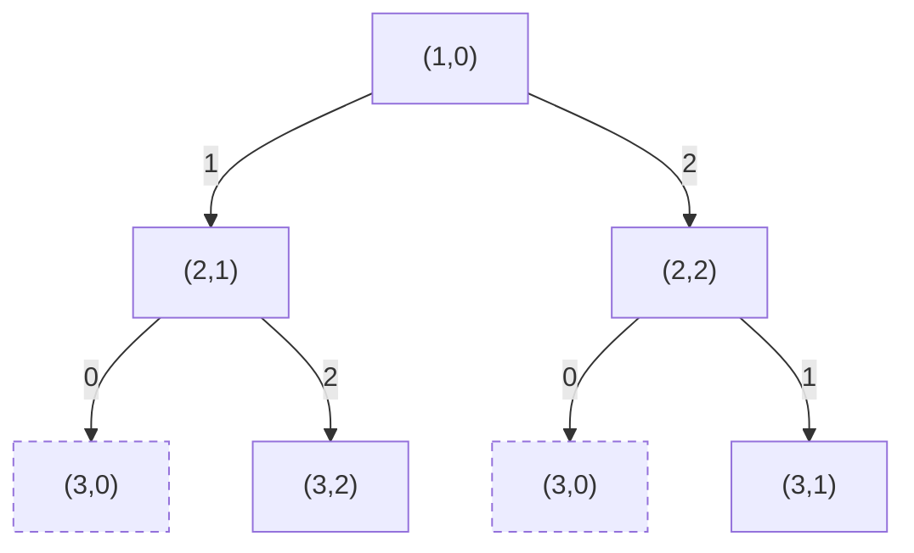
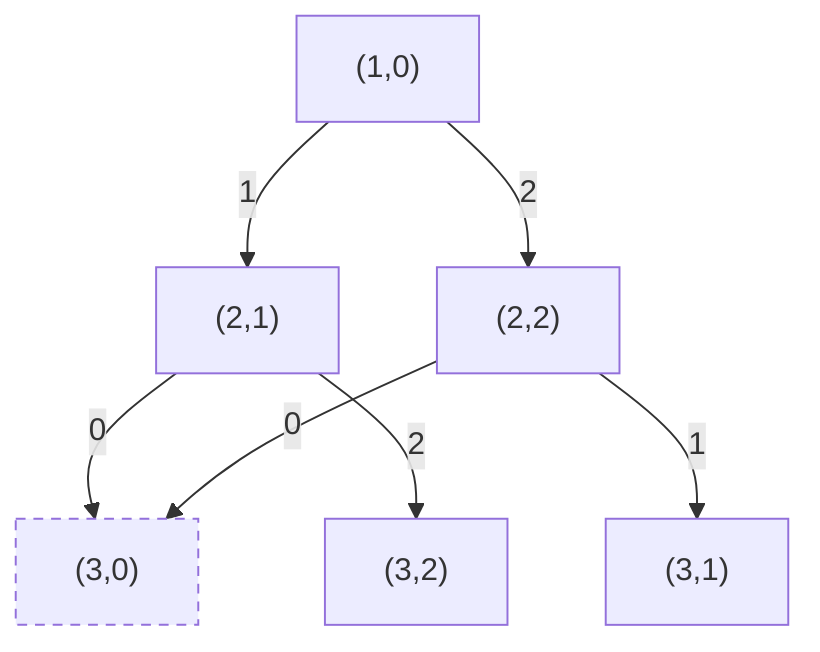
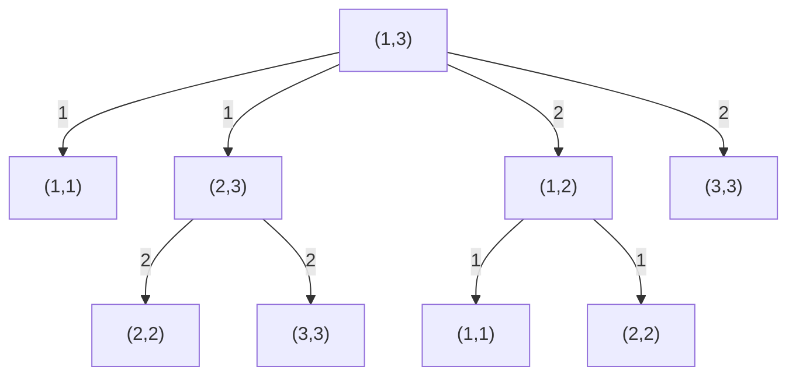

# T1 接龙

---

## 题意简化

---

输入 $n$ 张牌（$1\le n\le10^5$），第 $i$ 张数字为 $a_i$（$1\le a_i\le10^5$）。可任意重排后依次放牌；每次放牌后至多收走一次两张相同数字及其中间的整段，得分为端点数字乘收走张数。每张牌至多被收一次，求最大总分；没有可收的牌时输出 $0$。

## 问题拆分

---

1. 找出能作一次收牌两端的数字，并得到最大的端点值 $x$。
2. 求所有收牌方案的分数上界，再构造达到上界的放牌顺序。

## 满分做法：统计可作端点的最大数字

---

原有独立的 $n\le100$（20 分）、全相等（20 分）、$a_i\le1000$（30 分）及一般数据（30 分）均由同一程序处理；全相等且 $n\ge2$ 时答案为 $a_1n$。

1. 用计数数组记录每个 $a_i$：扫描 $n$ 张牌，每张 $O(1)$，取得出现至少两次的最大数字 $x$；数组占 $O(V)$，$V=10^5$。
2. 每段长度之和至多 $n$，端点值都不超过 $x$，故答案至多 $xn$。把两张 $x$ 放在两端、其他牌放中间，一次收完即可达到；这一构造只需 $O(n)$。若不存在 $x$，答案为 $0$。

总时间 $O(n+V)$，空间 $O(V)$。乘积用 `long long`。统计上界可达，因此无需枚举排列。

### 参考代码

```cpp
#include<bits/stdc++.h>
using namespace std;

const int maxv = 100000 + 10;
int cnt[maxv];

int main(){
	ios::sync_with_stdio(false);
	cin.tie(nullptr);

	int n;
	cin >> n;
	int best = 0;
	for(int i = 1; i <= n; i++){
		int x;
		cin >> x;
		cnt[x]++;
		if(cnt[x] >= 2){
			best = max(best, x);
		}
	}

	cout << 1LL * best * n << '\n';
	return 0;
}
```

## 知识点总结

---

可重排且每个对象只使用一次时，先找单次收益的全局上界，再检查能否用一种安排同时达到长度上界。

# T2 平方和

---

## 题意简化

---

输入 $n$ 个正整数 $a_i$（$n\le2\times10^5$、$a_i\le10^9$）和 $k\le10^9$。从不同位置选两数，使 $a_i^2+a_j^2$ 是 $k$ 的倍数并最大；保证至少有合法对，输出该最大平方和。

## 问题拆分

---

1. 求每个数平方模 $k$ 的余数，确定合法配对需要的互补余数。
2. 在每组余数中保存最大候选；同组配对还需第二个不同位置，最后比较平方和。

## 部分分（独立 20 分，$n\le2000$）：枚举位置对

---

1. 读入 $n$ 个数，存储耗时、空间均为 $O(n)$。
2. 枚举 $i<j$ 共 $\binom n2$ 对；每对用 $O(1)$ 算平方和、取模并更新最大值。

总时间 $O(n^2)$、空间 $O(n)$，代入 $n=2000$ 约检查两百万对。

### 参考代码

```cpp
#include<bits/stdc++.h>
using namespace std;

int main(){
	ios::sync_with_stdio(false);
	cin.tie(nullptr);
	int n;
	long long k;
	cin >> n >> k;
	static long long a[200010];
	for(int i = 1; i <= n; i++) cin >> a[i];
	long long ans = 0;
	for(int i = 1; i <= n; i++){
		for(int j = i + 1; j <= n; j++){
			long long sum = a[i] * a[i] + a[j] * a[j];
			if(sum % k == 0) ans = max(ans,sum);
		}
	}
	cout << ans << '\n';
	return 0;
}
```

## 部分分（独立 30 分，$k\le10^5$）：余数数组

---

1. 扫描 $n$ 个数，对每个平方余数保存最大的两个原数；$n$ 次、每次 $O(1)$。
2. 枚举 $k$ 个余数，$O(1)$ 找互补组并比较，同组需两名。

小模数子域时间 $O(n+k)$、空间 $O(k)$。代码在 $k$ 超过数组上限时用成对枚举保底，仍保持答案正确，但大 $n$ 时会自然超时。

### 参考代码

```cpp
#include<bits/stdc++.h>
using namespace std;

int main(){
	ios::sync_with_stdio(false);
	cin.tie(nullptr);
	int n,k;
	cin >> n >> k;
	static long long a[200010];
	for(int i = 1; i <= n; i++) cin >> a[i];
	long long ans = 0;
	if(k <= 100000){
		static long long first[100010],second[100010];
		for(int i = 1; i <= n; i++){
			long long x = a[i];
			int r = x * x % k;
			if(x > first[r]){
				second[r] = first[r];
				first[r] = x;
			}else if(x > second[r]){
				second[r] = x;
			}
		}
		for(int r = 0; r < k; r++){
			int s = (k - r) % k;
			long long x = first[r];
			long long y = r == s ? second[r] : first[s];
			if(x > 0 && y > 0) ans = max(ans,x * x + y * y);
		}
	}else{
		for(int i = 1; i <= n; i++){
			for(int j = i + 1; j <= n; j++){
				long long sum = a[i] * a[i] + a[j] * a[j];
				if(sum % k == 0) ans = max(ans,sum);
			}
		}
	}
	cout << ans << '\n';
	return 0;
}
```

## 满分做法：按余数维护前两大值

---

独立小规模档 $n\le2000$ 用下方两重枚举；独立小模数档 $k\le10^5$ 用余数数组；其余 50 分由本程序覆盖。

1. 扫描 $n$ 个数，计算 $a_i^2\bmod k$，用有序映射为每个实际出现的余数保留最大的两个原数；每次插入 $O(\log M)$，$M\le n$。
2. 遍历最多 $M$ 个余数组；对余数 $r$ 查询 $(k-r)\bmod k$，每次 $O(\log M)$。异组用各组第一名，同组用前两名，取最大平方和。

总时间 $O(n\log n)$、空间 $O(n)$。$a_i^2+a_j^2\le2\times10^{18}$，使用 `long long`。同余数组中的两个值来自不同位置。

### 参考代码

```cpp
#include<bits/stdc++.h>
using namespace std;

map<long long,pair<long long,long long> > best;

int main(){
	ios::sync_with_stdio(false);
	cin.tie(nullptr);

	int n;
	long long k;
	cin >> n >> k;
	for(int i = 1; i <= n; i++){
		long long x;
		cin >> x;
		long long r = x * x % k;
		pair<long long,long long> &p = best[r];
		if(x > p.first){
			p.second = p.first;
			p.first = x;
		}else if(x > p.second){
			p.second = x;
		}
	}

	long long ans = 0;
	for(map<long long,pair<long long,long long> >::iterator it = best.begin(); it != best.end(); it++){
		long long r = it->first;
		long long other = (k - r) % k;
		map<long long,pair<long long,long long> >::iterator jt = best.find(other);
		if(jt == best.end()) continue;
		long long x = it->second.first;
		long long y = jt->second.first;
		if(r == other) y = it->second.second;
		if(y > 0) ans = max(ans,x * x + y * y);
	}
	cout << ans << '\n';
	return 0;
}
```

## 知识点总结

---

模条件把两数配对时，先按余数分组并求互补余数；相同余数组要保留足够多的不同位置。

# T3 彩彩的三彩项链

---

## 题意简化

---

输入长度 $2\le n\le10^6$ 的环形珠串 $s$，每颗为 `r`、`g` 或 `b`。一次点击把一颗珠子按 $r\to g\to b\to r$ 推进一格，可反复点击。要求修改后每对相邻珠子颜色不同，包括首尾一对；输出最少点击数。

## 问题拆分

---

1. 枚举首颗修改后的颜色，得到首尾约束的基准。
2. 逐颗选择与前一颗不同的颜色，计算从原色点击到目标色的代价。
3. 末颗不得与首颗同色，在合法结果中取最小总代价。

## 部分分（独立 10 分，$n=10$）：按目标颜色搜索

---

1. 枚举首颗目标色 $3$ 次，初始化代价，每次 $O(1)$。
2. 从第二颗递归选不同于前一颗的两个目标色，更新点击代价；最多 $3\cdot2^{n-1}$ 条路径，每次扩展 $O(1)$。
3. 到第 $n$ 颗检查首尾异色，合法叶子用 $O(1)$ 更新答案。

总时间 $O(2^n)$、递归空间 $O(n)$；代入 $n=10$ 约千条路径。

### 搜索树

固定首色为 $r$，小例子有三颗珠子；节点 $(i,c)$ 表示第 $i$ 颗已选目标色 $c$。树中相同状态保留为两个叶子，因为它们来自不同历史。

**左上角图例**：$0/1/2=$ 选 $r/g/b$；条件：新色异于上一颗；代价：原色点击到新色的次数；价值：无，目标为代价最小。



**叶子**：$i=n$ 且末色异于首色为合法，返回累计点击数；末色等于首色为非法（虚线节点），不更新答案。箭头沿搜索决策方向。

### 参考代码

```cpp
#include<bits/stdc++.h>
using namespace std;

int n,original[1000010],ans = 1000000000;

void dfs(int i,int first,int last,int cost){
	if(cost >= ans) return;
	if(i == n){
		if(last != first) ans = min(ans,cost);
		return;
	}
	for(int c = 0; c < 3; c++){
		if(c == last) continue;
		int add = (c - original[i] + 3) % 3;
		dfs(i + 1,first,c,cost + add);
	}
}

int main(){
	ios::sync_with_stdio(false);
	cin.tie(nullptr);
	string s;
	cin >> n >> s;
	for(int i = 0; i < n; i++){
		if(s[i] == 'r') original[i] = 0;
		if(s[i] == 'g') original[i] = 1;
		if(s[i] == 'b') original[i] = 2;
	}
	for(int first = 0; first < 3; first++){
		int cost = (first - original[0] + 3) % 3;
		dfs(1,first,first,cost);
	}
	cout << ans << '\n';
	return 0;
}
```

## 满分做法：固定首色的三状态动态规划

---

独立 $n=10$ 档（10 分）可用下方搜索；$n=1000$、原串只有一种/两种颜色的三个 10 分档以及无额外限制的 60 分档均由 DP 程序覆盖。原串色数不会减少目标色的选择数。

1. 枚举首色共 $3$ 次，每次计算首颗点击代价并初始化三个颜色状态，单次 $O(1)$。
2. 对后续每颗珠子，从上一颗的 $3$ 种颜色向不同的新色转移；每颗至多 $9$ 次 $O(1)$ 更新，仅保留较小已付代价。
3. 在最后 $3$ 个状态中筛掉与首色相同者，取最小值；每个首色 $O(1)$。

朴素搜索至多 $3\cdot2^{n-1}$ 条路径，$n=10$ 可做，$n=10^6$ 不可行。合并未来等价的“已处理位置、末色、固定首色”状态后，转移代价为 $(\text{新色编号}-\text{原色编号}+3)\bmod3$。总时间 $O(9n)$，额外空间 $O(1)$。终态若末色等于首色必须舍弃。

### 合并后的 DP 状态图

固定首色为 $r$，$(i,c)$ 表示前 $i$ 颗已定且末色为 $c$。与上面的搜索树相比，两条历史到达同一状态时只保留最小累计代价；按 $i$ 递增更新。

**左上角图例**：$0/1/2=$ 选 $r/g/b$；条件：新色异于上一颗；代价：原色点击到新色的次数；价值：无，取最小代价。



**叶子**：$i=n,c\ne$ 首色合法，保留最小代价；$i=n,c=$ 首色非法（虚线节点），不参与答案。$(3,0)$ 的两条历史合流。

### 参考代码

```cpp
#include<bits/stdc++.h>
using namespace std;

int color(char c){
	if(c == 'r') return 0;
	if(c == 'g') return 1;
	return 2;
}

int main(){
	ios::sync_with_stdio(false);
	cin.tie(nullptr);

	int n;
	string s;
	cin >> n >> s;
	const int INF = 1000000000;
	int ans = INF;
	for(int first = 0; first < 3; first++){
		int dp[3] = {INF,INF,INF};
		dp[first] = (first - color(s[0]) + 3) % 3;
		for(int i = 1; i < n; i++){
			int next[3] = {INF,INF,INF};
			for(int last = 0; last < 3; last++){
				for(int now = 0; now < 3; now++){
					if(last == now) continue;
					int cost = (now - color(s[i]) + 3) % 3;
					next[now] = min(next[now],dp[last] + cost);
				}
			}
			for(int c = 0; c < 3; c++) dp[c] = next[c];
		}
		for(int last = 0; last < 3; last++){
			if(last != first) ans = min(ans,dp[last]);
		}
	}
	cout << ans << '\n';
	return 0;
}
```

## 知识点总结

---

环上相邻约束可枚举首状态解除首尾依赖；顺序搜索若只需记住上一状态，就可合并为常数状态的 DP。

# T4 表达式（eval）

---

## 题意简化

---

从文件 `eval.in` 读入长度至多 $5000$ 的合法表达式 $S$，仅含正整数、多位数、`+` 与 `*`。只能添加合法括号，不能调整数字和运算符顺序；求可能的最大值，完整十进制写入 `eval.out`。

## 问题拆分

---

1. 按字符解析每个多位正整数及后面的运算符。
2. 利用正数与分配律确定最优括号结构：每个乘号之间的加法段先求和。
3. 把各段之和相乘，并用高精度输出完整答案。

## 部分分（短表达式，$|S|\le10$）：搜索括号树

---

1. 扫描字符串，把至多 $q\le5$ 个正整数及相邻运算符分开；$O(|S|)$ 时间、$O(q)$ 存储。
2. 在区间 $[l,r]$ 枚举最后计算的运算符位置 $j$，递归求左右区间的最大值再相加或相乘；每个区间至多 $q-1$ 个分支。正数使运算对两侧值单调，左右各取最大即可。
3. 返回全区间最大值，写入 `eval.out`。递归会重复计算同一子区间，总调用量 $O(3^q)$。

总时间 $O(|S|+3^q)$、数组与递归空间 $O(q)$；$q\le5$ 很小。完整范围的 $q$ 可达 $2500$，需要换用后面的结构结论和高精度。

### 括号树搜索图

小例子含三个数，$(l,r)$ 表示必须求值的连续数字区间。一次选择最后计算的运算符 $j$，同编号的两条箭头分别指向**都要计算**的左右子区间；重复区间在搜索树中保留两份。

**左上角图例**：边号 $j=$ 最后计算的运算符位置；条件 $l\le j<r$；代价 $0$；价值：左右返回值按第 $j$ 个运算符合并。



**叶子**：$l=r$ 合法，返回该正整数；不存在非法叶子，区间内每个 $j$ 都合法。先求两侧再合并，当前区间在所有 $j$ 的结果中取最大值。

### 参考代码

```cpp
#include<bits/stdc++.h>
using namespace std;

long long a[3005];
char op[3005];

long long solve(int l,int r){
	if(l == r) return a[l];
	long long best = 0;
	for(int j = l; j < r; j++){
		long long left = solve(l,j);
		long long right = solve(j + 1,r);
		long long value;
		if(op[j] == '+') value = left + right;
		else value = left * right;
		best = max(best,value);
	}
	return best;
}

int main(){
	freopen("eval.in","r",stdin);
	freopen("eval.out","w",stdout);
	ios::sync_with_stdio(false);
	cin.tie(nullptr);
	string s;
	cin >> s;
	int q = 0;
	long long number = 0;
	for(int i = 0; i < (int)s.size(); i++){
		if(s[i] >= '0' && s[i] <= '9'){
			number = number * 10 + s[i] - '0';
		}else{
			a[++q] = number;
			op[q] = s[i];
			number = 0;
		}
	}
	a[++q] = number;
	cout << solve(1,q) << '\n';
	return 0;
}
```

## 满分做法：加法段求和后相乘

---

公开分档对应：1～2 点（短表达式，10 分）可用上面的括号树搜索；3～4 点（全为 1）、5～6 点（数字均不超过 9）、7～10 点（只有 `+`）、11～12 点（只有 `*`）、13～20 点（一般表达式）均使用本节的完整高精度代码。纯加时只得到一个加法段，纯乘时每段只有一个数；这些性质直接落在同一算法内，无须为它们重复一份代码。

1. 从左到右扫描至多 $|S|$ 个字符，逐位建立当前正整数；解析一次的字符工作量为 $O(|S|)$，高精度逐位加法另外计入位数成本。
2. 遇到 `+` 把当前数加入段和，遇到 `*` 把整个段和乘进答案，末尾再乘一次；段数不超过 $|S|$，不枚举括号树。
3. 以 $10^4$ 为基数存储高精度数，进位加法与竖式乘法；若最终答案有 $D$ 个十进制位，总乘法工作量上界 $O(D^2)$，存储 $O(D)$。

关键变形是 $A+BC\le(A+B)C$ 与 $AB+C\le A(B+C)$（$A,B,C$ 都是正整数）。反复把加法移入相邻乘法的因子，最终每个乘号之间的加法段先求和；这一括号方式合法且达到最大值。总时间上界 $O(|S|+D^2)$、空间 $O(D)$；这里 $D$ 是答案的十进制位数，可能远大于机器整数位数。

### 参考代码

```cpp
#include<bits/stdc++.h>
using namespace std;

struct Big{
	static const int BASE = 10000;
	vector<int> d;
	Big(int x = 0){
		if(x > 0) d.push_back(x);
	}
	void addDigit(int x){
		int carry = x;
		for(int i = 0; i < (int)d.size(); i++){
			int value = d[i] * 10 + carry;
			d[i] = value % BASE;
			carry = value / BASE;
		}
		if(carry > 0) d.push_back(carry);
	}
	void add(const Big &b){
		if(d.size() < b.d.size()) d.resize(b.d.size(),0);
		int carry = 0;
		for(int i = 0; i < (int)d.size(); i++){
			int value = d[i] + carry;
			if(i < (int)b.d.size()) value += b.d[i];
			d[i] = value % BASE;
			carry = value / BASE;
		}
		if(carry > 0) d.push_back(carry);
	}
	Big multiply(const Big &b) const{
		Big result;
		if(d.empty() || b.d.empty()) return result;
		result.d.resize(d.size() + b.d.size() + 1,0);
		for(int i = 0; i < (int)d.size(); i++){
			long long carry = 0;
			for(int j = 0; j < (int)b.d.size() || carry > 0; j++){
				long long value = result.d[i + j] + carry;
				if(j < (int)b.d.size()) value += 1LL * d[i] * b.d[j];
				result.d[i + j] = value % BASE;
				carry = value / BASE;
			}
		}
		while(!result.d.empty() && result.d.back() == 0) result.d.pop_back();
		return result;
	}
	void print() const{
		if(d.empty()){
			cout << 0;
			return;
		}
		cout << d.back();
		for(int i = (int)d.size() - 2; i >= 0; i--){
			cout << setw(4) << setfill('0') << d[i];
		}
	}
};

int main(){
	freopen("eval.in","r",stdin);
	freopen("eval.out","w",stdout);
	ios::sync_with_stdio(false);
	cin.tie(nullptr);

	string s;
	cin >> s;
	Big product(1),sum,number;
	for(int i = 0; i < (int)s.size(); i++){
		if(s[i] >= '0' && s[i] <= '9'){
			number.addDigit(s[i] - '0');
		}else if(s[i] == '+'){
			sum.add(number);
			number = Big();
		}else{
			sum.add(number);
			product = product.multiply(sum);
			sum = Big();
			number = Big();
		}
	}
	sum.add(number);
	product = product.multiply(sum);
	product.print();
	cout << '\n';
	return 0;
}
```

## 知识点总结

---

所有数为正且只能加括号时，可以利用分配律把相邻加法段作为整体乘；大整数位数必须计入复杂度。
