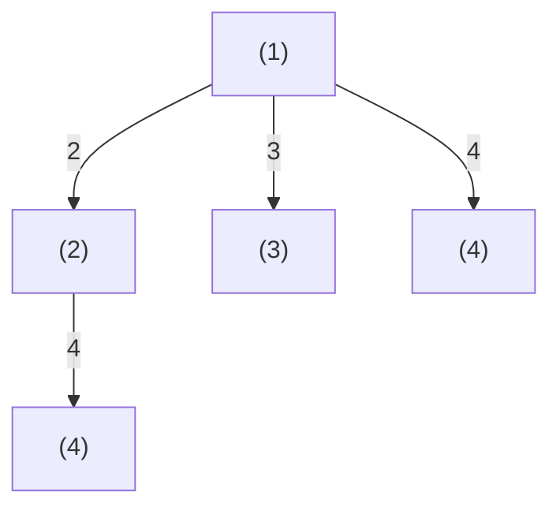
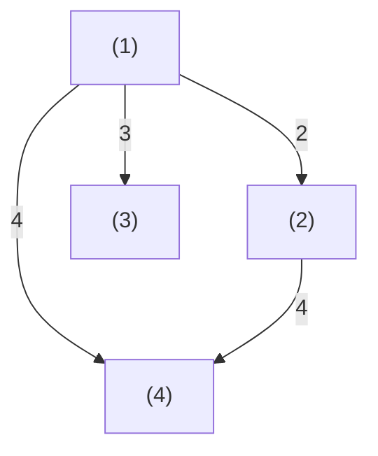

# T3 整除序列

---

## 题意简化

---

输入 $T\le10$ 组区间 $1\le L<R\le10^5$。每组选择严格递增的 $a_1<\cdots<a_S$，每项在 $[L,R]$，且前面任一项都整除后面的项。输出最长长度 $S$ 与这种长度的不同序列数，方案数用完整十进制表示。

## 问题拆分

---

1. 利用相邻倍数至少为 $2$ 求最大长度 $S$。
2. 找出能够保持长度 $S$ 的倍率序列。
3. 分别统计全为 $2$ 及恰有一个 $3$ 的首项与位置选择。

## 部分分（独立 20+30 分）：枚举整除前驱

---

1. 对每个 $x\in[L,R]$ 初始化长度 $len[x]=1$、方案数 $ways[x]=1$，表示只取 $x$；共 $O(R-L+1)$。
2. 按 $x$ 递增，枚举所有 $L\le y<x$；若 $x\bmod y=0$，把以 $y$ 结尾的链延长。每组询问至多 $(R-L+1)^2$ 次 $O(1)$ 判断与更新；新长度更大时覆盖方案数，等长时相加。
3. 扫描所有 $x$ 找最大长度 $S$，累加达到 $S$ 的 $ways[x]$；$O(R-L+1)$。

每问时间 $O((R-L+1)^2)$、空间 $O(R-L+1)$；窄区间及 $R\le2000$ 可行，$R$ 达 $10^5$ 时平方级不可行。相邻整除具有传递性，故延长链仍满足任意前后项整除。

### 整除链搜索树

小例子取 $[L,R]=[1,4]$，只画以 $1$ 开始的链；其他首项同样作为起点。状态 $(x)$ 表示当前链末项，树中两份 $(4)$ 对应不同历史。

**左上角图例**：边号 $y=$ 下一项；条件：$x<y\le R$ 且 $y\bmod x=0$；代价 $0$；贡献：链长加 $1$，方案数沿边继承。



**叶子**：没有更大合法倍数时可结束，返回该链长度和 $1$ 个方案；不满足整除条件的尝试不产生边。提前结束也合法，但不会增加最长长度。

### 合并后的 DP 状态图

仍取 $[1,4]$。每个 $(x)$ 初始可单独成链，按 $x$ 递增更新最长链长与方案数；两条路径到 $(4)$ 时，长者覆盖短者，同长则方案数相加。

**左上角图例**：边号 $y=$ 下一项；条件：$x<y\le R$ 且 $y\bmod x=0$；代价 $0$；贡献：候选链长加 $1$，方案数继承。



**叶子**：任何 $(x)$ 都可作为一条合法链的终点，返回 $len[x],ways[x]$；没有非法状态。答案从所有终点的最大长度及其方案数求得。

### 参考代码

```cpp
#include<bits/stdc++.h>
using namespace std;

const int N = 100010;
int len[N];
long long ways[N];

int main(){
	ios::sync_with_stdio(false);
	cin.tie(nullptr);
	int T;
	cin >> T;
	while(T--){
		int L,R;
		cin >> L >> R;
		for(int x = L; x <= R; x++){
			len[x] = 1;
			ways[x] = 1;
			for(int y = L; y < x; y++){
				if(x % y != 0) continue;
				int candidate = len[y] + 1;
				if(candidate > len[x]){
					len[x] = candidate;
					ways[x] = ways[y];
				}else if(candidate == len[x]){
					ways[x] += ways[y];
				}
			}
		}
		int bestLen = 0;
		long long count = 0;
		for(int x = L; x <= R; x++){
			if(len[x] > bestLen){
				bestLen = len[x];
				count = ways[x];
			}else if(len[x] == bestLen){
				count += ways[x];
			}
		}
		cout << bestLen << ' ' << count << '\n';
	}
	return 0;
}
```

## 满分做法：倍数上界与一次三倍计数

---

独立的窄区间档（20 分）与 $R\le2000$ 档（30 分）可用下方枚举前驱的 DP；其余 50 分由计数公式处理。

1. 从 $L$ 开始反复翻倍，至下一次会超过 $R$ 为止，最多 $O(\log R)$ 次；得到最大长度 $S$。
2. 因为 $L2^S>R$，任何一个倍率达到 $4$ 或两个倍率达到 $3$ 都不能维持 $S$ 项；只需两类倍率，判定 $O(1)$。
3. 全二链统计 $\max(0,\lfloor R/2^{S-1}\rfloor-L+1)$ 个首项；$S\ge2$ 时，单三链首项数为 $\max(0,\lfloor R/(3\cdot2^{S-2})\rfloor-L+1)$，再乘 $S-1$ 个三倍位置，公式计算 $O(1)$。

每问总时间 $O(\log R)$、空间 $O(1)$，所有询问合计 $O(T\log R)$。$S=1$ 时没有放置三倍的位置；代码单独处理。

### 参考代码

```cpp
#include<bits/stdc++.h>
using namespace std;

int main(){
	ios::sync_with_stdio(false);
	cin.tie(nullptr);

	int T;
	cin >> T;
	while(T--){
		long long L,R;
		cin >> L >> R;
		long long power = 1;
		int len = 1;
		while(L * power * 2 <= R){
			power *= 2;
			len++;
		}
		long long count = max(0LL,R / power - L + 1);
		if(len >= 2){
			long long limit = R / (power / 2 * 3);
			count += (len - 1) * max(0LL,limit - L + 1);
		}
		cout << len << ' ' << count << '\n';
	}
	return 0;
}
```

## 知识点总结

---

整除链的相邻倍率有明确下界时，先用最小倍率锁定最长长度，再用剩余倍率预算分类计数。
