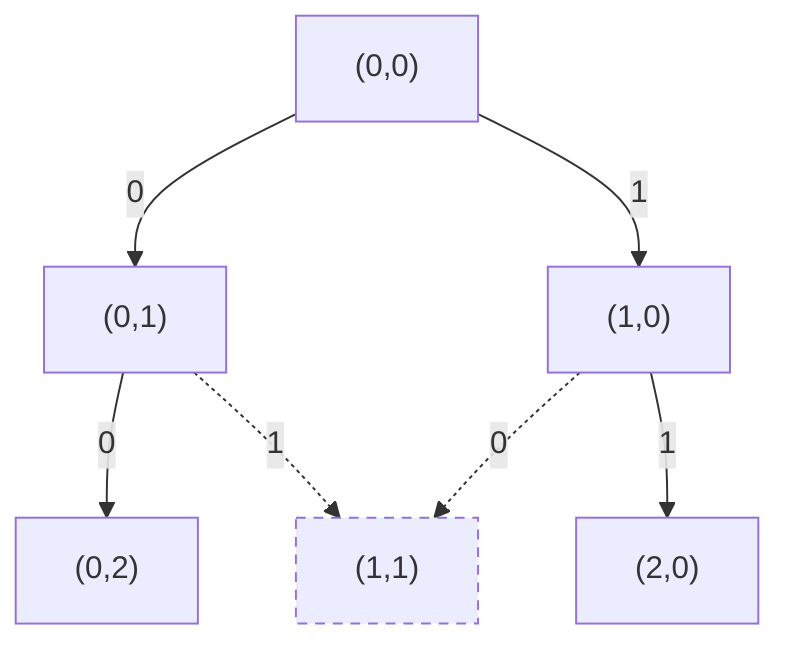

# T4 绿野仙踪（green）

---

## 题意简化

---

从 `green.in` 读入 $n$ 行、$m$ 列的网格（$2\le n,m\le1000$），坐标 $(x,y)$ 中 $x$ 为行、$y$ 为列。给定 $k\le1000$ 个花圃中心及起终点；统一正整数半径 $r$ 的花圃覆盖与中心行列距离都不超过 $r-1$ 的场内格子。被覆盖格不能走，起终点也不能被覆盖；只能四向走。求起终点仍连通时覆盖格并集的最大大小，若没有可行正半径输出 $0$ 至 `green.out`。

## 问题拆分

---

1. 给定 $r$，求所有正方形花圃覆盖格的并集大小。
2. 在未覆盖格上检查起点到终点四向连通，得到 $r$ 是否可行。
3. 利用半径增大只会增加障碍的单调性，找最大可行 $r$ 并输出该半径的覆盖数。

原题分档与算法对应：原题有 20 个独立测试点，每点 5 分。下表逐档对应到本题解的代码；同一做法覆盖多档时不重复粘贴代码。

| 测试点 | 原题限制或性质 | 对应算法与代码 |
|---:|---|---|
| 1～2 | 小网格，$k\le10$ | 逐半径涂色与 BFS；下方第一种部分分代码。 |
| 3～4 | $k=1$ | 逐格涂色、BFS 与二分；下方第二种部分分代码。 |
| 5～6 | $k\le10$ | 与 3～4 点共用第二种部分分代码。 |
| 7～8 | 起终点相邻 | 距离确定最大半径，逐行差分统计面积；下方第三种部分分代码。 |
| 9～10 | 起终点为指定对角 | 位置不能保证连通；用下方满分代码的二分、二维差分与 BFS。 |
| 11～20 | 无额外限制 | 同上，使用满分代码。 |

## 部分分（前 10 分：小网格）：逐半径涂色与 BFS

---

1. 给定半径 $r$，对每个中心裁剪正方形，逐行把覆盖区间涂为障碍；第 $i$ 个花圃耗时为其场内面积 $A_i$，一轮合计 $O(\sum_i A_i)$，重叠格重复涂色但只计一次。
2. 扫描 $nm$ 格统计并集，再从起点 BFS；每格最多入队一次、看四邻，耗时 $O(nm)$，队列与网格占 $O(nm)$。若端点被覆盖或终点不可达，则该半径失败。
3. 从 $r=1$ 递增检查，首次不可行便停止；可行半径构成前缀，至多试 $R=\max(n,m)$ 次，答案是最后一次可行的覆盖数。

总时间 $O(R(nm+\sum_i A_i))$，粗上界 $O(Rknm)$，空间 $O(nm+k)$。小网格 $n,m\le50,k\le10$ 时可行；大网格上的重复尝试和涂色成为瓶颈。

### 连通性搜索图

小例子为 $3$ 行 $3$ 列、半径 $1$，花圃中心 $(1,1)$，起点 $(0,0)$、终点 $(0,2)$。节点是格子坐标；队列从起点按四邻扩展，$(2,0)$ 的后续省略。

**左上角图例**：$0/1/2/3=$ 右/下/左/上；条件：在网格内且未访问、未覆盖；代价：走一步；价值：无，只判能否到达。虚线箭头示意被障碍禁止的尝试，不入队。



**叶子**：到达终点 $(0,2)$ 为合法，返回“可达”；被覆盖的 $(1,1)$ 为非法（虚线节点），不入队。若队列耗尽仍未到终点，则返回“不可达”。

### 参考代码

```cpp
#include<bits/stdc++.h>
using namespace std;

const int N = 1005;
int n,m,k,sx,sy,ex,ey;
int cx[1010],cy[1010],que[1000010];
unsigned char blocked[N][N];

bool check(int r,int &area){
	area = 0;
	for(int x = 0; x < n; x++) memset(blocked[x],0,m);
	for(int i = 0; i < k; i++){
		int x1 = max(0,cx[i] - r + 1);
		int x2 = min(n - 1,cx[i] + r - 1);
		int y1 = max(0,cy[i] - r + 1);
		int y2 = min(m - 1,cy[i] + r - 1);
		for(int x = x1; x <= x2; x++){
			memset(blocked[x] + y1,1,y2 - y1 + 1);
		}
	}
	for(int x = 0; x < n; x++){
		for(int y = 0; y < m; y++) area += blocked[x][y] != 0;
	}
	if(blocked[sx][sy] || blocked[ex][ey]) return false;
	int head = 0,tail = 0;
	que[tail++] = sx * m + sy;
	blocked[sx][sy] = 2;
	const int dx[4] = {0,1,0,-1};
	const int dy[4] = {1,0,-1,0};
	while(head < tail){
		int id = que[head++];
		int x = id / m;
		int y = id % m;
		if(x == ex && y == ey) return true;
		for(int d = 0; d < 4; d++){
			int nx = x + dx[d];
			int ny = y + dy[d];
			if(nx < 0 || nx >= n || ny < 0 || ny >= m) continue;
			if(blocked[nx][ny]) continue;
			blocked[nx][ny] = 2;
			que[tail++] = nx * m + ny;
		}
	}
	return false;
}

int main(){
	freopen("green.in","r",stdin);
	freopen("green.out","w",stdout);
	ios::sync_with_stdio(false);
	cin.tie(nullptr);
	cin >> n >> m >> k;
	cin >> sx >> sy >> ex >> ey;
	for(int i = 0; i < k; i++) cin >> cx[i] >> cy[i];
	int answer = 0;
	for(int r = 1; r <= max(n,m); r++){
		int area;
		if(!check(r,area)) break;
		answer = area;
	}
	cout << answer << '\n';
	return 0;
}
```

## 部分分（第 1～6 点，共 30 分）：少中心逐格涂色与二分

---

1. 给定半径 $r$，裁剪每个中心的正方形并逐格涂色；只有第一次涂到的格才使面积加一。第 $i$ 个花圃耗时 $O(A_i)$，一轮共 $O(\sum_i A_i)$。
2. 若起终点未覆盖，从起点 BFS 搜索未覆盖格，每格最多入队一次、检查四邻，耗时 $O(nm)$、空间 $O(nm)$。
3. 可行半径构成前缀，在 $0$ 到 $R=\max(n,m)$ 中二分最后可行的正整数半径；最后再计算面积，共 $O(\log R)$ 次判定。

总时间 $O((nm+\sum_i A_i)\log R)$，粗上界 $O(knm\log R)$，空间 $O(nm+k)$。第 3～4 点 $k=1$，第 5～6 点 $k\le10$，均可通过；第 1～2 点也能通过。大 $k$ 时重复涂色代价高。BFS 的四邻顺序与上图相同。

### 参考代码

```cpp
#include<bits/stdc++.h>
using namespace std;

const int N = 1005;
int n,m,k,sx,sy,ex,ey;
int cx[1010],cy[1010],que[1000010];
unsigned char blocked[N][N];

bool check(int r,int &area){
	area = 0;
	for(int x = 0; x < n; x++) memset(blocked[x],0,m);
	for(int i = 0; i < k; i++){
		int x1 = max(0,cx[i] - r + 1);
		int x2 = min(n - 1,cx[i] + r - 1);
		int y1 = max(0,cy[i] - r + 1);
		int y2 = min(m - 1,cy[i] + r - 1);
		for(int x = x1; x <= x2; x++){
			for(int y = y1; y <= y2; y++){
				if(!blocked[x][y]){
					blocked[x][y] = 1;
					area++;
				}
			}
		}
	}
	if(blocked[sx][sy] || blocked[ex][ey]) return false;
	int head = 0,tail = 0;
	que[tail++] = sx * m + sy;
	blocked[sx][sy] = 2;
	const int dx[4] = {0,1,0,-1};
	const int dy[4] = {1,0,-1,0};
	while(head < tail){
		int id = que[head++];
		int x = id / m;
		int y = id % m;
		if(x == ex && y == ey) return true;
		for(int d = 0; d < 4; d++){
			int nx = x + dx[d];
			int ny = y + dy[d];
			if(nx < 0 || nx >= n || ny < 0 || ny >= m) continue;
			if(blocked[nx][ny]) continue;
			blocked[nx][ny] = 2;
			que[tail++] = nx * m + ny;
		}
	}
	return false;
}

int main(){
	freopen("green.in","r",stdin);
	freopen("green.out","w",stdout);
	ios::sync_with_stdio(false);
	cin.tie(nullptr);
	cin >> n >> m >> k;
	cin >> sx >> sy >> ex >> ey;
	for(int i = 0; i < k; i++) cin >> cx[i] >> cy[i];
	int l = 0,r = max(n,m) + 1;
	while(l + 1 < r){
		int mid = (l + r) / 2;
		int area;
		if(check(mid,area)) l = mid;
		else r = mid;
	}
	int answer = 0;
	if(l > 0) check(l,answer);
	cout << answer << '\n';
	return 0;
}
```

## 部分分（第 7～8 点，共 10 分）：相邻端点直接定半径

---

1. 起终点相邻，只要两格未被覆盖，就能一步到达。对每个花圃中心计算到两个端点的切比雪夫距离，取所有距离的最小值 $r^*$；这就是最大可行正整数半径，耗时 $O(k)$。
2. 固定 $r^*$ 后按行统计覆盖并集：每行清空长度为 $m+1$ 的差分数组；对 $k$ 个花圃，若该行落在正方形内，就给这一行的覆盖列区间做两次差分更新；前缀还原后统计正值格，单行 $O(k+m)$。
3. 累加全部 $n$ 行的覆盖格数并输出。

总时间 $O(n(k+m))$、空间 $O(m+k)$，无须 BFS。这个推导只适用于起终点相邻的子任务，其他位置仍需判四向连通。

### 参考代码

```cpp
#include<bits/stdc++.h>
using namespace std;

const int N = 1010;
int n,m,k,sx,sy,ex,ey;
int cx[N],cy[N],row[N];

int main(){
	freopen("green.in","r",stdin);
	freopen("green.out","w",stdout);
	ios::sync_with_stdio(false);
	cin.tie(nullptr);
	cin >> n >> m >> k;
	cin >> sx >> sy >> ex >> ey;
	int r = max(n,m) + 1;
	for(int i = 0; i < k; i++){
		cin >> cx[i] >> cy[i];
		int ds = max(abs(sx - cx[i]),abs(sy - cy[i]));
		int de = max(abs(ex - cx[i]),abs(ey - cy[i]));
		r = min(r,min(ds,de));
	}
	int answer = 0;
	for(int x = 0; x < n; x++){
		memset(row,0,(m + 1) * sizeof(int));
		for(int i = 0; i < k; i++){
			if(abs(x - cx[i]) >= r) continue;
			int y1 = max(0,cy[i] - r + 1);
			int y2 = min(m - 1,cy[i] + r - 1);
			row[y1]++;
			row[y2 + 1]--;
		}
		int count = 0;
		for(int y = 0; y < m; y++){
			count += row[y];
			if(count > 0) answer++;
		}
	}
	cout << answer << '\n';
	return 0;
}
```

## 满分做法：二维差分、BFS 与二分

---

前 2 点有逐半径程序；第 3～6 点用少中心直接涂色后二分；第 7～8 点用相邻端点公式。第 9～10 点虽然端点在对角，但障碍仍可能切断道路，需使用这里的一般连通性算法；第 11～20 点同样使用本算法。

1. 对 $k$ 个中心各做四次二维差分更新，$O(k)$；对 $nm$ 格做二维前缀还原并统计覆盖数，$O(nm)$。
2. 若起点或终点被覆盖则失败；否则对空格 BFS，每格至多入队一次、检查四邻，$O(nm)$ 时间和队列空间。
3. 在 $0$ 到 $\max(n,m)$ 二分最后可行半径，共 $O(\log\max(n,m))$ 次判定；最后重算一次覆盖数。半径 $0$ 只作二分哨兵，答案仍要求正半径。

每次判定 $O(nm+k)$，总时间 $O((nm+k)\log\max(n,m))$、空间 $O(nm+k)$。若 $r=1$ 不可行，最终答案为 $0$。坐标与矩形裁剪始终按行、列顺序处理。

### 参考代码

```cpp
#include<bits/stdc++.h>
using namespace std;

const int N = 1005;
int n,m,k,sx,sy,ex,ey;
int cx[1010],cy[1010],diff[N][N],que[1000010];
unsigned char state[N][N];

void addRect(int x1,int y1,int x2,int y2){
	diff[x1][y1]++;
	diff[x2 + 1][y1]--;
	diff[x1][y2 + 1]--;
	diff[x2 + 1][y2 + 1]++;
}

bool check(int r,int &area){
	area = 0;
	if(r == 0) return true;
	for(int x = 0; x <= n; x++) memset(diff[x],0,(m + 1) * sizeof(int));
	for(int x = 0; x < n; x++) memset(state[x],0,m);
	for(int i = 0; i < k; i++){
		int x1 = max(0,cx[i] - r + 1);
		int x2 = min(n - 1,cx[i] + r - 1);
		int y1 = max(0,cy[i] - r + 1);
		int y2 = min(m - 1,cy[i] + r - 1);
		addRect(x1,y1,x2,y2);
	}
	for(int x = 0; x < n; x++){
		for(int y = 0; y < m; y++){
			if(x > 0) diff[x][y] += diff[x - 1][y];
			if(y > 0) diff[x][y] += diff[x][y - 1];
			if(x > 0 && y > 0) diff[x][y] -= diff[x - 1][y - 1];
			if(diff[x][y] > 0){
				state[x][y] = 1;
				area++;
			}
		}
	}
	if(state[sx][sy] || state[ex][ey]) return false;
	const int dx[4] = {0,1,0,-1};
	const int dy[4] = {1,0,-1,0};
	int head = 0,tail = 0;
	que[tail++] = sx * m + sy;
	state[sx][sy] = 2;
	while(head < tail){
		int id = que[head++];
		int x = id / m;
		int y = id % m;
		if(x == ex && y == ey) return true;
		for(int d = 0; d < 4; d++){
			int nx = x + dx[d];
			int ny = y + dy[d];
			if(nx < 0 || nx >= n || ny < 0 || ny >= m) continue;
			if(state[nx][ny]) continue;
			state[nx][ny] = 2;
			que[tail++] = nx * m + ny;
		}
	}
	return false;
}

int main(){
	freopen("green.in","r",stdin);
	freopen("green.out","w",stdout);
	ios::sync_with_stdio(false);
	cin.tie(nullptr);
	cin >> n >> m >> k;
	cin >> sx >> sy >> ex >> ey;
	for(int i = 0; i < k; i++) cin >> cx[i] >> cy[i];
	int l = 0,r = max(n,m) + 1;
	while(l + 1 < r){
		int mid = (l + r) / 2;
		int area;
		if(check(mid,area)) l = mid;
		else r = mid;
	}
	int area;
	check(l,area);
	cout << area << '\n';
	return 0;
}
```

## 知识点总结

---

按公开分档选择合适的判定方法：小网格可逐半径枚举，少中心可直接涂色，相邻端点可由距离定半径；其余情况用二维差分、BFS 和二分。端点位置特殊不等于道路必然连通。
