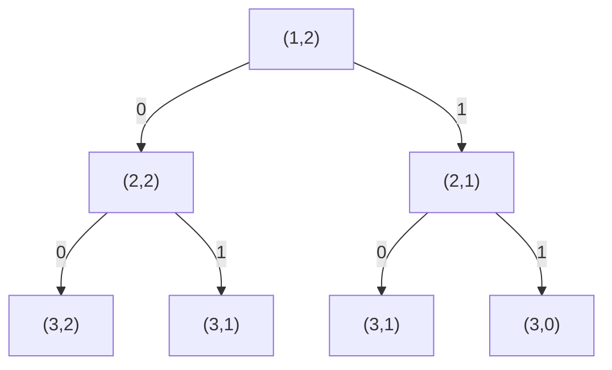
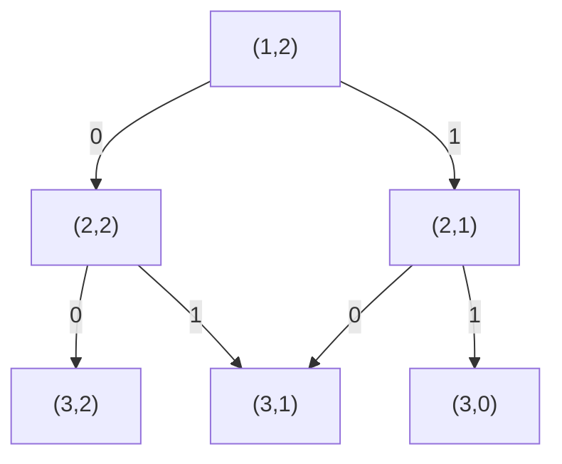
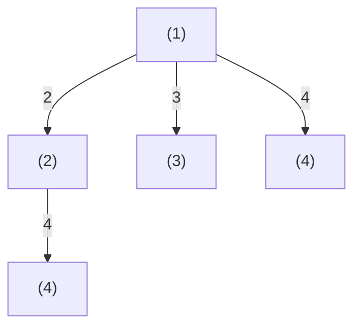
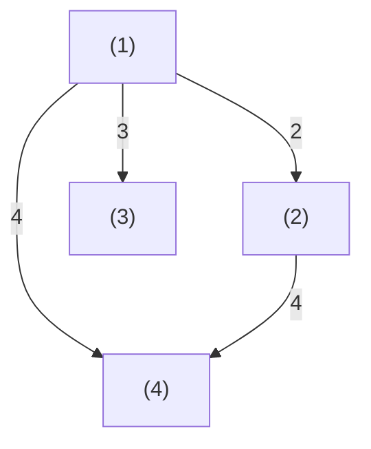
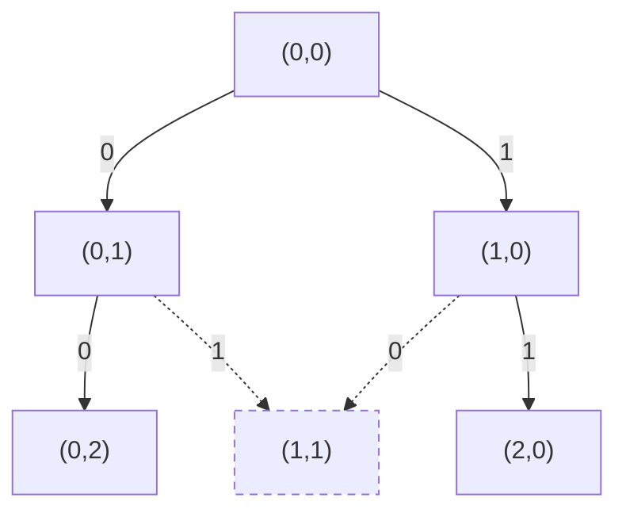

# T1 上下五千年

---

## 题意简化

---

输入合法公历日期 $y,m,d$，年份 $2000\le y\le7000$。把年、月、日的十进制写法直接拼接，不补前导零；若拼接串回文，则称为回文时间。求严格晚于输入日期的第一个回文时间，输出其年月日。

## 问题拆分

---

1. 先利用回文串首尾相同，排除不可能的日期，并确定需要搜索的年份范围。
2. 按年、月、日升序枚举候选日期，跳过不晚于输入的日期。
3. 拼接年、月、日并检查回文，首次成功就输出。

## 满分做法：枚举每月前 27 日

---

原有年份上界 $2200$、$4000$、$7000$ 的累计 $30/60/100$ 分均由这份程序覆盖，无须设置部分分。

1. $7010$ 年 $10$ 月 $7$ 日得到 `7010107`，是回文时间，且晚于所有合法输入。因此答案年份不超过 $7010$，相关年份首位只会是 $2$～$7$。回文串末位必须等于首位；日为 $28$～$31$ 时末位是 $8,9,0,1$，均不可能。每月只枚举 $1$～$27$ 日，这些日期在所有月份都合法，无须处理闰年和大小月。
2. 从输入年份起依次枚举月份 $1$～$12$、日期 $1$～$27$，比较年月日并跳过输入当天及以前。最多检查 $(7011-y)\times12\times27$ 个候选。
3. 把候选日期的三个整数直接拼接，用双指针比较首尾字符；字符串长度固定，每次 $O(1)$。第一次回文命中就是严格晚于输入的最早日期。

总时间 $O((7011-y)\times12\times27)$，最多约 $162$ 万次检查；额外空间 $O(1)$。输入日期即使在 $28$～$31$ 日，也只需用年月日比较跳过较早候选。

### 参考代码

```cpp
#include<bits/stdc++.h>
using namespace std;

bool palindromeDate(int y,int m,int d){
	string s = to_string(y) + to_string(m) + to_string(d);
	int l = 0,r = (int)s.size() - 1;
	while(l < r){
		if(s[l] != s[r]) return false;
		l++;
		r--;
	}
	return true;
}

int main(){
	ios::sync_with_stdio(false);
	cin.tie(nullptr);

	int y,m,d;
	cin >> y >> m >> d;
	for(int yy = y; ; yy++){
		for(int mm = 1; mm <= 12; mm++){
			for(int dd = 1; dd <= 27; dd++){
				if(yy == y && (mm < m || (mm == m && dd <= d))) continue;
				if(palindromeDate(yy,mm,dd)){
					cout << yy << ' ' << mm << ' ' << dd << '\n';
					return 0;
				}
			}
		}
	}
}
```

## 知识点总结

---

先用回文首尾约束排除 $28$～$31$ 日，剩下的日期在所有月份都合法；按时间顺序枚举即可得到最早答案，不需要闰年或每月天数判断。

# T2 采购

---

## 题意简化

---

输入 $n\le1000$ 件商品、容量 $m\le3000$、每件扣费 $k\le3000$；第 $i$ 件体积 $w_i$、价值 $val_i$，二者均为不超过 $10^5$ 的正整数。每件至多选一次，总体积不超过 $m$，也可空选。求最大 $\sum(val_i-k)$ 并输出。

## 问题拆分

---

1. 把总收益拆成每件独立的 $val_i-k$，得到选择与不选择两种分支。
2. 在容量不超过 $m$ 的条件下组合各件选择，空集收益为 $0$。
3. 从所有可行容量中取最大收益。

## 部分分（独立 20 分，$n\le20$）：枚举子集

---

1. 读入商品到数组，$O(n)$ 时间、空间。
2. 对第 $i$ 件递归“不选/选”两支；用当前体积剪掉超容量支。至多 $2^{n+1}-1$ 个状态，每次 $O(1)$。
3. 合法叶子更新最大净收益，至多 $2^n$ 次、每次 $O(1)$，空集使答案至少为 $0$。

总时间 $O(2^n)$、递归空间 $O(n)$；$n=20$ 时约百万叶子。

### 搜索树

例子取 $n=2,m=2,w_1=w_2=1$。状态 $(i,c)$ 为下一件编号与剩余容量；树中重复的 $(3,1)$ 分开画，表示两种不同子集。

**左上角图例**：$0=$ 不选；条件：$i\le n$；代价 $0$，价值 $0$。$1=$ 选；条件：$i\le n,c\ge w_i$；代价 $w_i$，价值 $val_i-k$。



**叶子**：$i=n+1,c\ge0$ 合法，返回沿路净收益；容量不足的选择不产生边。所有叶子均合法，空集对应连续选择 $0$。

### 参考代码

```cpp
#include<bits/stdc++.h>
using namespace std;

int n,m,k;
int w[1010],value[1010];
long long ans;

void dfs(int i,int weight,long long gain){
	if(weight > m) return;
	if(i > n){
		ans = max(ans,gain);
		return;
	}
	dfs(i + 1,weight,gain);
	dfs(i + 1,weight + w[i],gain + value[i] - k);
}

int main(){
	ios::sync_with_stdio(false);
	cin.tie(nullptr);
	cin >> n >> m >> k;
	for(int i = 1; i <= n; i++) cin >> w[i] >> value[i];
	ans = 0;
	dfs(1,0,0);
	cout << ans << '\n';
	return 0;
}
```

## 满分做法：二维 0/1 背包

---

独立 $n\le20$ 档（20 分）由上面的 DFS 覆盖；独立 $m\le300$ 档（30 分）和其余 50 分由二维背包覆盖。

1. 读入商品并计算每件净收益 $val_i-k$，共 $n$ 次 $O(1)$。
2. 令 $dp[i][c]$ 为从第 $i$ 件起、剩余容量 $c$ 时的最大收益。按 $i=n,\ldots,1$ 填表：不选取 $dp[i+1][c]$，能放下时也比较 $dp[i+1][c-w_i]+val_i-k$；共 $O(nm)$ 次 $O(1)$ 转移。
3. 边界 $dp[n+1][c]=0$ 允许空选；读取 $dp[1][m]$，$O(1)$。

小规模可搜 $2^n$ 个子集；二维表合并未来等价的“下一件、剩余容量”状态。每次只从下一件转移，故同件不会重复选择；负收益可直接跳过。总时间 $O(nm)$（至多三百万个状态）、空间 $O(nm)$，最大约 $24$ MiB，低于题目空间限制。

### DP 状态图

搜索树中的两条历史可到达相同的“下一件、剩余容量”，后续选择相同，因此合并。下图 $n=2,m=2,w_1=w_2=1$；箭头为决策方向，二维表按 $i=n,\ldots,1$ 先求子状态。

**左上角图例**：$0=$ 不选；条件：$i\le n$；代价 $0$，价值 $0$。$1=$ 选；条件：$i\le n,c\ge w_i$；代价 $w_i$，价值 $val_i-k$。



**叶子**：$i=n+1,c\ge0$ 均合法，后续价值为 $0$；容量不足不产生边。两条边汇入 $(3,1)$，取较大净收益。

### 参考代码

```cpp
#include<bits/stdc++.h>
using namespace std;

const int N = 1010;
const int M = 3010;
int n,m,k;
int w[N],value[N];
long long dp[N][M];

int main(){
	ios::sync_with_stdio(false);
	cin.tie(nullptr);
	cin >> n >> m >> k;
	for(int i = 1; i <= n; i++) cin >> w[i] >> value[i];
	for(int i = n; i >= 1; i--){
		for(int c = 0; c <= m; c++){
			dp[i][c] = dp[i + 1][c];
			if(c >= w[i]){
				dp[i][c] = max(dp[i][c],dp[i + 1][c - w[i]] + value[i] - k);
			}
		}
	}
	cout << dp[1][m] << '\n';
	return 0;
}
```

## 知识点总结

---

目标中每取一件都减固定代价时，先并入单件收益；用“下一件、剩余容量”的二维 DP 合并重复子问题，每次转移只决定当前一件。

# T3 整除序列

---

## 题意简化

---

输入 $T\le10$ 组区间 $1\le L<R\le10^5$。每组选择严格递增的 $a_1<\cdots<a_S$，每项在 $[L,R]$，且前面任一项都整除后面的项。输出最长长度 $S$ 与这种长度的不同序列数，方案数用完整十进制表示。

## 问题拆分

---

1. 利用相邻倍数至少为 $2$ 求最大长度 $S$。
2. 找出能够保持长度 $S$ 的倍率序列。
3. 分别统计全为 $2$ 及恰有一个 $3$ 的首项与位置选择。

## 部分分（独立 20+30 分）：枚举整除前驱

---

1. 对每个 $x\in[L,R]$ 初始化长度 $len[x]=1$、方案数 $ways[x]=1$，表示只取 $x$；共 $O(R-L+1)$。
2. 按 $x$ 递增，枚举所有 $L\le y<x$；若 $x\bmod y=0$，把以 $y$ 结尾的链延长。每组询问至多 $(R-L+1)^2$ 次 $O(1)$ 判断与更新；新长度更大时覆盖方案数，等长时相加。
3. 扫描所有 $x$ 找最大长度 $S$，累加达到 $S$ 的 $ways[x]$；$O(R-L+1)$。

每问时间 $O((R-L+1)^2)$、空间 $O(R-L+1)$；窄区间及 $R\le2000$ 可行，$R$ 达 $10^5$ 时平方级不可行。相邻整除具有传递性，故延长链仍满足任意前后项整除。

### 整除链搜索树

小例子取 $[L,R]=[1,4]$，只画以 $1$ 开始的链；其他首项同样作为起点。状态 $(x)$ 表示当前链末项，树中两份 $(4)$ 对应不同历史。

**左上角图例**：边号 $y=$ 下一项；条件：$x<y\le R$ 且 $y\bmod x=0$；代价 $0$；贡献：链长加 $1$，方案数沿边继承。



**叶子**：没有更大合法倍数时可结束，返回该链长度和 $1$ 个方案；不满足整除条件的尝试不产生边。提前结束也合法，但不会增加最长长度。

### 合并后的 DP 状态图

仍取 $[1,4]$。每个 $(x)$ 初始可单独成链，按 $x$ 递增更新最长链长与方案数；两条路径到 $(4)$ 时，长者覆盖短者，同长则方案数相加。

**左上角图例**：边号 $y=$ 下一项；条件：$x<y\le R$ 且 $y\bmod x=0$；代价 $0$；贡献：候选链长加 $1$，方案数继承。



**叶子**：任何 $(x)$ 都可作为一条合法链的终点，返回 $len[x],ways[x]$；没有非法状态。答案从所有终点的最大长度及其方案数求得。

### 参考代码

```cpp
#include<bits/stdc++.h>
using namespace std;

const int N = 100010;
int len[N];
long long ways[N];

int main(){
	ios::sync_with_stdio(false);
	cin.tie(nullptr);
	int T;
	cin >> T;
	while(T--){
		int L,R;
		cin >> L >> R;
		for(int x = L; x <= R; x++){
			len[x] = 1;
			ways[x] = 1;
			for(int y = L; y < x; y++){
				if(x % y != 0) continue;
				int candidate = len[y] + 1;
				if(candidate > len[x]){
					len[x] = candidate;
					ways[x] = ways[y];
				}else if(candidate == len[x]){
					ways[x] += ways[y];
				}
			}
		}
		int bestLen = 0;
		long long count = 0;
		for(int x = L; x <= R; x++){
			if(len[x] > bestLen){
				bestLen = len[x];
				count = ways[x];
			}else if(len[x] == bestLen){
				count += ways[x];
			}
		}
		cout << bestLen << ' ' << count << '\n';
	}
	return 0;
}
```

## 满分做法：倍数上界与一次三倍计数

---

独立的窄区间档（20 分）与 $R\le2000$ 档（30 分）可用下方枚举前驱的 DP；其余 50 分由计数公式处理。

1. 从 $L$ 开始反复翻倍，至下一次会超过 $R$ 为止，最多 $O(\log R)$ 次；得到最大长度 $S$。
2. 因为 $L2^S>R$，任何一个倍率达到 $4$ 或两个倍率达到 $3$ 都不能维持 $S$ 项；只需两类倍率，判定 $O(1)$。
3. 全二链统计 $\max(0,\lfloor R/2^{S-1}\rfloor-L+1)$ 个首项；$S\ge2$ 时，单三链首项数为 $\max(0,\lfloor R/(3\cdot2^{S-2})\rfloor-L+1)$，再乘 $S-1$ 个三倍位置，公式计算 $O(1)$。

每问总时间 $O(\log R)$、空间 $O(1)$，所有询问合计 $O(T\log R)$。$S=1$ 时没有放置三倍的位置；代码单独处理。

### 参考代码

```cpp
#include<bits/stdc++.h>
using namespace std;

int main(){
	ios::sync_with_stdio(false);
	cin.tie(nullptr);

	int T;
	cin >> T;
	while(T--){
		long long L,R;
		cin >> L >> R;
		long long power = 1;
		int len = 1;
		while(L * power * 2 <= R){
			power *= 2;
			len++;
		}
		long long count = max(0LL,R / power - L + 1);
		if(len >= 2){
			long long limit = R / (power / 2 * 3);
			count += (len - 1) * max(0LL,limit - L + 1);
		}
		cout << len << ' ' << count << '\n';
	}
	return 0;
}
```

## 知识点总结

---

整除链的相邻倍率有明确下界时，先用最小倍率锁定最长长度，再用剩余倍率预算分类计数。

# T4 绿野仙踪（green）

---

## 题意简化

---

从 `green.in` 读入 $n$ 行、$m$ 列的网格（$2\le n,m\le1000$），坐标 $(x,y)$ 中 $x$ 为行、$y$ 为列。给定 $k\le1000$ 个花圃中心及起终点；统一正整数半径 $r$ 的花圃覆盖与中心行列距离都不超过 $r-1$ 的场内格子。被覆盖格不能走，起终点也不能被覆盖；只能四向走。求起终点仍连通时覆盖格并集的最大大小，若没有可行正半径输出 $0$ 至 `green.out`。

## 问题拆分

---

1. 给定 $r$，求所有正方形花圃覆盖格的并集大小。
2. 在未覆盖格上检查起点到终点四向连通，得到 $r$ 是否可行。
3. 利用半径增大只会增加障碍的单调性，找最大可行 $r$ 并输出该半径的覆盖数。

原题分档与算法对应：原题有 20 个独立测试点，每点 5 分。下表逐档对应到本题解的代码；同一做法覆盖多档时不重复粘贴代码。

| 测试点 | 原题限制或性质 | 对应算法与代码 |
|---:|---|---|
| 1～2 | 小网格，$k\le10$ | 逐半径涂色与 BFS；下方第一种部分分代码。 |
| 3～4 | $k=1$ | 逐格涂色、BFS 与二分；下方第二种部分分代码。 |
| 5～6 | $k\le10$ | 与 3～4 点共用第二种部分分代码。 |
| 7～8 | 起终点相邻 | 距离确定最大半径，逐行差分统计面积；下方第三种部分分代码。 |
| 9～10 | 起终点为指定对角 | 位置不能保证连通；用下方满分代码的二分、二维差分与 BFS。 |
| 11～20 | 无额外限制 | 同上，使用满分代码。 |

## 部分分（前 10 分：小网格）：逐半径涂色与 BFS

---

1. 给定半径 $r$，对每个中心裁剪正方形，逐行把覆盖区间涂为障碍；第 $i$ 个花圃耗时为其场内面积 $A_i$，一轮合计 $O(\sum_i A_i)$，重叠格重复涂色但只计一次。
2. 扫描 $nm$ 格统计并集，再从起点 BFS；每格最多入队一次、看四邻，耗时 $O(nm)$，队列与网格占 $O(nm)$。若端点被覆盖或终点不可达，则该半径失败。
3. 从 $r=1$ 递增检查，首次不可行便停止；可行半径构成前缀，至多试 $R=\max(n,m)$ 次，答案是最后一次可行的覆盖数。

总时间 $O(R(nm+\sum_i A_i))$，粗上界 $O(Rknm)$，空间 $O(nm+k)$。小网格 $n,m\le50,k\le10$ 时可行；大网格上的重复尝试和涂色成为瓶颈。

### 连通性搜索图

小例子为 $3$ 行 $3$ 列、半径 $1$，花圃中心 $(1,1)$，起点 $(0,0)$、终点 $(0,2)$。节点是格子坐标；队列从起点按四邻扩展，$(2,0)$ 的后续省略。

**左上角图例**：$0/1/2/3=$ 右/下/左/上；条件：在网格内且未访问、未覆盖；代价：走一步；价值：无，只判能否到达。虚线箭头示意被障碍禁止的尝试，不入队。



**叶子**：到达终点 $(0,2)$ 为合法，返回“可达”；被覆盖的 $(1,1)$ 为非法（虚线节点），不入队。若队列耗尽仍未到终点，则返回“不可达”。

### 参考代码

```cpp
#include<bits/stdc++.h>
using namespace std;

const int N = 1005;
int n,m,k,sx,sy,ex,ey;
int cx[1010],cy[1010],que[1000010];
unsigned char blocked[N][N];

bool check(int r,int &area){
	area = 0;
	for(int x = 0; x < n; x++) memset(blocked[x],0,m);
	for(int i = 0; i < k; i++){
		int x1 = max(0,cx[i] - r + 1);
		int x2 = min(n - 1,cx[i] + r - 1);
		int y1 = max(0,cy[i] - r + 1);
		int y2 = min(m - 1,cy[i] + r - 1);
		for(int x = x1; x <= x2; x++){
			memset(blocked[x] + y1,1,y2 - y1 + 1);
		}
	}
	for(int x = 0; x < n; x++){
		for(int y = 0; y < m; y++) area += blocked[x][y] != 0;
	}
	if(blocked[sx][sy] || blocked[ex][ey]) return false;
	int head = 0,tail = 0;
	que[tail++] = sx * m + sy;
	blocked[sx][sy] = 2;
	const int dx[4] = {0,1,0,-1};
	const int dy[4] = {1,0,-1,0};
	while(head < tail){
		int id = que[head++];
		int x = id / m;
		int y = id % m;
		if(x == ex && y == ey) return true;
		for(int d = 0; d < 4; d++){
			int nx = x + dx[d];
			int ny = y + dy[d];
			if(nx < 0 || nx >= n || ny < 0 || ny >= m) continue;
			if(blocked[nx][ny]) continue;
			blocked[nx][ny] = 2;
			que[tail++] = nx * m + ny;
		}
	}
	return false;
}

int main(){
	freopen("green.in","r",stdin);
	freopen("green.out","w",stdout);
	ios::sync_with_stdio(false);
	cin.tie(nullptr);
	cin >> n >> m >> k;
	cin >> sx >> sy >> ex >> ey;
	for(int i = 0; i < k; i++) cin >> cx[i] >> cy[i];
	int answer = 0;
	for(int r = 1; r <= max(n,m); r++){
		int area;
		if(!check(r,area)) break;
		answer = area;
	}
	cout << answer << '\n';
	return 0;
}
```

## 部分分（第 1～6 点，共 30 分）：少中心逐格涂色与二分

---

1. 给定半径 $r$，裁剪每个中心的正方形并逐格涂色；只有第一次涂到的格才使面积加一。第 $i$ 个花圃耗时 $O(A_i)$，一轮共 $O(\sum_i A_i)$。
2. 若起终点未覆盖，从起点 BFS 搜索未覆盖格，每格最多入队一次、检查四邻，耗时 $O(nm)$、空间 $O(nm)$。
3. 可行半径构成前缀，在 $0$ 到 $R=\max(n,m)$ 中二分最后可行的正整数半径；最后再计算面积，共 $O(\log R)$ 次判定。

总时间 $O((nm+\sum_i A_i)\log R)$，粗上界 $O(knm\log R)$，空间 $O(nm+k)$。第 3～4 点 $k=1$，第 5～6 点 $k\le10$，均可通过；第 1～2 点也能通过。大 $k$ 时重复涂色代价高。BFS 的四邻顺序与上图相同。

### 参考代码

```cpp
#include<bits/stdc++.h>
using namespace std;

const int N = 1005;
int n,m,k,sx,sy,ex,ey;
int cx[1010],cy[1010],que[1000010];
unsigned char blocked[N][N];

bool check(int r,int &area){
	area = 0;
	for(int x = 0; x < n; x++) memset(blocked[x],0,m);
	for(int i = 0; i < k; i++){
		int x1 = max(0,cx[i] - r + 1);
		int x2 = min(n - 1,cx[i] + r - 1);
		int y1 = max(0,cy[i] - r + 1);
		int y2 = min(m - 1,cy[i] + r - 1);
		for(int x = x1; x <= x2; x++){
			for(int y = y1; y <= y2; y++){
				if(!blocked[x][y]){
					blocked[x][y] = 1;
					area++;
				}
			}
		}
	}
	if(blocked[sx][sy] || blocked[ex][ey]) return false;
	int head = 0,tail = 0;
	que[tail++] = sx * m + sy;
	blocked[sx][sy] = 2;
	const int dx[4] = {0,1,0,-1};
	const int dy[4] = {1,0,-1,0};
	while(head < tail){
		int id = que[head++];
		int x = id / m;
		int y = id % m;
		if(x == ex && y == ey) return true;
		for(int d = 0; d < 4; d++){
			int nx = x + dx[d];
			int ny = y + dy[d];
			if(nx < 0 || nx >= n || ny < 0 || ny >= m) continue;
			if(blocked[nx][ny]) continue;
			blocked[nx][ny] = 2;
			que[tail++] = nx * m + ny;
		}
	}
	return false;
}

int main(){
	freopen("green.in","r",stdin);
	freopen("green.out","w",stdout);
	ios::sync_with_stdio(false);
	cin.tie(nullptr);
	cin >> n >> m >> k;
	cin >> sx >> sy >> ex >> ey;
	for(int i = 0; i < k; i++) cin >> cx[i] >> cy[i];
	int l = 0,r = max(n,m) + 1;
	while(l + 1 < r){
		int mid = (l + r) / 2;
		int area;
		if(check(mid,area)) l = mid;
		else r = mid;
	}
	int answer = 0;
	if(l > 0) check(l,answer);
	cout << answer << '\n';
	return 0;
}
```

## 部分分（第 7～8 点，共 10 分）：相邻端点直接定半径

---

1. 起终点相邻，只要两格未被覆盖，就能一步到达。对每个花圃中心计算到两个端点的切比雪夫距离，取所有距离的最小值 $r^*$；这就是最大可行正整数半径，耗时 $O(k)$。
2. 固定 $r^*$ 后按行统计覆盖并集：每行清空长度为 $m+1$ 的差分数组；对 $k$ 个花圃，若该行落在正方形内，就给这一行的覆盖列区间做两次差分更新；前缀还原后统计正值格，单行 $O(k+m)$。
3. 累加全部 $n$ 行的覆盖格数并输出。

总时间 $O(n(k+m))$、空间 $O(m+k)$，无须 BFS。这个推导只适用于起终点相邻的子任务，其他位置仍需判四向连通。

### 参考代码

```cpp
#include<bits/stdc++.h>
using namespace std;

const int N = 1010;
int n,m,k,sx,sy,ex,ey;
int cx[N],cy[N],row[N];

int main(){
	freopen("green.in","r",stdin);
	freopen("green.out","w",stdout);
	ios::sync_with_stdio(false);
	cin.tie(nullptr);
	cin >> n >> m >> k;
	cin >> sx >> sy >> ex >> ey;
	int r = max(n,m) + 1;
	for(int i = 0; i < k; i++){
		cin >> cx[i] >> cy[i];
		int ds = max(abs(sx - cx[i]),abs(sy - cy[i]));
		int de = max(abs(ex - cx[i]),abs(ey - cy[i]));
		r = min(r,min(ds,de));
	}
	int answer = 0;
	for(int x = 0; x < n; x++){
		memset(row,0,(m + 1) * sizeof(int));
		for(int i = 0; i < k; i++){
			if(abs(x - cx[i]) >= r) continue;
			int y1 = max(0,cy[i] - r + 1);
			int y2 = min(m - 1,cy[i] + r - 1);
			row[y1]++;
			row[y2 + 1]--;
		}
		int count = 0;
		for(int y = 0; y < m; y++){
			count += row[y];
			if(count > 0) answer++;
		}
	}
	cout << answer << '\n';
	return 0;
}
```

## 满分做法：二维差分、BFS 与二分

---

前 2 点有逐半径程序；第 3～6 点用少中心直接涂色后二分；第 7～8 点用相邻端点公式。第 9～10 点虽然端点在对角，但障碍仍可能切断道路，需使用这里的一般连通性算法；第 11～20 点同样使用本算法。

1. 对 $k$ 个中心各做四次二维差分更新，$O(k)$；对 $nm$ 格做二维前缀还原并统计覆盖数，$O(nm)$。
2. 若起点或终点被覆盖则失败；否则对空格 BFS，每格至多入队一次、检查四邻，$O(nm)$ 时间和队列空间。
3. 在 $0$ 到 $\max(n,m)$ 二分最后可行半径，共 $O(\log\max(n,m))$ 次判定；最后重算一次覆盖数。半径 $0$ 只作二分哨兵，答案仍要求正半径。

每次判定 $O(nm+k)$，总时间 $O((nm+k)\log\max(n,m))$、空间 $O(nm+k)$。若 $r=1$ 不可行，最终答案为 $0$。坐标与矩形裁剪始终按行、列顺序处理。

### 参考代码

```cpp
#include<bits/stdc++.h>
using namespace std;

const int N = 1005;
int n,m,k,sx,sy,ex,ey;
int cx[1010],cy[1010],diff[N][N],que[1000010];
unsigned char state[N][N];

void addRect(int x1,int y1,int x2,int y2){
	diff[x1][y1]++;
	diff[x2 + 1][y1]--;
	diff[x1][y2 + 1]--;
	diff[x2 + 1][y2 + 1]++;
}

bool check(int r,int &area){
	area = 0;
	if(r == 0) return true;
	for(int x = 0; x <= n; x++) memset(diff[x],0,(m + 1) * sizeof(int));
	for(int x = 0; x < n; x++) memset(state[x],0,m);
	for(int i = 0; i < k; i++){
		int x1 = max(0,cx[i] - r + 1);
		int x2 = min(n - 1,cx[i] + r - 1);
		int y1 = max(0,cy[i] - r + 1);
		int y2 = min(m - 1,cy[i] + r - 1);
		addRect(x1,y1,x2,y2);
	}
	for(int x = 0; x < n; x++){
		for(int y = 0; y < m; y++){
			if(x > 0) diff[x][y] += diff[x - 1][y];
			if(y > 0) diff[x][y] += diff[x][y - 1];
			if(x > 0 && y > 0) diff[x][y] -= diff[x - 1][y - 1];
			if(diff[x][y] > 0){
				state[x][y] = 1;
				area++;
			}
		}
	}
	if(state[sx][sy] || state[ex][ey]) return false;
	const int dx[4] = {0,1,0,-1};
	const int dy[4] = {1,0,-1,0};
	int head = 0,tail = 0;
	que[tail++] = sx * m + sy;
	state[sx][sy] = 2;
	while(head < tail){
		int id = que[head++];
		int x = id / m;
		int y = id % m;
		if(x == ex && y == ey) return true;
		for(int d = 0; d < 4; d++){
			int nx = x + dx[d];
			int ny = y + dy[d];
			if(nx < 0 || nx >= n || ny < 0 || ny >= m) continue;
			if(state[nx][ny]) continue;
			state[nx][ny] = 2;
			que[tail++] = nx * m + ny;
		}
	}
	return false;
}

int main(){
	freopen("green.in","r",stdin);
	freopen("green.out","w",stdout);
	ios::sync_with_stdio(false);
	cin.tie(nullptr);
	cin >> n >> m >> k;
	cin >> sx >> sy >> ex >> ey;
	for(int i = 0; i < k; i++) cin >> cx[i] >> cy[i];
	int l = 0,r = max(n,m) + 1;
	while(l + 1 < r){
		int mid = (l + r) / 2;
		int area;
		if(check(mid,area)) l = mid;
		else r = mid;
	}
	int area;
	check(l,area);
	cout << area << '\n';
	return 0;
}
```

## 知识点总结

---

按公开分档选择合适的判定方法：小网格可逐半径枚举，少中心可直接涂色，相邻端点可由距离定半径；其余情况用二维差分、BFS 和二分。端点位置特殊不等于道路必然连通。
