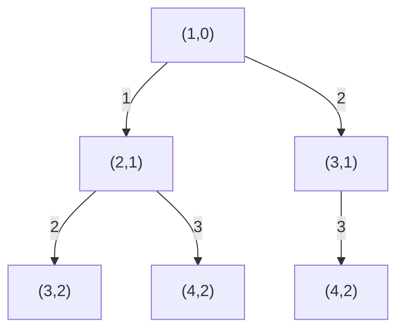
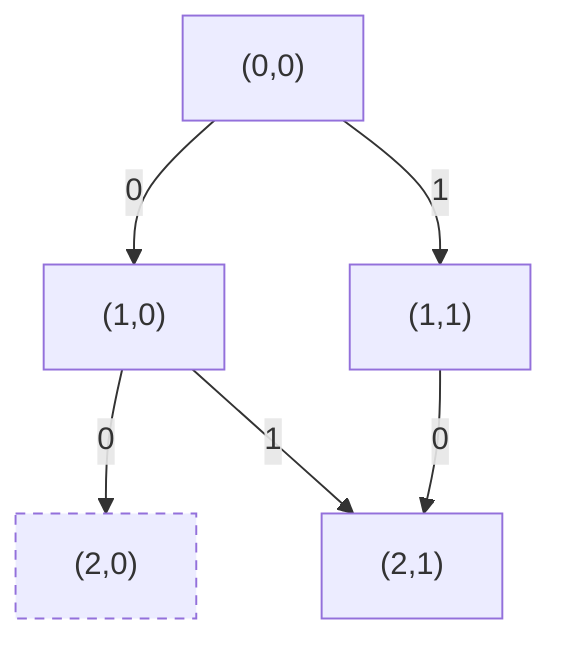

# T2 各乘一个

---

## 题意简化

---

输入长度 $n\le10^5$ 的整数数组 $a$ 和长度 $1\le x\le10$ 的整数数组 $b$；可含负数。必须从 $a$ 中恰好选 $x$ 个递增下标 $i_1<\cdots<i_x$，依次与固定顺序的 $b_1,\ldots,b_x$ 配对，最大化 $\sum_{j=1}^x a_{i_j}b_j$ 并输出。

## 问题拆分

---

1. 依次处理 $a$ 的位置，决定选或不选，并记录已选个数。
2. 选第 $j$ 个位置时只与 $b_j$ 相乘；同一“已看位置、已选个数”可合并历史。
3. 只接受恰好选满 $x$ 个的位置序列，取最大得分。

## 部分分（独立小规模及 $x=1$，共 40 分）：搜索下标组合

---

1. 读入两个数组，$O(n+x)$ 时间、空间。
2. 递归参数为下个可选位置与已选数量；第 $j$ 层枚举后续可选下标并加入 $a_i b_j$，剪掉剩余位置不足的分支。合法叶子数为 $\binom nx$，每条路径最多 $x$ 层。
3. 选满 $x$ 个时以 $O(1)$ 更新答案；负数可能使答案为负，所以初值为负无穷。

时间保守上界 $O(x\binom nx)$，递归空间 $O(x)$，输入数组占 $O(n+x)$；$n\le20$ 足够。$x=1$ 时只有 $n$ 个合法叶子，时间退化为 $O(n)$，所以这份代码也通过独立的 $x=1$ 档。

### 组合搜索树

例子取 $n=3,x=2$。状态 $(start,j)$ 表示下一次最小可选下标与已经选的数量；同为 $(4,2)$ 的两个节点来自不同下标组合，不能在搜索树中合并。

**左上角图例**：边号 $i=$ 本次选中的 $a_i$；条件：$i\ge start$ 且剩余位置足以选满；代价：占用一个选择名额；价值：$a_i b_{j+1}$。



**叶子**：$j=x$ 合法，返回累计分数；剩余位置不足以选满时剪枝，不展开非法边。每条合法路径代表一组递增下标。

### 参考代码

```cpp
#include<bits/stdc++.h>
using namespace std;

const long long NEG = -(1LL << 60);
int n,x,b[15];
int a[100010];
long long ans = NEG;

void dfs(int start,int chosen,long long sum){
	if(chosen == x){
		ans = max(ans,sum);
		return;
	}
	int last = n - (x - chosen) + 1;
	for(int i = start; i <= last; i++){
		dfs(i + 1,chosen + 1,sum + 1LL * a[i] * b[chosen + 1]);
	}
}

int main(){
	ios::sync_with_stdio(false);
	cin.tie(nullptr);
	cin >> n >> x;
	for(int i = 1; i <= n; i++) cin >> a[i];
	for(int j = 1; j <= x; j++) cin >> b[j];
	dfs(1,0,0);
	cout << ans << '\n';
	return 0;
}
```

## 满分做法：前缀选取动态规划

---

公开分档对应：1～2 点（$n\le20$，20 分）和 3～4 点（$x=1$，20 分）可用上面的组合搜索代码；当 $x=1$ 时只需枚举 $n$ 个位置。5～6 点（$x=2$）、7～8 点（$x=3$）及 9～10 点（一般）使用本节 $O(nx)$ DP。满分代码也覆盖前四点，负数与恰好选满的条件在所有档一致。

1. 把 $dp[0][0]$ 设为 $0$，其他状态为负无穷；初始化 $O(nx)$ 表空间。
2. 对 $i=1,\ldots,n$ 和 $j=0,\ldots,x$，比较跳过 $a_i$ 与从 $dp[i-1][j-1]$ 选中它；每状态 $O(1)$，共 $O(nx)$，得分用 `long long`。
3. 读 $dp[n][x]$，$O(1)$；不可达状态必须保持负无穷，不能让空选或未选满误入答案。

组合搜索在 $n\le20$ 时可行；把后续等价的前缀状态合并后，转移式为 $dp[i][j]=\max(dp[i-1][j],dp[i-1][j-1]+a_i b_j)$，不合法的第二项忽略。总时间 $O(nx)$、空间 $O(nx)$，最大约一百万状态。

### 选或跳过的搜索树

为推导状态，另看 $n=2,x=1$：状态 $(i,j)$ 是已看完 $i$ 个位置、已选 $j$ 个；两条历史都到 $(2,1)$，树中暂时分开。

**左上角图例**：$0=$ 跳过下一项；条件 $i<n$；代价 $0$，价值 $0$。$1=$ 选下一项；条件 $i<n,j<x$；代价一个名额，价值 $a_{i+1}b_{j+1}$。


**叶子**：$i=n,j=x$ 合法，返回累计分数；$i=n,j\ne x$ 非法（虚线节点），不能作答案。

### 合并后的 DP 状态图

与上面的选/跳搜索相同，但合并未来等价的 $(2,1)$；按 $i$ 递增，把较大已得分数保留给后续。

**左上角图例**：$0=$ 跳过下一项；条件 $i<n$；代价 $0$，价值 $0$。$1=$ 选下一项；条件 $i<n,j<x$；代价一个名额，价值 $a_{i+1}b_{j+1}$。



**叶子**：$i=n,j=x$ 合法，保留最大累计分数；$i=n,j\ne x$ 非法（虚线节点），保持负无穷。两条边到 $(2,1)$ 时取较大值。

### 参考代码

```cpp
#include<bits/stdc++.h>
using namespace std;

const long long NEG = -(1LL << 60);
long long dp[100005][11];
int a[100005], b[11];

int main(){
	ios::sync_with_stdio(false);
	cin.tie(nullptr);
	int n, x;
	cin >> n >> x;
	for(int i = 1; i <= n; i++){
		cin >> a[i];
	}
	for(int j = 1; j <= x; j++){
		cin >> b[j];
		dp[0][j] = NEG;
	}
	// dp[i][j]：前 i 个元素中恰好选 j 个，与 b 的前 j 项配对。
	for(int i = 1; i <= n; i++){
		dp[i][0] = 0;
		for(int j = 1; j <= x; j++){
			dp[i][j] = dp[i - 1][j];
			if(dp[i - 1][j - 1] != NEG){
				long long value = dp[i - 1][j - 1] + 1LL * a[i] * b[j];
				dp[i][j] = max(dp[i][j], value);
			}
		}
	}
	cout << dp[n][x] << '\n';
	return 0;
}
```

## 知识点总结

---

按顺序选定固定数量的位置时，把“处理到哪里、已选几个”作为状态；允许负数意味着空集不能代替不可达状态。
