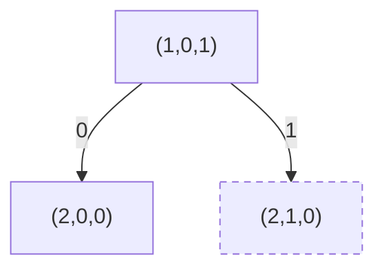
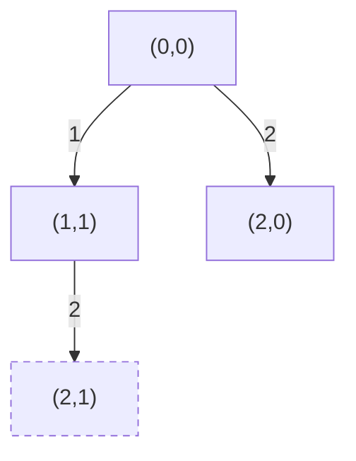
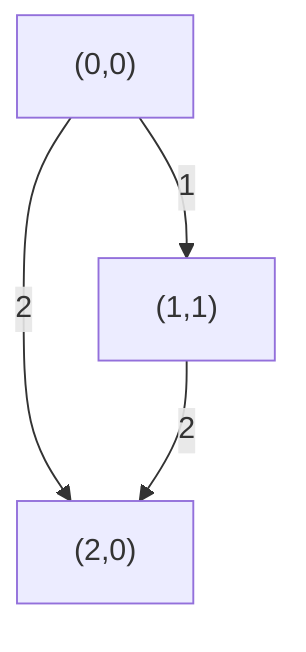

# T4 切割

---

## 题意简化

---

输入 $n,k\le400$ 和 $n$ 个不超过 $10^{18}$ 的正整数。每个原数可在内部相邻数位间切开，不能跨原数拼接，切出的前导零段按整数解释。要求所有段的数值和被 $k$ 整除，求最少切口；无解输出 $-1$。

## 问题拆分

---

1. 在每个原数内部决定下一段结束位，并计算该段模 $k$ 的贡献。
2. 沿原数顺序合并各段的余数与切口数；不在原数末尾结束的段产生一个切口。
3. 到全部数位结束时仅接受总余数为 $0$ 的方案。

## 部分分（累计 20/60 分）：逐数枚举切法再合并余数

---

1. 对每个 $d_i$ 位原数枚举 $2^{d_i-1}$ 个内部切口掩码；每个掩码扫描 $d_i$ 位，计算段和余数与切口数，保留各余数最小切口。第 $i$ 个数成本 $O(d_i2^{d_i-1})$。
2. 将已处理原数的 $k$ 种余数与当前数的 $k$ 种余数组合，每数至多 $k^2$ 次 $O(1)$，得到新的最小切口表。
3. 处理完 $n$ 个数后读取余数 $0$，不可达输出 $-1$。

总时间 $O(\sum_i d_i2^{d_i-1}+nk^2)$、空间 $O(k+D)$。第二档 $d_i\le6$；首档虽可有 19 位数，但 $n,k\le10$，需按实际运行量验证，不能只用位数上界断言。

### 切口搜索树

例子只含原数 $12$、$k=2$。从处理完第一位的状态 $(p,r,v)=(1,0,1)$ 出发，$r$ 是已结束段的和模 $k$，$v$ 是当前未结束段模 $k$；唯一间隙可切或不切。

**左上角图例**：$0=$ 不切；条件：同一原数内部；代价 $0$，价值：把下一位接在当前段。$1=$ 切；条件相同；代价 $1$，价值：当前段计入总余数并以下一位开新段。



**叶子**：末位也计入段和后，$r+v\equiv0\pmod k$ 为合法，返回切口数；否则非法（虚线节点），不能更新答案。

### 参考代码

```cpp
#include<bits/stdc++.h>
using namespace std;

const int INF = 1000000000;
int best[405], dp[405], nextDp[405];

int main(){
	ios::sync_with_stdio(false);
	cin.tie(nullptr);
	int n, k;
	cin >> n >> k;
	for(int r = 1; r < k; r++){
		dp[r] = INF;
	}
	for(int i = 1; i <= n; i++){
		string s;
		cin >> s;
		int length = (int)s.size();
		for(int r = 0; r < k; r++){
			best[r] = INF;
			nextDp[r] = INF;
		}
		// 每个相邻数位间隙选切或不切，统计该数字的全部切法。
		for(int mask = 0; mask < (1 << (length - 1)); mask++){
			int sum = 0, value = 0, cuts = 0;
			for(int j = 0; j < length; j++){
				value = (value * 10 + s[j] - '0') % k;
				if(j == length - 1 || (mask & (1 << j)) != 0){
					sum = (sum + value) % k;
					value = 0;
					if(j != length - 1){
						cuts++;
					}
				}
			}
			best[sum] = min(best[sum], cuts);
		}
		for(int r = 0; r < k; r++){
			if(dp[r] == INF){
				continue;
			}
			for(int t = 0; t < k; t++){
				if(best[t] != INF){
					int next = (r + t) % k;
					nextDp[next] = min(nextDp[next], dp[r] + best[t]);
				}
			}
		}
		for(int r = 0; r < k; r++){
			dp[r] = nextDp[r];
		}
	}
	if(dp[0] == INF){
		cout << -1 << '\n';
	}else{
		cout << dp[0] << '\n';
	}
	return 0;
}
```

## 满分做法：数位位置与余数动态规划

---

原有累计前 20 分满足 $n,k\le10$；前 60 分中的新增 40 分满足 $n,k\le100,a_i\le10^5$。下方单数切法枚举在这两个子域可用；一般 40 分用本 DP。

1. 将每个数转为十进制数位并记录原数末尾，总位数 $D\le7600$，耗时、空间 $O(D)$。
2. 令 $dp[p][r]$ 为前 $p$ 位已完整分段、段和模 $k$ 为 $r$ 的最少切口；从每个可达状态枚举本原数内下一段末位，逐位更新段值模 $k$。每个起点最多 $19$ 个末位，状态至多 $Dk$，每条边 $O(1)$。
3. 段未结束于原数末尾则代价加一；保留同一 $(p,r)$ 的较小代价，最后读取 $dp[D][0]$，不可达输出 $-1$。

直接给所有内部间隙选切/不切最多有 $2^G$ 种方案，$G\le18n$。合并同一前缀与余数后，时间 $O(19Dk)$、空间 $O(Dk)$，最大约三百万状态。

### 按下一段结束位搜索

例子只含原数 $12$、$k=2$；$(p,r)$ 为已经完整分段的前缀位数与段和余数。第一个段可停在第 $1$ 位或第 $2$ 位。

**左上角图例**：边号 $j=$ 下一段末位；条件：$p+1..j$ 不跨原数；代价：$j$ 非原数末位时为 $1$，否则为 $0$；贡献：该段数值模 $k$。



**叶子**：$p=D,r=0$ 合法，返回切口数；$p=D,r\ne0$ 非法（虚线节点），返回不可行。不同选择历史在较大实例里会得到同一 $(p,r)$。

### 合并后的 DP 状态图

例子改为原数 $12$、$k=3$，两种切法均到 $(2,0)$。$(p,r)$ 为已完成前缀位数与段和余数；从起点向后更新，合流时保留较少切口。

**左上角图例**：边号 $j=$ 下一段末位；条件：$p+1..j$ 不跨原数；代价：$j$ 非原数末位时为 $1$，否则为 $0$；贡献：该段数值模 $k$。



**叶子**：$p=D,r=0$ 合法，保留最少切口；$p=D,r\ne0$ 不作答案。图例中没有失败余数，不额外制造非法节点。

### 参考代码

```cpp
#include<bits/stdc++.h>
using namespace std;

const int INF = 1000000000;
int dp[8005][405], rightEnd[8005];

int main(){
	ios::sync_with_stdio(false);
	cin.tie(nullptr);
	int n, k;
	cin >> n >> k;
	string s = " ";
	for(int i = 1; i <= n; i++){
		string t;
		cin >> t;
		int start = (int)s.size();
		s += t;
		int finish = (int)s.size() - 1;
		for(int j = start; j <= finish; j++){
			rightEnd[j] = finish;
		}
	}
	int length = (int)s.size() - 1;
	for(int i = 0; i <= length; i++){
		for(int r = 0; r < k; r++){
			dp[i][r] = INF;
		}
	}
	dp[0][0] = 0;
	// dp[i][r]：前 i 位已分段完成，数字和模 k 为 r 的最少切割数。
	for(int i = 0; i < length; i++){
		int value = 0;
		for(int j = i + 1; j <= rightEnd[i + 1]; j++){
			value = (value * 10 + s[j] - '0') % k;
			int cost = 0;
			if(j < rightEnd[i + 1]){
				cost = 1;
			}
			for(int r = 0; r < k; r++){
				if(dp[i][r] == INF){
					continue;
				}
				int next = (r + value) % k;
				dp[j][next] = min(dp[j][next], dp[i][r] + cost);
			}
		}
	}
	if(dp[length][0] == INF){
		cout << -1 << '\n';
	}else{
		cout << dp[length][0] << '\n';
	}
	return 0;
}
```

## 知识点总结

---

分割字符串并要求合并后的余数时，可把“已完成前缀、累计余数”作为状态，枚举下一段结束点并按段贡献转移。
