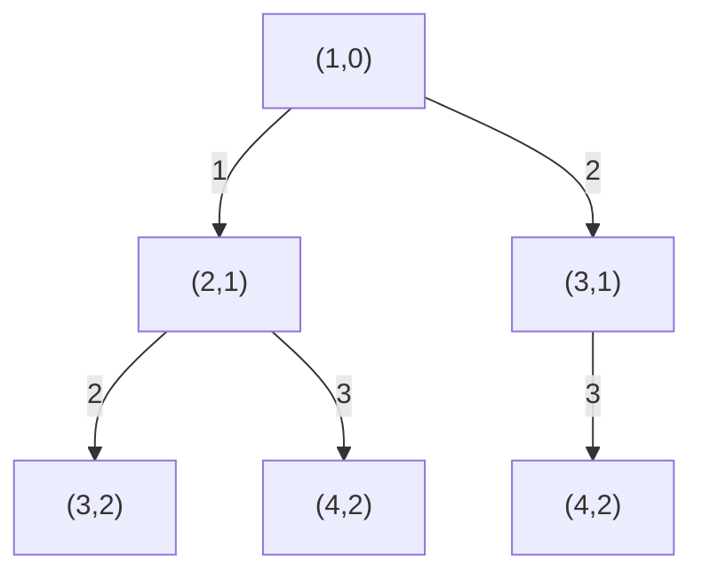
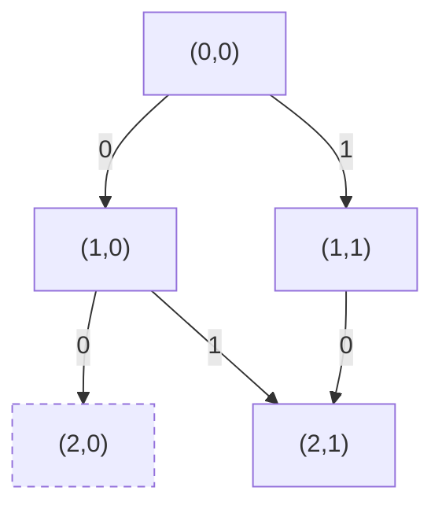
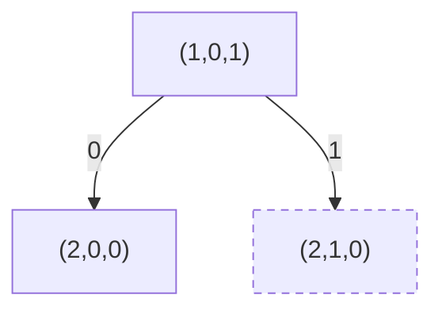
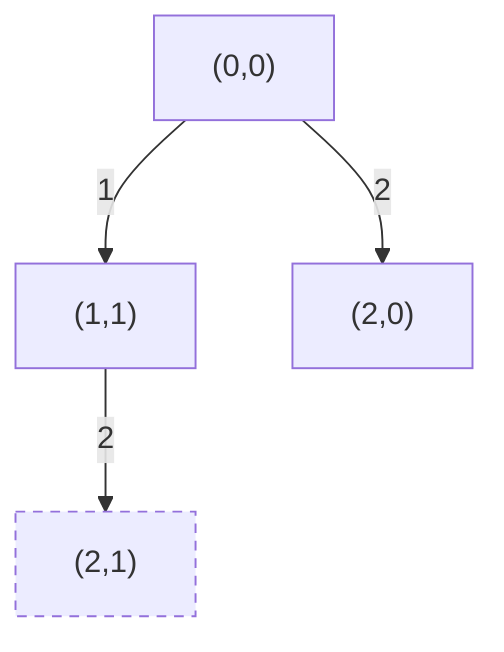
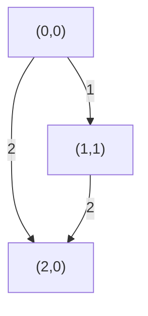

# T1 最多求余

---

## 题意简化

---

输入 $n\le10^4$ 个正整数 $a_i$ 和模数 $k\le10^5$。把每个数变为 $a_i\bmod k$，在余数 $0,1,\ldots,k-1$ 中找出现次数最多者；并列选最小余数，输出这个余数。

## 问题拆分

---

1. 逐个求余并统计每种余数的次数。
2. 从小到大检查余数，按最多次数及并列规则选答案。

## 满分做法：余数计数数组

---

原有“余数全同”20 分、“出现次数互异”再 40 分，以及一般数据再 40 分，都由计数数组处理，无须针对性质另写程序。

1. 建长度为 $k$ 的计数数组，扫描 $n$ 个数并各求余、加一，$n$ 次 $O(1)$。
2. 从 $0$ 到 $k-1$ 扫描 $k$ 次，只有发现严格更大的次数才更新答案；同次数保留先遇到的较小余数。

总时间 $O(n+k)$、空间 $O(k)$；$k=1$ 时唯一余数为 $0$。

### 参考代码

```cpp
#include<bits/stdc++.h>
using namespace std;

int cnt[100005];

int main(){
	ios::sync_with_stdio(false);
	cin.tie(nullptr);
	int n, k;
	cin >> n >> k;
	for(int i = 1; i <= n; i++){
		int x;
		cin >> x;
		cnt[x % k]++;
	}
	int ans = 0;
	// 从小到大扫描；只有次数严格更多时才更新。
	for(int r = 1; r < k; r++){
		if(cnt[r] > cnt[ans]){
			ans = r;
		}
	}
	cout << ans << '\n';
	return 0;
}
```

## 知识点总结

---

值域可直接开数组时，频次统计加升序扫描自然解决“最大频次、最小编号”的并列规则。

# T2 各乘一个

---

## 题意简化

---

输入长度 $n\le10^5$ 的整数数组 $a$ 和长度 $1\le x\le10$ 的整数数组 $b$；可含负数。必须从 $a$ 中恰好选 $x$ 个递增下标 $i_1<\cdots<i_x$，依次与固定顺序的 $b_1,\ldots,b_x$ 配对，最大化 $\sum_{j=1}^x a_{i_j}b_j$ 并输出。

## 问题拆分

---

1. 依次处理 $a$ 的位置，决定选或不选，并记录已选个数。
2. 选第 $j$ 个位置时只与 $b_j$ 相乘；同一“已看位置、已选个数”可合并历史。
3. 只接受恰好选满 $x$ 个的位置序列，取最大得分。

## 部分分（独立小规模及 $x=1$，共 40 分）：搜索下标组合

---

1. 读入两个数组，$O(n+x)$ 时间、空间。
2. 递归参数为下个可选位置与已选数量；第 $j$ 层枚举后续可选下标并加入 $a_i b_j$，剪掉剩余位置不足的分支。合法叶子数为 $\binom nx$，每条路径最多 $x$ 层。
3. 选满 $x$ 个时以 $O(1)$ 更新答案；负数可能使答案为负，所以初值为负无穷。

时间保守上界 $O(x\binom nx)$，递归空间 $O(x)$，输入数组占 $O(n+x)$；$n\le20$ 足够。$x=1$ 时只有 $n$ 个合法叶子，时间退化为 $O(n)$，所以这份代码也通过独立的 $x=1$ 档。

### 组合搜索树

例子取 $n=3,x=2$。状态 $(start,j)$ 表示下一次最小可选下标与已经选的数量；同为 $(4,2)$ 的两个节点来自不同下标组合，不能在搜索树中合并。

**左上角图例**：边号 $i=$ 本次选中的 $a_i$；条件：$i\ge start$ 且剩余位置足以选满；代价：占用一个选择名额；价值：$a_i b_{j+1}$。



**叶子**：$j=x$ 合法，返回累计分数；剩余位置不足以选满时剪枝，不展开非法边。每条合法路径代表一组递增下标。

### 参考代码

```cpp
#include<bits/stdc++.h>
using namespace std;

const long long NEG = -(1LL << 60);
int n,x,b[15];
int a[100010];
long long ans = NEG;

void dfs(int start,int chosen,long long sum){
	if(chosen == x){
		ans = max(ans,sum);
		return;
	}
	int last = n - (x - chosen) + 1;
	for(int i = start; i <= last; i++){
		dfs(i + 1,chosen + 1,sum + 1LL * a[i] * b[chosen + 1]);
	}
}

int main(){
	ios::sync_with_stdio(false);
	cin.tie(nullptr);
	cin >> n >> x;
	for(int i = 1; i <= n; i++) cin >> a[i];
	for(int j = 1; j <= x; j++) cin >> b[j];
	dfs(1,0,0);
	cout << ans << '\n';
	return 0;
}
```

## 满分做法：前缀选取动态规划

---

公开分档对应：1～2 点（$n\le20$，20 分）和 3～4 点（$x=1$，20 分）可用上面的组合搜索代码；当 $x=1$ 时只需枚举 $n$ 个位置。5～6 点（$x=2$）、7～8 点（$x=3$）及 9～10 点（一般）使用本节 $O(nx)$ DP。满分代码也覆盖前四点，负数与恰好选满的条件在所有档一致。

1. 把 $dp[0][0]$ 设为 $0$，其他状态为负无穷；初始化 $O(nx)$ 表空间。
2. 对 $i=1,\ldots,n$ 和 $j=0,\ldots,x$，比较跳过 $a_i$ 与从 $dp[i-1][j-1]$ 选中它；每状态 $O(1)$，共 $O(nx)$，得分用 `long long`。
3. 读 $dp[n][x]$，$O(1)$；不可达状态必须保持负无穷，不能让空选或未选满误入答案。

组合搜索在 $n\le20$ 时可行；把后续等价的前缀状态合并后，转移式为 $dp[i][j]=\max(dp[i-1][j],dp[i-1][j-1]+a_i b_j)$，不合法的第二项忽略。总时间 $O(nx)$、空间 $O(nx)$，最大约一百万状态。

### 选或跳过的搜索树

为推导状态，另看 $n=2,x=1$：状态 $(i,j)$ 是已看完 $i$ 个位置、已选 $j$ 个；两条历史都到 $(2,1)$，树中暂时分开。

**左上角图例**：$0=$ 跳过下一项；条件 $i<n$；代价 $0$，价值 $0$。$1=$ 选下一项；条件 $i<n,j<x$；代价一个名额，价值 $a_{i+1}b_{j+1}$。


**叶子**：$i=n,j=x$ 合法，返回累计分数；$i=n,j\ne x$ 非法（虚线节点），不能作答案。

### 合并后的 DP 状态图

与上面的选/跳搜索相同，但合并未来等价的 $(2,1)$；按 $i$ 递增，把较大已得分数保留给后续。

**左上角图例**：$0=$ 跳过下一项；条件 $i<n$；代价 $0$，价值 $0$。$1=$ 选下一项；条件 $i<n,j<x$；代价一个名额，价值 $a_{i+1}b_{j+1}$。



**叶子**：$i=n,j=x$ 合法，保留最大累计分数；$i=n,j\ne x$ 非法（虚线节点），保持负无穷。两条边到 $(2,1)$ 时取较大值。

### 参考代码

```cpp
#include<bits/stdc++.h>
using namespace std;

const long long NEG = -(1LL << 60);
long long dp[100005][11];
int a[100005], b[11];

int main(){
	ios::sync_with_stdio(false);
	cin.tie(nullptr);
	int n, x;
	cin >> n >> x;
	for(int i = 1; i <= n; i++){
		cin >> a[i];
	}
	for(int j = 1; j <= x; j++){
		cin >> b[j];
		dp[0][j] = NEG;
	}
	// dp[i][j]：前 i 个元素中恰好选 j 个，与 b 的前 j 项配对。
	for(int i = 1; i <= n; i++){
		dp[i][0] = 0;
		for(int j = 1; j <= x; j++){
			dp[i][j] = dp[i - 1][j];
			if(dp[i - 1][j - 1] != NEG){
				long long value = dp[i - 1][j - 1] + 1LL * a[i] * b[j];
				dp[i][j] = max(dp[i][j], value);
			}
		}
	}
	cout << dp[n][x] << '\n';
	return 0;
}
```

## 知识点总结

---

按顺序选定固定数量的位置时，把“处理到哪里、已选几个”作为状态；允许负数意味着空集不能代替不可达状态。

# T3 三元组

---

## 题意简化

---

输入 $n\le10^5$ 个三元组 $(a_i,b_i,c_i)$，三者为不超过 $10^9$ 的正整数。对每个 $i\le j$，若 $2\min(a_i+a_j,b_i+b_j)\le\max(a_i+a_j,b_i+b_j)$，累加 $c_ic_j$；允许 $i=j$，每个无序下标对只计一次。输出总和模 $10^9+7$。

## 问题拆分

---

1. 把好对条件拆成两种互斥的“单点键之和不大于零”。
2. 对每种键，统计满足阈值的 $i\le j$ 的权值乘积和。
3. 把两种情况相加并取模。

## 部分分（累计 20/40 分，$n\le1000$）：枚举下标对

---

1. 读入 $n$ 个三元组，$O(n)$ 时间、空间。
2. 枚举全部 $i\le j$，共 $n(n+1)/2$ 对；每对用 $O(1)$ 计算两个坐标和并判断条件。
3. 合法对加入 $c_ic_j$ 并取模，每对 $O(1)$。

总时间 $O(n^2)$、空间 $O(n)$，$n=1000$ 约五十万对。

### 参考代码

```cpp
#include<bits/stdc++.h>
using namespace std;

const long long MOD = 1000000007;
long long a[100005], b[100005], c[100005];

int main(){
	ios::sync_with_stdio(false);
	cin.tie(nullptr);
	int n;
	cin >> n;
	for(int i = 1; i <= n; i++){
		cin >> a[i] >> b[i] >> c[i];
	}
	long long ans = 0;
	for(int i = 1; i <= n; i++){
		// j 从 i 开始：允许选择同一个三元组两次。
		for(int j = i; j <= n; j++){
			long long x = a[i] + a[j];
			long long y = b[i] + b[j];
			if(2 * min(x, y) <= max(x, y)){
				ans = (ans + c[i] * c[j]) % MOD;
			}
		}
	}
	cout << ans << '\n';
	return 0;
}
```

## 满分做法：排序、前缀和与双指针

---

累计前 20 分（$n\le1000$ 且总值较小）与前 40 分（$n\le1000$）均可用下方两重枚举，后者必须取模；其余 60 分使用排序与双指针。

1. 分别构造键 $2a_i-b_i$ 与 $2b_i-a_i$；两遍各 $O(n)$，键用 `long long`。两种不等式不能同时成立，因为原始两坐标和均为正。
2. 每种键排序 $O(n\log n)$，计算权值前缀和 $O(n)$；固定左端 $l$，右端 $r$ 单调左移，求满足键和非正的右侧权值和，共 $O(n)$ 次移动。
3. 把 $c_l$ 乘以区间权值和并累计，含 $l=r$ 的自对，每种键 $O(n)$；最终两种和相加取模，$O(1)$。

总时间 $O(n\log n)$、空间 $O(n)$。排序后只计 $l\le r$，每个无序下标对恰好一次；两类条件互斥，不会重计。

### 参考代码

```cpp
#include<bits/stdc++.h>
using namespace std;

const long long MOD = 1000000007;
struct Node {
	long long key, weight;
};
Node p[100005];
long long a[100005], b[100005], c[100005], prefix[100005];
int n;

bool cmp(const Node &u, const Node &v){
	return u.key < v.key;
}

long long calc(){
	sort(p + 1, p + n + 1, cmp);
	prefix[0] = 0;
	for(int i = 1; i <= n; i++){
		prefix[i] = (prefix[i - 1] + p[i].weight) % MOD;
	}
	long long result = 0;
	int r = n;
	for(int l = 1; l <= n; l++){
		while(r >= l && p[l].key + p[r].key > 0){
			r--;
		}
		if(r < l){
			break;
		}
		// 区间 [l,r] 包含自身，恰好统计一次无序点对。
		long long sum = (prefix[r] - prefix[l - 1] + MOD) % MOD;
		result = (result + p[l].weight * sum) % MOD;
	}
	return result;
}

int main(){
	ios::sync_with_stdio(false);
	cin.tie(nullptr);
	cin >> n;
	for(int i = 1; i <= n; i++){
		cin >> a[i] >> b[i] >> c[i];
		p[i].key = 2 * a[i] - b[i];
		p[i].weight = c[i];
	}
	long long ans = calc();
	for(int i = 1; i <= n; i++){
		p[i].key = 2 * b[i] - a[i];
		p[i].weight = c[i];
	}
	ans = (ans + calc()) % MOD;
	cout << ans << '\n';
	return 0;
}
```

## 知识点总结

---

若成对条件能写成两键之和的阈值，排序后用移动端点求合法区间，并用前缀和汇总带权贡献。

# T4 切割

---

## 题意简化

---

输入 $n,k\le400$ 和 $n$ 个不超过 $10^{18}$ 的正整数。每个原数可在内部相邻数位间切开，不能跨原数拼接，切出的前导零段按整数解释。要求所有段的数值和被 $k$ 整除，求最少切口；无解输出 $-1$。

## 问题拆分

---

1. 在每个原数内部决定下一段结束位，并计算该段模 $k$ 的贡献。
2. 沿原数顺序合并各段的余数与切口数；不在原数末尾结束的段产生一个切口。
3. 到全部数位结束时仅接受总余数为 $0$ 的方案。

## 部分分（累计 20/60 分）：逐数枚举切法再合并余数

---

1. 对每个 $d_i$ 位原数枚举 $2^{d_i-1}$ 个内部切口掩码；每个掩码扫描 $d_i$ 位，计算段和余数与切口数，保留各余数最小切口。第 $i$ 个数成本 $O(d_i2^{d_i-1})$。
2. 将已处理原数的 $k$ 种余数与当前数的 $k$ 种余数组合，每数至多 $k^2$ 次 $O(1)$，得到新的最小切口表。
3. 处理完 $n$ 个数后读取余数 $0$，不可达输出 $-1$。

总时间 $O(\sum_i d_i2^{d_i-1}+nk^2)$、空间 $O(k+D)$。第二档 $d_i\le6$；首档虽可有 19 位数，但 $n,k\le10$，需按实际运行量验证，不能只用位数上界断言。

### 切口搜索树

例子只含原数 $12$、$k=2$。从处理完第一位的状态 $(p,r,v)=(1,0,1)$ 出发，$r$ 是已结束段的和模 $k$，$v$ 是当前未结束段模 $k$；唯一间隙可切或不切。

**左上角图例**：$0=$ 不切；条件：同一原数内部；代价 $0$，价值：把下一位接在当前段。$1=$ 切；条件相同；代价 $1$，价值：当前段计入总余数并以下一位开新段。



**叶子**：末位也计入段和后，$r+v\equiv0\pmod k$ 为合法，返回切口数；否则非法（虚线节点），不能更新答案。

### 参考代码

```cpp
#include<bits/stdc++.h>
using namespace std;

const int INF = 1000000000;
int best[405], dp[405], nextDp[405];

int main(){
	ios::sync_with_stdio(false);
	cin.tie(nullptr);
	int n, k;
	cin >> n >> k;
	for(int r = 1; r < k; r++){
		dp[r] = INF;
	}
	for(int i = 1; i <= n; i++){
		string s;
		cin >> s;
		int length = (int)s.size();
		for(int r = 0; r < k; r++){
			best[r] = INF;
			nextDp[r] = INF;
		}
		// 每个相邻数位间隙选切或不切，统计该数字的全部切法。
		for(int mask = 0; mask < (1 << (length - 1)); mask++){
			int sum = 0, value = 0, cuts = 0;
			for(int j = 0; j < length; j++){
				value = (value * 10 + s[j] - '0') % k;
				if(j == length - 1 || (mask & (1 << j)) != 0){
					sum = (sum + value) % k;
					value = 0;
					if(j != length - 1){
						cuts++;
					}
				}
			}
			best[sum] = min(best[sum], cuts);
		}
		for(int r = 0; r < k; r++){
			if(dp[r] == INF){
				continue;
			}
			for(int t = 0; t < k; t++){
				if(best[t] != INF){
					int next = (r + t) % k;
					nextDp[next] = min(nextDp[next], dp[r] + best[t]);
				}
			}
		}
		for(int r = 0; r < k; r++){
			dp[r] = nextDp[r];
		}
	}
	if(dp[0] == INF){
		cout << -1 << '\n';
	}else{
		cout << dp[0] << '\n';
	}
	return 0;
}
```

## 满分做法：数位位置与余数动态规划

---

原有累计前 20 分满足 $n,k\le10$；前 60 分中的新增 40 分满足 $n,k\le100,a_i\le10^5$。下方单数切法枚举在这两个子域可用；一般 40 分用本 DP。

1. 将每个数转为十进制数位并记录原数末尾，总位数 $D\le7600$，耗时、空间 $O(D)$。
2. 令 $dp[p][r]$ 为前 $p$ 位已完整分段、段和模 $k$ 为 $r$ 的最少切口；从每个可达状态枚举本原数内下一段末位，逐位更新段值模 $k$。每个起点最多 $19$ 个末位，状态至多 $Dk$，每条边 $O(1)$。
3. 段未结束于原数末尾则代价加一；保留同一 $(p,r)$ 的较小代价，最后读取 $dp[D][0]$，不可达输出 $-1$。

直接给所有内部间隙选切/不切最多有 $2^G$ 种方案，$G\le18n$。合并同一前缀与余数后，时间 $O(19Dk)$、空间 $O(Dk)$，最大约三百万状态。

### 按下一段结束位搜索

例子只含原数 $12$、$k=2$；$(p,r)$ 为已经完整分段的前缀位数与段和余数。第一个段可停在第 $1$ 位或第 $2$ 位。

**左上角图例**：边号 $j=$ 下一段末位；条件：$p+1..j$ 不跨原数；代价：$j$ 非原数末位时为 $1$，否则为 $0$；贡献：该段数值模 $k$。



**叶子**：$p=D,r=0$ 合法，返回切口数；$p=D,r\ne0$ 非法（虚线节点），返回不可行。不同选择历史在较大实例里会得到同一 $(p,r)$。

### 合并后的 DP 状态图

例子改为原数 $12$、$k=3$，两种切法均到 $(2,0)$。$(p,r)$ 为已完成前缀位数与段和余数；从起点向后更新，合流时保留较少切口。

**左上角图例**：边号 $j=$ 下一段末位；条件：$p+1..j$ 不跨原数；代价：$j$ 非原数末位时为 $1$，否则为 $0$；贡献：该段数值模 $k$。



**叶子**：$p=D,r=0$ 合法，保留最少切口；$p=D,r\ne0$ 不作答案。图例中没有失败余数，不额外制造非法节点。

### 参考代码

```cpp
#include<bits/stdc++.h>
using namespace std;

const int INF = 1000000000;
int dp[8005][405], rightEnd[8005];

int main(){
	ios::sync_with_stdio(false);
	cin.tie(nullptr);
	int n, k;
	cin >> n >> k;
	string s = " ";
	for(int i = 1; i <= n; i++){
		string t;
		cin >> t;
		int start = (int)s.size();
		s += t;
		int finish = (int)s.size() - 1;
		for(int j = start; j <= finish; j++){
			rightEnd[j] = finish;
		}
	}
	int length = (int)s.size() - 1;
	for(int i = 0; i <= length; i++){
		for(int r = 0; r < k; r++){
			dp[i][r] = INF;
		}
	}
	dp[0][0] = 0;
	// dp[i][r]：前 i 位已分段完成，数字和模 k 为 r 的最少切割数。
	for(int i = 0; i < length; i++){
		int value = 0;
		for(int j = i + 1; j <= rightEnd[i + 1]; j++){
			value = (value * 10 + s[j] - '0') % k;
			int cost = 0;
			if(j < rightEnd[i + 1]){
				cost = 1;
			}
			for(int r = 0; r < k; r++){
				if(dp[i][r] == INF){
					continue;
				}
				int next = (r + value) % k;
				dp[j][next] = min(dp[j][next], dp[i][r] + cost);
			}
		}
	}
	if(dp[length][0] == INF){
		cout << -1 << '\n';
	}else{
		cout << dp[length][0] << '\n';
	}
	return 0;
}
```

## 知识点总结

---

分割字符串并要求合并后的余数时，可把“已完成前缀、累计余数”作为状态，枚举下一段结束点并按段贡献转移。
