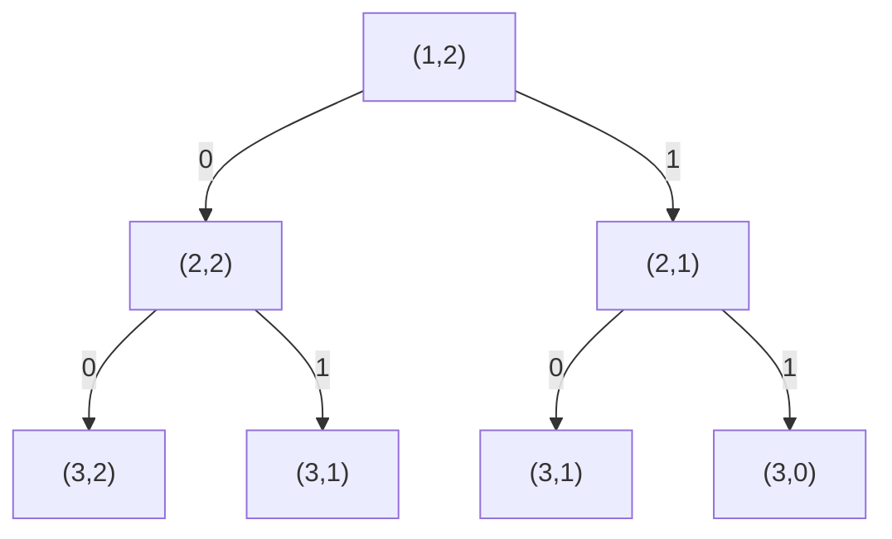
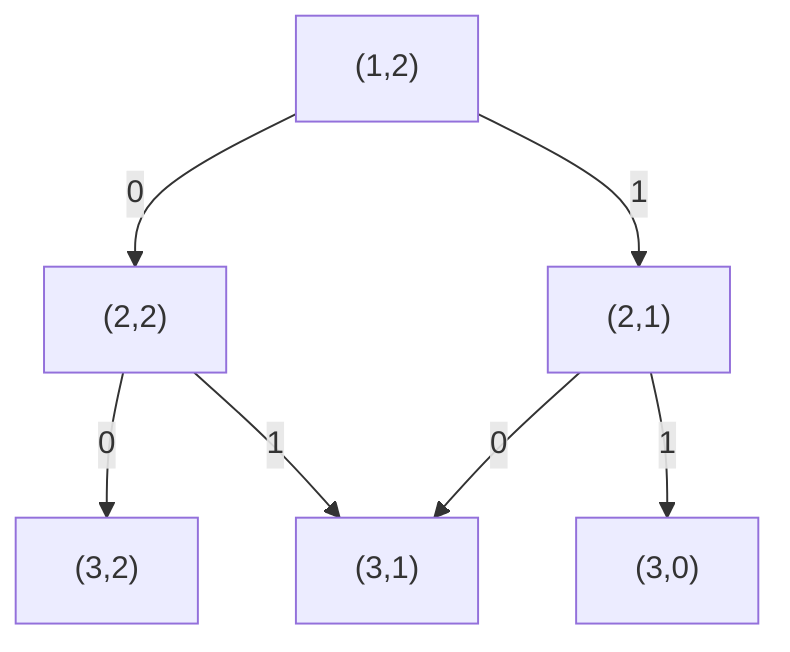

# T2 采购

---

## 题意简化

---

输入 $n\le1000$ 件商品、容量 $m\le3000$、每件扣费 $k\le3000$；第 $i$ 件体积 $w_i$、价值 $val_i$，二者均为不超过 $10^5$ 的正整数。每件至多选一次，总体积不超过 $m$，也可空选。求最大 $\sum(val_i-k)$ 并输出。

## 问题拆分

---

1. 把总收益拆成每件独立的 $val_i-k$，得到选择与不选择两种分支。
2. 在容量不超过 $m$ 的条件下组合各件选择，空集收益为 $0$。
3. 从所有可行容量中取最大收益。

## 部分分（独立 20 分，$n\le20$）：枚举子集

---

1. 读入商品到数组，$O(n)$ 时间、空间。
2. 对第 $i$ 件递归“不选/选”两支；用当前体积剪掉超容量支。至多 $2^{n+1}-1$ 个状态，每次 $O(1)$。
3. 合法叶子更新最大净收益，至多 $2^n$ 次、每次 $O(1)$，空集使答案至少为 $0$。

总时间 $O(2^n)$、递归空间 $O(n)$；$n=20$ 时约百万叶子。

### 搜索树

例子取 $n=2,m=2,w_1=w_2=1$。状态 $(i,c)$ 为下一件编号与剩余容量；树中重复的 $(3,1)$ 分开画，表示两种不同子集。

**左上角图例**：$0=$ 不选；条件：$i\le n$；代价 $0$，价值 $0$。$1=$ 选；条件：$i\le n,c\ge w_i$；代价 $w_i$，价值 $val_i-k$。



**叶子**：$i=n+1,c\ge0$ 合法，返回沿路净收益；容量不足的选择不产生边。所有叶子均合法，空集对应连续选择 $0$。

### 参考代码

```cpp
#include<bits/stdc++.h>
using namespace std;

int n,m,k;
int w[1010],value[1010];
long long ans;

void dfs(int i,int weight,long long gain){
	if(weight > m) return;
	if(i > n){
		ans = max(ans,gain);
		return;
	}
	dfs(i + 1,weight,gain);
	dfs(i + 1,weight + w[i],gain + value[i] - k);
}

int main(){
	ios::sync_with_stdio(false);
	cin.tie(nullptr);
	cin >> n >> m >> k;
	for(int i = 1; i <= n; i++) cin >> w[i] >> value[i];
	ans = 0;
	dfs(1,0,0);
	cout << ans << '\n';
	return 0;
}
```

## 满分做法：一维 0/1 背包

---

独立 $n\le20$ 档（20 分）由下方 DFS 覆盖；独立 $m\le300$ 档（30 分）和其余 50 分由一维背包覆盖。

1. 读入商品并计算每件净收益 $val_i-k$，共 $n$ 次 $O(1)$。
2. 维护一维容量数组 $dp[c]$。每件从 $m$ 降到 $w_i$ 更新一次，最多 $nm$ 次 $O(1)$；倒序使同件不能重复选择。
3. 所有容量初值为 $0$，表示可以不装满且可空选；处理完后读取 $dp[m]$，$O(1)$。

小规模可搜 $2^n$ 个子集；容量限制使状态只需当前容量。更新式为 $dp[c]\gets\max(dp[c],dp[c-w_i]+val_i-k)$，必须按容量倒序。总时间 $O(nm)$（至多三百万次更新），空间 $O(m)$。净收益可为负，直接跳过。

### DP 状态图

搜索树中的两条历史可到达相同的“下一件、剩余容量”，后续选择相同，因此合并。下图 $n=2,m=2,w_1=w_2=1$；箭头为决策方向，后向函数先求子状态，一维表按物品倒序容量更新。

**左上角图例**：$0=$ 不选；条件：$i\le n$；代价 $0$，价值 $0$。$1=$ 选；条件：$i\le n,c\ge w_i$；代价 $w_i$，价值 $val_i-k$。



**叶子**：$i=n+1,c\ge0$ 均合法，后续价值为 $0$；容量不足不产生边。两条边汇入 $(3,1)$，取较大净收益。

### 参考代码

```cpp
#include<bits/stdc++.h>
using namespace std;

int main(){
	ios::sync_with_stdio(false);
	cin.tie(nullptr);

	int n, m;
	long long k;
	cin >> n >> m >> k;
	vector<long long> dp(m + 1, 0);

	for(int i = 1; i <= n; i++){
		int w;
		long long value;
		cin >> w >> value;
		long long gain = value - k;
		for(int j = m; j >= w; j--){
			dp[j] = max(dp[j], dp[j - w] + gain);
		}
	}

	cout << *max_element(dp.begin(), dp.end()) << '\n';
	return 0;
}
```

## 知识点总结

---

目标中每取一件都减固定代价时，先并入单件收益；每件只可取一次的容量 DP 必须倒序更新。
