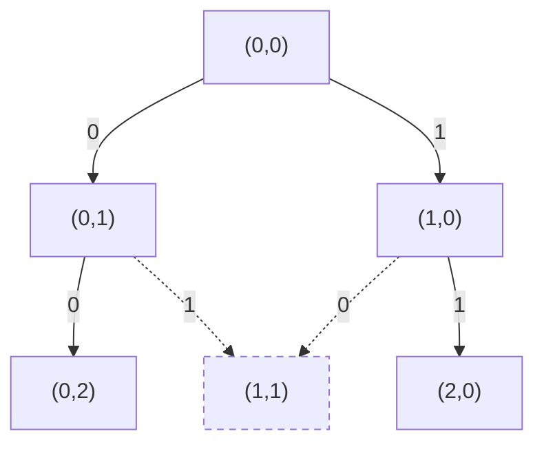

# T4 绿野仙踪（green）

---

## 题意简化

---

从 `green.in` 读入 $n$ 行、$m$ 列的网格（$2\le n,m\le1000$），坐标 $(x,y)$ 中 $x$ 为行、$y$ 为列。给定 $k\le1000$ 个花圃中心及起终点；统一正整数半径 $r$ 的花圃覆盖与中心行列距离都不超过 $r-1$ 的场内格子。被覆盖格不能走，起终点也不能被覆盖；只能四向走。求起终点仍连通时覆盖格并集的最大大小，若没有可行正半径输出 $0$ 至 `green.out`。

## 问题拆分

---

1. 给定 $r$，求所有正方形花圃覆盖格的并集大小。
2. 在未覆盖格上检查起点到终点四向连通，得到 $r$ 是否可行。
3. 利用半径增大只会增加障碍的单调性，找最大可行 $r$ 并输出该半径的覆盖数。

## 部分分（前 10 分：小网格）：逐半径涂色与 BFS

---

1. 给定半径 $r$，对每个中心裁剪正方形，逐行把覆盖区间涂为障碍；第 $i$ 个花圃耗时为其场内面积 $A_i$，一轮合计 $O(\sum_i A_i)$，重叠格重复涂色但只计一次。
2. 扫描 $nm$ 格统计并集，再从起点 BFS；每格最多入队一次、看四邻，耗时 $O(nm)$，队列与网格占 $O(nm)$。若端点被覆盖或终点不可达，则该半径失败。
3. 从 $r=1$ 递增检查，首次不可行便停止；可行半径构成前缀，至多试 $R=\max(n,m)$ 次，答案是最后一次可行的覆盖数。

总时间 $O(R(nm+\sum_i A_i))$，粗上界 $O(Rknm)$，空间 $O(nm+k)$。小网格 $n,m\le50,k\le10$ 时可行；大网格上的重复尝试和涂色成为瓶颈。

### 连通性搜索图

小例子为 $3$ 行 $3$ 列、半径 $1$，花圃中心 $(1,1)$，起点 $(0,0)$、终点 $(0,2)$。节点是格子坐标；队列从起点按四邻扩展，$(2,0)$ 的后续省略。

**左上角图例**：$0/1/2/3=$ 右/下/左/上；条件：在网格内且未访问、未覆盖；代价：走一步；价值：无，只判能否到达。虚线箭头示意被障碍禁止的尝试，不入队。



**叶子**：到达终点 $(0,2)$ 为合法，返回“可达”；被覆盖的 $(1,1)$ 为非法（虚线节点），不入队。若队列耗尽仍未到终点，则返回“不可达”。

### 参考代码

```cpp
#include<bits/stdc++.h>
using namespace std;

const int N = 1005;
int n,m,k,sx,sy,ex,ey;
int cx[1010],cy[1010],que[1000010];
unsigned char blocked[N][N];

bool check(int r,int &area){
	area = 0;
	for(int x = 0; x < n; x++) memset(blocked[x],0,m);
	for(int i = 0; i < k; i++){
		int x1 = max(0,cx[i] - r + 1);
		int x2 = min(n - 1,cx[i] + r - 1);
		int y1 = max(0,cy[i] - r + 1);
		int y2 = min(m - 1,cy[i] + r - 1);
		for(int x = x1; x <= x2; x++){
			memset(blocked[x] + y1,1,y2 - y1 + 1);
		}
	}
	for(int x = 0; x < n; x++){
		for(int y = 0; y < m; y++) area += blocked[x][y] != 0;
	}
	if(blocked[sx][sy] || blocked[ex][ey]) return false;
	int head = 0,tail = 0;
	que[tail++] = sx * m + sy;
	blocked[sx][sy] = 2;
	const int dx[4] = {1,-1,0,0};
	const int dy[4] = {0,0,1,-1};
	while(head < tail){
		int id = que[head++];
		int x = id / m;
		int y = id % m;
		if(x == ex && y == ey) return true;
		for(int d = 0; d < 4; d++){
			int nx = x + dx[d];
			int ny = y + dy[d];
			if(nx < 0 || nx >= n || ny < 0 || ny >= m) continue;
			if(blocked[nx][ny]) continue;
			blocked[nx][ny] = 2;
			que[tail++] = nx * m + ny;
		}
	}
	return false;
}

int main(){
	freopen("green.in","r",stdin);
	freopen("green.out","w",stdout);
	ios::sync_with_stdio(false);
	cin.tie(nullptr);
	cin >> n >> m >> k;
	cin >> sx >> sy >> ex >> ey;
	for(int i = 0; i < k; i++) cin >> cx[i] >> cy[i];
	int answer = 0;
	for(int r = 1; r <= max(n,m); r++){
		int area;
		if(!check(r,area)) break;
		answer = area;
	}
	cout << answer << '\n';
	return 0;
}
```

## 满分做法：二维差分、BFS 与二分

---

小网格组先用下面的逐半径枚举程序；其余少中心、相邻端点、对角端点及一般档由二分与二维差分程序覆盖。相邻/对角位置不改变四向连通的定义。

1. 对 $k$ 个中心各做四次二维差分更新，$O(k)$；对 $nm$ 格做二维前缀还原并统计覆盖数，$O(nm)$。
2. 若起点或终点被覆盖则失败；否则对空格 BFS，每格至多入队一次、检查四邻，$O(nm)$ 时间和队列空间。
3. 在 $0$ 到 $\max(n,m)$ 二分最后可行半径，共 $O(\log\max(n,m))$ 次判定；最后重算一次覆盖数。半径 $0$ 只作二分哨兵，答案仍要求正半径。

每次判定 $O(nm+k)$，总时间 $O((nm+k)\log\max(n,m))$、空间 $O(nm+k)$。若 $r=1$ 不可行，最终答案为 $0$。坐标与矩形裁剪始终按行、列顺序处理。

### 参考代码

```cpp
#include<bits/stdc++.h>
using namespace std;

int n,m,k,sx,sy,ex,ey;
const int MAXC = 1002010;
pair<int,int> center[1010];
int diff[MAXC],que[MAXC];
unsigned char blocked[MAXC],vis[MAXC];

void addRect(int x1,int y1,int x2,int y2){
	int w = m + 1;
	diff[x1 * w + y1]++;
	diff[(x2 + 1) * w + y1]--;
	diff[x1 * w + y2 + 1]--;
	diff[(x2 + 1) * w + y2 + 1]++;
}

bool check(int r,int &area){
	area = 0;
	if(r == 0) return true;
	fill(diff,diff + (n + 1) * (m + 1),0);
	fill(blocked,blocked + n * m,0);
	fill(vis,vis + n * m,0);
	for(int i = 0; i < k; i++){
		int x = center[i].first;
		int y = center[i].second;
		addRect(max(0,x - r + 1),max(0,y - r + 1),
			min(n - 1,x + r - 1),min(m - 1,y + r - 1));
	}
	for(int x = 0; x < n; x++){
		for(int y = 0; y < m; y++){
			int id = x * (m + 1) + y;
			if(x > 0) diff[id] += diff[(x - 1) * (m + 1) + y];
			if(y > 0) diff[id] += diff[id - 1];
			if(x > 0 && y > 0) diff[id] -= diff[(x - 1) * (m + 1) + y - 1];
			if(diff[id] > 0){
				blocked[x * m + y] = 1;
				area++;
			}
		}
	}
	int start = sx * m + sy;
	int goal = ex * m + ey;
	if(blocked[start] || blocked[goal]) return false;
	int head = 0,tail = 0;
	que[tail++] = start;
	vis[start] = 1;
	const int dx[4] = {1,-1,0,0};
	const int dy[4] = {0,0,1,-1};
	while(head < tail){
		int id = que[head++];
		if(id == goal) return true;
		int x = id / m;
		int y = id % m;
		for(int d = 0; d < 4; d++){
			int nx = x + dx[d];
			int ny = y + dy[d];
			if(nx < 0 || nx >= n || ny < 0 || ny >= m) continue;
			int next = nx * m + ny;
			if(blocked[next] || vis[next]) continue;
			vis[next] = 1;
			que[tail++] = next;
		}
	}
	return false;
}

int main(){
	freopen("green.in","r",stdin);
	freopen("green.out","w",stdout);
	ios::sync_with_stdio(false);
	cin.tie(nullptr);
	cin >> n >> m >> k;
	cin >> sx >> sy >> ex >> ey;
	for(int i = 0; i < k; i++) cin >> center[i].first >> center[i].second;
	int l = 0,r = max(n,m) + 1;
	while(l + 1 < r){
		int mid = (l + r) / 2;
		int area;
		if(check(mid,area)) l = mid;
		else r = mid;
	}
	int area;
	check(l,area);
	cout << area << '\n';
	return 0;
}
```

## 知识点总结

---

障碍随参数单调增多时，先建立完整可行性判定，再用二分寻找最后一个可行参数；矩形并集用差分避免逐中心涂色。
