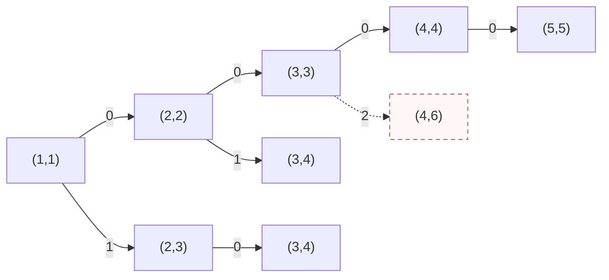
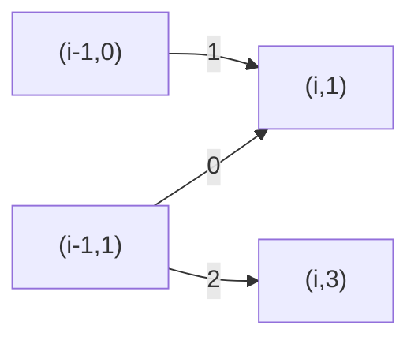
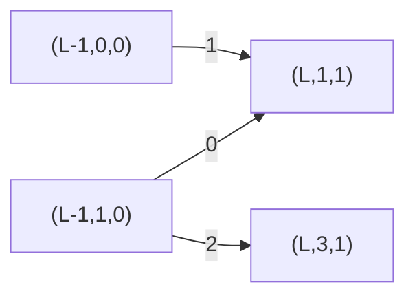
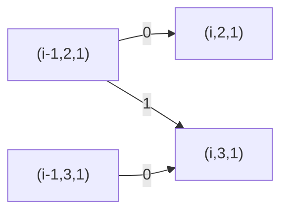
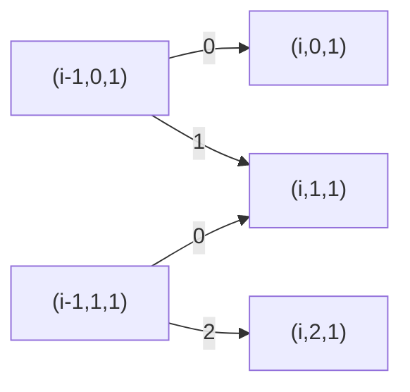
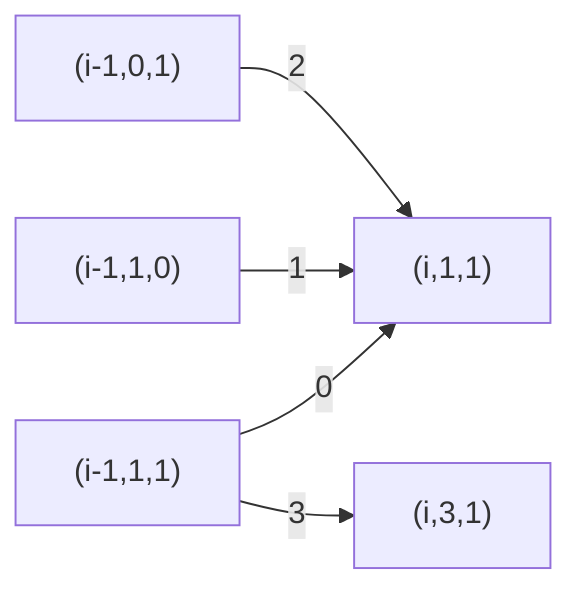
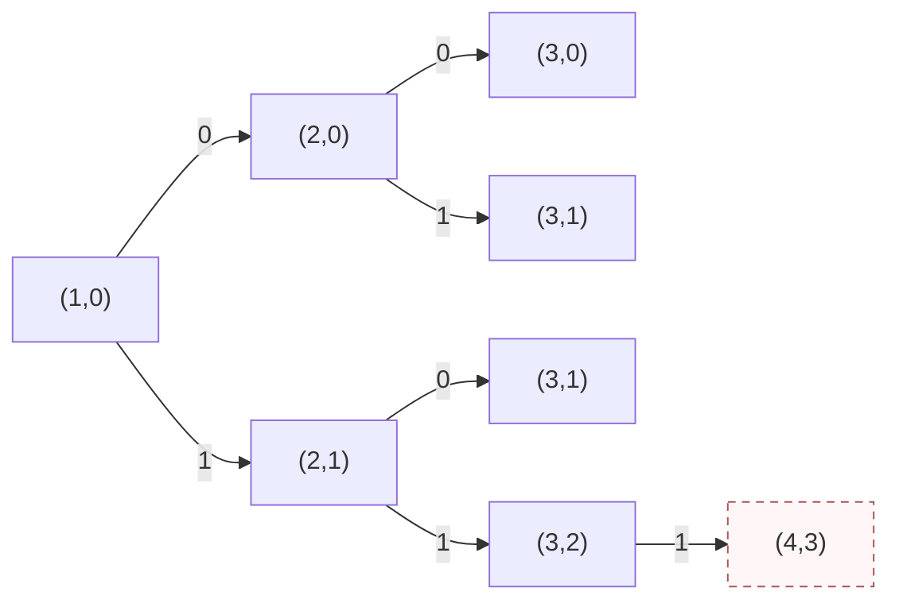
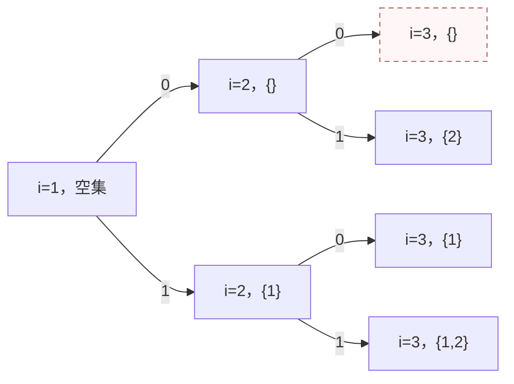
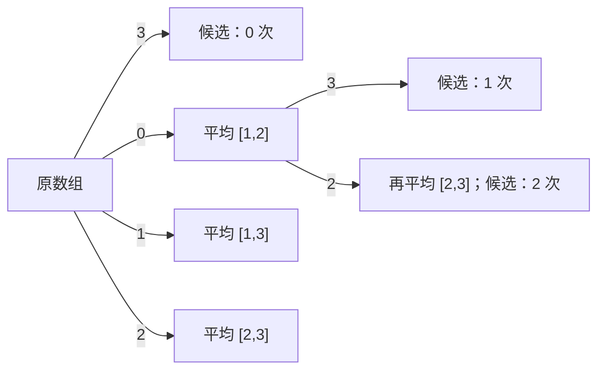

# T1 四段异或与最大连续和

---

## 题意简化

---

长度 $4\le n\le10^5$ 的有符号数组，必须从左到右选恰好四个互不相交的非空区间，分别把区间内的数异或 $b_1,b_2,b_3,b_4$；区间可相邻。随后在变换后的整个数组中选一个非空连续子数组，最大化其元素和。数组元素可负，异或按 32 位补码；答案需用 `long long`。

## 问题拆分

---

1. 确定四个区间，得到每个位置变换后的数。
2. 在变换后的数组中找到最大非空连续子数组和。
3. 在所有合法区间选择中取最大值。

| 测试点 | 对应解法 |
|---|---|
| 1～2、3～4、5～6、7～8 | 依次使用直接枚举、区间摘要枚举、固定答案两端点的 DP、固定答案左端点的 DP |
| 9～14 | 依次使用零掩码、单点操作、全覆盖、不相交、仅第四掩码非零、非负零掩码的简化算法 |
| 15～20 | 九阶段与最大子数组三态合并 |

## 1～2 点（10 分）：直接枚举

---

**步骤 1、3。** 用 `dfs(j,start)` 表示正在选择第 $j$ 段，其左端点至少为 `start`。枚举 $l\ge start,r\ge l$，原地异或 $[l,r]$ 后递归下一段；返回时再异或一次恢复。四段都选完才进入步骤 2。合法四段的选择数是 $\binom{n+4}{8}$，比把每层都估作 $n^2$ 更准确。

**步骤 2。** 对每个完整方案再枚举答案子数组的左右端点，逐个累加其中的数，单方案 $O(n^3)$。总时间 $O\!\left(n^3\binom{n+4}{8}\right)$，搜索栈与数组共 $O(n)$ 空间。$n\le10$ 可用；第 3～4 点 $n=30$ 时实测超时。

### 四段搜索小图

状态 `(j,s)` 表示下一段是第 $j$ 段，最早从 $s$ 开始；图示 $n=5$ 的局部选择。相同 `(j,s)` 若来自不同历史，数组已变换的部分可能不同，所以搜索树中保留两个节点。

**左上角图例**：`0` = 取本段 `[s,s]`；`1` = 取本段 `[s,s+1]`；`2` = 其它合法 `[l,r]`。条件：$j\le4$、区间非空且在 $1\ldots n$ 内；代价：异或该段元素；价值：此时不计和，四段完成后统一扫描。虚线箭头表示选择后无法凑齐四段，不进入合法答案。



**叶子**：$j=5$ 是合法四段终态，扫描数组并返回最大连续和；$j\le4$ 且 $s>n$ 是非法终态，不参与最大值。图中 `(4,6)` 是虚线非法叶子。

### 参考代码

```cpp
#include<bits/stdc++.h>
using namespace std;

const int N = 100005;
int n,x[N],b[5];
long long ans = -(1LL << 60);

void dfs(int j,int start){
	if(j == 5){
		for(int l = 1; l <= n; l++){
			for(int r = l; r <= n; r++){
				long long sum = 0;
				for(int i = l; i <= r; i++) sum += x[i];
				ans = max(ans,sum);
			}
		}
		return;
	}
	for(int l = start; l <= n - (4 - j); l++){
		for(int r = l; r <= n - (4 - j); r++){
			for(int i = l; i <= r; i++) x[i] ^= b[j];
			dfs(j + 1,r + 1);
			for(int i = l; i <= r; i++) x[i] ^= b[j];
		}
	}
}

int main(){
	ios::sync_with_stdio(false);
	cin.tie(0);

	cin >> n;
	for(int j = 1; j <= 4; j++) cin >> b[j];
	for(int i = 1; i <= n; i++) cin >> x[i];
	dfs(1,1);
	cout << ans << '\n';
	return 0;
}
```

## 3～4 点（10 分）：预处理区间摘要后枚举四段

---

**步骤 1。** 对每个掩码 $0,b_1,b_2,b_3,b_4$ 和每个原数组区间预处理四个值：区间和、最大前缀和、最大后缀和、最大非空子数组和。两个相邻区间的摘要可在 $O(1)$ 合并，跨边界的最优子数组为左区间最大后缀加右区间最大前缀。代码直接扫描每个区间求摘要，时间 $O(5n^3)$、空间 $O(5n^2)$；$n\le30$ 时很小。

**步骤 2。** 沿用上面的四段搜索图。选择一个操作段时把之前的零掩码空白和本段摘要依次合并；四段选完再合并尾部空白。每个搜索分支只做常数次摘要合并，不再逐个枚举答案子数组。总时间 $O\!\left(n^3+\binom{n+4}{8}\right)$，空间 $O(n^2)$。第 5～6 点 $n=100$ 时搜索方案数仍过大，实测超时。

### 参考代码

```cpp
#include<bits/stdc++.h>
using namespace std;

const int N = 100005;
const long long NEG = -(1LL << 60);
struct Info{
	long long sum,pref,suf,best;
};
vector<Info> data[5];
int n,x[N],b[5],width;
long long answer = NEG;

Info emptyInfo(){
	Info z = {0,NEG,NEG,NEG};
	return z;
}

Info mergeInfo(Info a,Info c){
	if(a.best == NEG) return c;
	if(c.best == NEG) return a;
	Info z;
	z.sum = a.sum + c.sum;
	z.pref = max(a.pref,a.sum + c.pref);
	z.suf = max(c.suf,c.sum + a.suf);
	z.best = max(max(a.best,c.best),a.suf + c.pref);
	return z;
}

Info getInfo(int mask,int l,int r){
	if(l > r) return emptyInfo();
	return data[mask][l * width + r];
}

void dfs(int j,int start,Info cur){
	if(j == 5){
		Info all = mergeInfo(cur,getInfo(0,start,n));
		answer = max(answer,all.best);
		return;
	}
	for(int l = start; l <= n - (4 - j); l++){
		Info before = mergeInfo(cur,getInfo(0,start,l - 1));
		for(int r = l; r <= n - (4 - j); r++){
			Info now = mergeInfo(before,getInfo(j,l,r));
			dfs(j + 1,r + 1,now);
		}
	}
}

int main(){
	ios::sync_with_stdio(false);
	cin.tie(0);

	cin >> n;
	for(int j = 1; j <= 4; j++) cin >> b[j];
	for(int i = 1; i <= n; i++) cin >> x[i];
	width = n + 1;
	for(int mask = 0; mask <= 4; mask++) data[mask] = vector<Info>(1LL * width * width);
	for(int mask = 0; mask <= 4; mask++){
		for(int l = 1; l <= n; l++){
			long long sum = 0,bestEnd = NEG,best = NEG,pref = NEG;
			for(int r = l; r <= n; r++){
				long long v = x[r] ^ b[mask];
				sum += v;
				pref = max(pref,sum);
				bestEnd = max(v,bestEnd + v);
				best = max(best,bestEnd);
				Info z = {sum,pref,NEG,best};
				long long tail = 0;
				for(int i = r; i >= l; i--){
					tail += x[i] ^ b[mask];
					z.suf = max(z.suf,tail);
				}
				data[mask][l * width + r] = z;
			}
		}
	}
	dfs(1,1,emptyInfo());
	cout << answer << '\n';
	return 0;
}
```

## 5～6 点（10 分）：固定答案两端点的阶段 DP

---

**步骤 1。** 枚举答案子数组 $[L,R]$，共有 $O(n^2)$ 种。四个操作段用九阶段 $p=0,1,\ldots,8$ 表示，掩码依次为 $(0,b_1,0,b_2,0,b_3,0,b_4,0)$。每次处理一个位置，可以留在阶段、前进一阶段，或从奇数阶段越过零长度空白前进两阶段。进入奇数阶段必消耗一个元素，所以四段非空。

**步骤 2。** 对固定 $[L,R]$，`dp[p]` 表示当前阶段能得到的 $[L,R]$ 内最大和。位置在 $[L,R]$ 外时本次加零，在其中时加异或后的值；枚举 9 个源阶段和 9 个目标阶段检查合法转移。处理完所有数后只接受阶段 7、8。每个 $[L,R]$ 耗时 $O(9^2n)$，合计 $O(9^2n^3)$ 时间，输入数组以外只需 $O(1)$ DP 空间；$n\le100$ 可用。

### 固定两端点的 DP 小图

节点 $(i,p)$ 表示处理完 $i$ 个位置、当前位于阶段 $p$。**左上角图例**：`0` = 留在原阶段；`1` = 前进一阶段；`2` = 从奇数阶段直接前进两阶段。条件：阶段前进必须消耗当前元素；代价：在 $[L,R]$ 内加 $x_i\mathbin{\mathrm{xor}}\mathrm{mask}[p]$，区间外加零；价值：当前累计和。



**终态**：$i=n$ 且 $p=7$ 或 $8$；合流时取较大和。第 7～8 点 $n=500$ 时该程序实测超时。

### 参考代码

```cpp
#include<bits/stdc++.h>
using namespace std;

const int N = 100005;
const long long NEG = -(1LL << 60);
int n,x[N],b[4],maskValue[9];
long long dp[9],nextDp[9];

int main(){
	ios::sync_with_stdio(false);
	cin.tie(0);

	cin >> n >> b[0] >> b[1] >> b[2] >> b[3];
	for(int i = 1; i <= n; i++) cin >> x[i];
	int temp[9] = {0,b[0],0,b[1],0,b[2],0,b[3],0};
	for(int p = 0; p < 9; p++) maskValue[p] = temp[p];
	long long answer = NEG;
	for(int left = 1; left <= n; left++){
		for(int right = left; right <= n; right++){
			for(int p = 0; p < 9; p++) dp[p] = NEG;
			dp[0] = 0;
			for(int i = 1; i <= n; i++){
				for(int p = 0; p < 9; p++) nextDp[p] = NEG;
				for(int q = 0; q < 9; q++){
					for(int p = 0; p < 9; p++){
						bool allowed = q == p || q == p + 1;
						if(p % 2 == 1 && p < 7 && q == p + 2) allowed = true;
						if(!allowed || dp[p] == NEG) continue;
						long long value = dp[p];
						if(left <= i && i <= right) value += x[i] ^ maskValue[q];
						nextDp[q] = max(nextDp[q],value);
					}
				}
				for(int p = 0; p < 9; p++) dp[p] = nextDp[p];
			}
			answer = max(answer,max(dp[7],dp[8]));
		}
	}
	cout << answer << '\n';
	return 0;
}
```

## 7～8 点（10 分）：固定答案左端点的阶段 DP

---

**步骤 1。** 枚举最终最大子数组的左端点 $L$。四个操作段仍用九个阶段 $p=0,1,\ldots,8$ 表示，掩码依次是 $(0,b_1,0,b_2,0,b_3,0,b_4,0)$。留在当前阶段、前进一阶段、从奇数阶段越过空白前进两阶段，分别处理段内延续、开始下一段和相邻操作段。每次阶段前进都消耗一个位置，因此四段非空。枚举一个 $L$ 的阶段转移为 $O(9\cdot3n)=O(n)$，状态空间 $O(9)$。

**步骤 2。** 对固定的 $L$，用 $s=0,1,2$ 表示答案子数组尚未开始、正在延伸、已经结束。$i<L$ 时只能保持 $s=0$；$i=L$ 时必须把变换后的 $a_L$ 加入，转为 $s=1$；之后可以延伸、结束或保持结束。相同 $(p,s)$ 只保留最大的和，因为后续可选操作相同。到 $i=n$ 时只接受阶段 7、8 且 $s=1,2$，所以四段都完成、答案子数组非空。每个 $L$ 扫描 $n$ 个数，耗时 $O(n)$，两层状态表空间 $O(9\cdot3)$。

**步骤 3。** 在所有 $L$ 的合法终态中取最大值。总时间 $O(n^2)$，额外空间 $O(n)$（输入数组占主要部分）。$n\le500$ 可用；完整范围需把所有 $L$ 合并进“尚未开始”状态。第 15～20 点的十万规模输入使该程序实测超时。

### 固定左端点的 DP 小图

节点 $(i,p,s)$ 表示处理完前 $i$ 个数的阶段与子数组状态；图示 $i=L$ 的合流。**左上角图例**：`0` = 当前阶段不变；`1` = 进入下一阶段；`2` = 从奇数阶段跳过零长度空白。条件：$i=L$，本位置必须开始答案子数组；代价：阶段掩码作用于 $a_L$；价值：把变换后的 $a_L$ 作为第一个加数。其他 $i$ 按上述 $s$ 规则转移。



**终态**：仅 $(n,7,1/2)$ 与 $(n,8,1/2)$ 合法。两条箭头合到同一状态时取较大的子数组和。

### 参考代码

```cpp
#include<bits/stdc++.h>
using namespace std;

const int N = 100005;
const long long NEG = -(1LL << 60);
int n,x[N],b[4],maskValue[9];
long long dp[9][3],nextDp[9][3];

int main(){
	ios::sync_with_stdio(false);
	cin.tie(0);

	cin >> n >> b[0] >> b[1] >> b[2] >> b[3];
	for(int i = 1; i <= n; i++) cin >> x[i];
	int temp[9] = {0,b[0],0,b[1],0,b[2],0,b[3],0};
	for(int p = 0; p < 9; p++) maskValue[p] = temp[p];
	long long ans = NEG;
	for(int left = 1; left <= n; left++){
		for(int p = 0; p < 9; p++){
			for(int s = 0; s < 3; s++) dp[p][s] = NEG;
		}
		dp[0][0] = 0;
		for(int i = 1; i <= n; i++){
			for(int p = 0; p < 9; p++){
				for(int s = 0; s < 3; s++) nextDp[p][s] = NEG;
			}
			for(int p = 0; p < 9; p++){
				for(int step = 0; step <= 2; step++){
					int q = p + step;
					if(q >= 9) continue;
					if(step == 2 && (p % 2 == 0 || p >= 7)) continue;
					int v = x[i] ^ maskValue[q];
					if(i < left && dp[p][0] != NEG) nextDp[q][0] = 0;
					if(i == left && dp[p][0] != NEG) nextDp[q][1] = max(nextDp[q][1],(long long)v);
					if(i > left){
						if(dp[p][1] != NEG){
							nextDp[q][1] = max(nextDp[q][1],dp[p][1] + v);
							nextDp[q][2] = max(nextDp[q][2],dp[p][1]);
						}
						if(dp[p][2] != NEG) nextDp[q][2] = max(nextDp[q][2],dp[p][2]);
					}
				}
			}
			for(int p = 0; p < 9; p++){
				for(int s = 0; s < 3; s++) dp[p][s] = nextDp[p][s];
			}
		}
		for(int p = 7; p <= 8; p++){
			for(int s = 1; s <= 2; s++) ans = max(ans,dp[p][s]);
		}
	}
	cout << ans << '\n';
	return 0;
}
```

## 第 9 点（5 分）：四个掩码均为零

---

**步骤 1。** 异或零不改变数组，四段只需存在即可；由于 $n\ge4$，可以任选四个单点段。

**步骤 2～3。** 用 Kadane 扫描最大非空连续和，当前位置的最优结尾和是“只取当前数”与“延续前一段”二者的较大值。时间 $O(n)$、额外空间 $O(1)$；全负数组也要输出最大的负数。

### 参考代码

```cpp
#include<bits/stdc++.h>
using namespace std;

int main(){
	ios::sync_with_stdio(false);
	cin.tie(0);

	int n,b[4],x;
	cin >> n >> b[0] >> b[1] >> b[2] >> b[3];
	long long answer = -(1LL << 60),endHere = 0;
	for(int i = 1; i <= n; i++){
		cin >> x;
		endHere = max((long long)x,endHere + x);
		answer = max(answer,endHere);
	}
	cout << answer << '\n';
	return 0;
}
```

## 第 10 点（5 分）：最优四段都可取单点

---

**步骤 1。** 按保证，只需依次选四个不同位置，分别异或 $b_1,b_2,b_3,b_4$。令 $j$ 为已经选中的单点数，本位置可不操作，或作为第 $j+1$ 个单点；每个状态最多两种选择。

**步骤 2～3。** 叠加最大子数组的三态 $s=0,1,2$（未开始、正在延伸、已结束）。`dp[j][s]` 记录同状态下最大的和，最后只取 $j=4,s\in\{1,2\}$。每位置 $5\times3$ 个状态，时间 $O(n)$、额外空间 $O(1)$。该保证不限制一般测试点的合法区间。

### 单点选择 DP 小图

节点 $(i,j,s)$ 表示已处理 $i$ 个数、用了 $j$ 个单点和当前子数组状态。**左上角图例**：`0` = 本位置不操作；`1` = 本位置作为下一个单点。条件：`1` 需要 $j<4$；代价：分别取 $x_i$ 或 $x_i\mathbin{\mathrm{xor}}b_{j+1}$；价值：若 $s=1$，加入当前子数组和。



**终态**：$i=n,j=4,s=1/2$，多条路径合到同状态时取较大和。

### 参考代码

```cpp
#include<bits/stdc++.h>
using namespace std;

const long long NEG = -(1LL << 60);
long long dp[5][3],nextDp[5][3];

void update(int from,int to,int value){
	if(dp[from][0] != NEG){
		nextDp[to][0] = 0;
		nextDp[to][1] = max(nextDp[to][1],(long long)value);
	}
	if(dp[from][1] != NEG){
		nextDp[to][1] = max(nextDp[to][1],dp[from][1] + value);
		nextDp[to][2] = max(nextDp[to][2],dp[from][1]);
	}
	if(dp[from][2] != NEG) nextDp[to][2] = max(nextDp[to][2],dp[from][2]);
}

int main(){
	ios::sync_with_stdio(false);
	cin.tie(0);

	int n,b[5];
	cin >> n;
	for(int j = 1; j <= 4; j++) cin >> b[j];
	for(int j = 0; j <= 4; j++){
		for(int s = 0; s < 3; s++) dp[j][s] = NEG;
	}
	dp[0][0] = 0;
	for(int i = 1; i <= n; i++){
		int x;
		cin >> x;
		for(int j = 0; j <= 4; j++){
			for(int s = 0; s < 3; s++) nextDp[j][s] = NEG;
		}
		for(int j = 0; j <= 4; j++){
			update(j,j,x);
			if(j < 4) update(j,j + 1,x ^ b[j + 1]);
		}
		for(int j = 0; j <= 4; j++){
			for(int s = 0; s < 3; s++) dp[j][s] = nextDp[j][s];
		}
	}
	cout << max(dp[4][1],dp[4][2]) << '\n';
	return 0;
}
```

## 第 11 点（5 分）：最优四段可覆盖全序列

---

**步骤 1。** 按保证，四段把位置 $1\ldots n$ 分成四个相邻非空块。当前位置只能继续当前块，或从第二个位置起进入下一块；没有未操作位置。

**步骤 2～3。** 用块号 $j=1,2,3,4$ 与最大子数组三态做 DP。每次用本块的掩码异或当前数，终态必须在第 4 块且子数组非空。总时间 $O(4\cdot3n)=O(n)$，额外空间 $O(1)$。

### 覆盖全序列的 DP 小图

节点 $(i,j,s)$ 中 $j$ 是当前块。**左上角图例**：`0` = 留在第 $j$ 块；`1` = 当前数开始第 $j+1$ 块。条件：`1` 只在 $j<4$ 时可用；代价：当前数异或目标块的掩码；价值：最大子数组当前和。


**终态**：$i=n,j=4,s=1/2$；与上一图的节点形状相似，但这里每个位置都属于某个操作块，`0` 的含义不是“不操作”。

### 参考代码

```cpp
#include<bits/stdc++.h>
using namespace std;

const long long NEG = -(1LL << 60);
long long dp[4][3],nextDp[4][3];

void update(int from,int to,int value){
	if(dp[from][0] != NEG){
		nextDp[to][0] = 0;
		nextDp[to][1] = max(nextDp[to][1],(long long)value);
	}
	if(dp[from][1] != NEG){
		nextDp[to][1] = max(nextDp[to][1],dp[from][1] + value);
		nextDp[to][2] = max(nextDp[to][2],dp[from][1]);
	}
	if(dp[from][2] != NEG) nextDp[to][2] = max(nextDp[to][2],dp[from][2]);
}

int main(){
	ios::sync_with_stdio(false);
	cin.tie(0);

	int n,b[4],x;
	cin >> n >> b[0] >> b[1] >> b[2] >> b[3];
	for(int j = 0; j < 4; j++){
		for(int s = 0; s < 3; s++) dp[j][s] = NEG;
	}
	dp[0][0] = 0;
	for(int i = 1; i <= n; i++){
		cin >> x;
		for(int j = 0; j < 4; j++){
			for(int s = 0; s < 3; s++) nextDp[j][s] = NEG;
		}
		for(int j = 0; j < 4; j++){
			update(j,j,x ^ b[j]);
			if(i > 1 && j < 3) update(j,j + 1,x ^ b[j + 1]);
		}
		for(int j = 0; j < 4; j++){
			for(int s = 0; s < 3; s++) dp[j][s] = nextDp[j][s];
		}
	}
	cout << max(dp[3][1],dp[3][2]) << '\n';
	return 0;
}
```

## 第 12 点（5 分）：存在与操作段不相交的最优子数组

---

**步骤 1。** 若答案子数组为 $[L,R]$，四个非空操作段与它不相交，当且仅当区间外至少有四个位置，即 $R-L+1\le n-4$。充分性是从区间外按顺序选四个单点作操作段。答案子数组中的数不会改变。

**步骤 2～3。** 因题目保证存在这样的最优方案，求原数组中长度不超过 $n-4$ 的最大非空子数组和即可。令前缀和为 $P_i$，对每个右端点 $r$，在 $j\in[r-(n-4),r-1]$ 中找最小 $P_j$。用单调队列维护这个滑动窗口，时间与空间均为 $O(n)$。

### 参考代码

```cpp
#include<bits/stdc++.h>
using namespace std;

const int N = 100005;
long long prefix[N];
int que[N];

int main(){
	ios::sync_with_stdio(false);
	cin.tie(0);

	int n,b[4],x;
	cin >> n >> b[0] >> b[1] >> b[2] >> b[3];
	for(int i = 1; i <= n; i++){
		cin >> x;
		prefix[i] = prefix[i - 1] + x;
	}
	int maxLength = n - 4,front = 1,back = 0;
	long long answer = -(1LL << 60);
	for(int r = 1; r <= n; r++){
		int j = r - 1;
		while(front <= back && prefix[que[back]] >= prefix[j]) back--;
		que[++back] = j;
		while(front <= back && que[front] < r - maxLength) front++;
		if(front <= back) answer = max(answer,prefix[r] - prefix[que[front]]);
	}
	cout << answer << '\n';
	return 0;
}
```

## 第 13 点（5 分）：仅第四个掩码可能非零

---

**步骤 1。** 前三段异或零，不改变数值。第四段左端点 $l\ge4$ 是必要且充分的：位置 $1,2,3$ 可以分别充当前三段。所以只需决定一个从第 4 个位置或更后开始的非空异或段。

**步骤 2～3。** 用三个阶段“异或前、异或中、异或后”和最大子数组三态做 DP；异或前进入异或中只允许 $i\ge4$。终态处于异或中或异或后，子数组已开始。时间 $O(n)$、额外空间 $O(1)$。

### 单个有效操作段的 DP 小图

节点 $(i,p,s)$ 中 $p=0,1,2$ 分别表示异或前、中、后。**左上角图例**：`0` = 维持阶段；`1` = 开始第四段；`2` = 结束第四段。条件：`1` 仅当 $i\ge4$；代价：阶段 1 的当前数异或 $b_4$；价值：答案子数组当前和。



**终态**：$i=n,p=1/2,s=1/2$。

### 参考代码

```cpp
#include<bits/stdc++.h>
using namespace std;

const long long NEG = -(1LL << 60);
long long dp[3][3],nextDp[3][3];

void update(int from,int to,int value){
	if(dp[from][0] != NEG){
		nextDp[to][0] = 0;
		nextDp[to][1] = max(nextDp[to][1],(long long)value);
	}
	if(dp[from][1] != NEG){
		nextDp[to][1] = max(nextDp[to][1],dp[from][1] + value);
		nextDp[to][2] = max(nextDp[to][2],dp[from][1]);
	}
	if(dp[from][2] != NEG) nextDp[to][2] = max(nextDp[to][2],dp[from][2]);
}

int main(){
	ios::sync_with_stdio(false);
	cin.tie(0);

	int n,b[4],x;
	cin >> n >> b[0] >> b[1] >> b[2] >> b[3];
	for(int p = 0; p < 3; p++){
		for(int s = 0; s < 3; s++) dp[p][s] = NEG;
	}
	dp[0][0] = 0;
	for(int i = 1; i <= n; i++){
		cin >> x;
		for(int p = 0; p < 3; p++){
			for(int s = 0; s < 3; s++) nextDp[p][s] = NEG;
		}
		update(0,0,x);
		if(i >= 4) update(0,1,x ^ b[3]);
		update(1,1,x ^ b[3]);
		update(1,2,x);
		update(2,2,x);
		for(int p = 0; p < 3; p++){
			for(int s = 0; s < 3; s++) dp[p][s] = nextDp[p][s];
		}
	}
	long long answer = NEG;
	for(int p = 1; p <= 2; p++){
		for(int s = 1; s <= 2; s++) answer = max(answer,dp[p][s]);
	}
	cout << answer << '\n';
	return 0;
}
```

## 第 14 点（5 分）：所有数非负且掩码全零

---

**步骤 1。** 操作不改变任何数。

**步骤 2～3。** 非负数组的最大非空连续和就是整数组的和，线性累加并用 `long long` 输出。时间 $O(n)$，额外空间 $O(1)$。这档包含在第 9 点的零掩码性质内，但可用更直接的求和程序。

### 参考代码

```cpp
#include<bits/stdc++.h>
using namespace std;

int main(){
	ios::sync_with_stdio(false);
	cin.tie(0);

	int n,b[4],x;
	cin >> n >> b[0] >> b[1] >> b[2] >> b[3];
	long long sum = 0;
	for(int i = 1; i <= n; i++){
		cin >> x;
		sum += x;
	}
	cout << sum << '\n';
	return 0;
}
```

## 满分做法（15～20 点，30 分）：区间阶段与最大子数组状态合并

---

**步骤 1。** 一个位置只需知道当前属于四段中的哪段或段间空白。用九个阶段 $p=0,1,\ldots,8$，异或掩码依次为

$$ (0,b_1,0,b_2,0,b_3,0,b_4,0). $$

奇数阶段是四个非空操作段，偶数阶段是未操作区。处理一个新位置时可留在原阶段，或前进一阶段；从奇数阶段还可直接前进两阶段，表示中间空白长度为零。每次前进都要消耗当前元素，所以进入过的奇数阶段自动非空。处理完 $n$ 个位置，只接受阶段 7 或 8，保证四段都选过。阶段 0 和 8 允许为空。

**步骤 2。** 最大子数组再用状态 $s=0,1,2$ 表示“尚未开始、正在延伸、已经结束”。若本位置变换后是 $v$，从 $s=0$ 可以继续等待或以 $v$ 开始；从 $s=1$ 可以加上 $v$ 或在本位置之前结束；$s=2$ 只能保持。正在延伸的值是当前子数组和，结束状态的值是已完成的和。答案只取 $s=1,2$，因此子数组非空。

**步骤 3。** `dp[p][s]` 保留已处理前缀中同一阶段、同一子数组状态的最大和。后续可选动作只由 `(p,s)` 决定，因此较小的和永远不会更优，可以合并。初态 `dp[0][0]=0`，其它状态为负无穷。按位置从左到右更新，每次使用上一轮数组；终态取 $p\in\{7,8\}$ 且 $s\in\{1,2\}$ 的最大值。

### DP 状态合流小图

节点 `(i,p,s)` 表示已处理 $i$ 个数后的状态。图只展示进入 `(i,1,1)` 及跳过第一、二段之间空白的局部转移；其余转移按上文同样更新。

**左上角图例**：`0` = 留在阶段 1，延伸子数组；`1` = 留在阶段 1，新开子数组；`2` = 从阶段 0 开始第一段并延伸子数组；`3` = 从阶段 1 直接进入阶段 3、空白长度为零。条件：源状态可达；代价：当前数的阶段掩码异或；价值：当前数的变换值。`1` 新开时不继承旧和。



**终态**：$i=n$、$p\in\{7,8\}$、$s\in\{1,2\}$ 才合法；其它状态不参加答案。箭头是从上一位置向下一位置的转移，多个路径到同一状态时取最大和。

每个位置只有 $9\times3$ 个状态，阶段最多三种走法，子数组状态最多两种走法；总时间 $O(9\cdot3\cdot3\cdot n)=O(n)$，两张 $9\times3$ 表只用 $O(1)$ 额外空间。$n=10^5$ 时转移数量为常数倍百万级。

### 参考代码

```cpp
#include<bits/stdc++.h>
using namespace std;

const long long NEG = -(1LL << 60);
long long dp[9][3],ndp[9][3];

int main(){
	ios::sync_with_stdio(false);
	cin.tie(0);

	int n,b[4],x;
	cin >> n >> b[0] >> b[1] >> b[2] >> b[3];
	int mask[9] = {0,b[0],0,b[1],0,b[2],0,b[3],0};
	for(int p = 0; p < 9; p++){
		for(int s = 0; s < 3; s++) dp[p][s] = NEG;
	}
	dp[0][0] = 0;
	for(int i = 1; i <= n; i++){
		cin >> x;
		for(int p = 0; p < 9; p++){
			for(int s = 0; s < 3; s++) ndp[p][s] = NEG;
		}
		for(int p = 0; p < 9; p++){
			for(int step = 0; step <= 2; step++){
				int q = p + step;
				if(q >= 9) continue;
				if(step == 2 && (p % 2 == 0 || p >= 7)) continue;
				int v = x ^ mask[q];
				if(dp[p][0] != NEG){
					ndp[q][0] = 0;
					ndp[q][1] = max(ndp[q][1],(long long)v);
				}
				if(dp[p][1] != NEG){
					ndp[q][1] = max(ndp[q][1],dp[p][1] + v);
					ndp[q][2] = max(ndp[q][2],dp[p][1]);
				}
				if(dp[p][2] != NEG){
					ndp[q][2] = max(ndp[q][2],dp[p][2]);
				}
			}
		}
		for(int p = 0; p < 9; p++){
			for(int s = 0; s < 3; s++) dp[p][s] = ndp[p][s];
		}
	}
	long long ans = NEG;
	for(int p = 7; p <= 8; p++){
		for(int s = 1; s <= 2; s++) ans = max(ans,dp[p][s]);
	}
	cout << ans << '\n';
	return 0;
}
```

## 知识点总结

---

多个有顺序的非空区间可以压成有限阶段；最大连续和可以压成“前、内、后”三态。两组状态作笛卡尔积，就能在一次从左到右扫描中同时决定操作段和答案子数组。

# T2 环上三点分组

---

## 题意简化

---

输入一张 $n\le2\times10^5$ 的连通简单基环图，恰有 $n$ 条编号边。删去一些边后，每个连通块都要恰有三个点，块内可有环。输出升序删除边编号的字典序最小序列；无解输出 $-1$。边数不作为第一目标，所以可能多删一条低编号环边而得到更小序列。

## 问题拆分

---

1. 确定不在唯一环上的树边必须怎样切，得到每个环点尚未闭合的点数。
2. 在环上把这些点数分成总和为 3 的连通组，并确定要切的环边。
3. 对全部合法删除序列排序并取字典序最小者。

| 测试点 | 对应解法 |
|---|---|
| 1～2、3～4、5～8 | 依次枚举全部边集、只枚举环边集、逐条尝试环切边 |
| 9～14 | 不可行判定、纯环、每环点一条二边挂链、三点环、交替叶子、全环点一叶子 |
| 15～20 | 剥叶后只试前三条环边为起始切边 |

## 1～2 点（10 分）：枚举删边集合

---

**步骤 1、2。** 用一个二进制计数器遍历全部 $2^n$ 个删边集合。对当前方案把未删边加入并查集，再统计每个连通块的点数；所有非空连通块恰为 3 时方案合法。每个集合需要 $O(n\alpha(n))$ 时间和 $O(n)$ 空间。这里无需先求环，因为直接检查最终图。

**步骤 3。** 合法方案的删除边编号天然按升序收集，与当前最好方案作 $O(n)$ 的字典序比较。总时间 $O(n\alpha(n)2^n)$，空间 $O(n)$；$n\le12$ 可用，第 3～4 点已超时。代码中的二进制计数器对任意 $n$ 都有定义。

### 删边搜索小图

节点 $(i,d)$ 表示前 $i-1$ 条边已决定，其中删掉 $d$ 条。**左上角图例**：`0` = 保留第 $i$ 条边，`1` = 删除第 $i$ 条边；条件：$1\le i\le n$；代价：叶子用并查集检查连通块；价值：合法时的删除编号序列。虚线节点表示检查失败。



**终态**：决定完全部边后，只有每个连通块大小为 3 的叶子参加字典序比较；图示三点环上 `(4,3)` 删去全部三条边，留下三个单点，是虚线非法叶子。

### 参考代码

```cpp
#include<bits/stdc++.h>
using namespace std;

const int N = 200005;
int n,u[N],v[N],bit[N],fa[N],sizeD[N],cnt[N],cur[N],best[N],cn,bn = -1;

int findRoot(int x){
	int root = x;
	while(fa[root] != root) root = fa[root];
	while(fa[x] != x){
		int y = fa[x];
		fa[x] = root;
		x = y;
	}
	return root;
}

bool smaller(){
	if(bn == -1) return true;
	int m = min(cn,bn);
	for(int i = 1; i <= m; i++){
		if(cur[i] != best[i]) return cur[i] < best[i];
	}
	return cn < bn;
}

int main(){
	ios::sync_with_stdio(false);
	cin.tie(0);

	cin >> n;
	for(int i = 1; i <= n; i++) cin >> u[i] >> v[i];
	if(n % 3 != 0){
		cout << -1 << '\n';
		return 0;
	}
	while(true){
		for(int i = 1; i <= n; i++){
			fa[i] = i;
			sizeD[i] = 1;
			cnt[i] = 0;
		}
		cn = 0;
		for(int i = 1; i <= n; i++){
			if(bit[i]){
				cur[++cn] = i;
			}else{
				int a = findRoot(u[i]),b = findRoot(v[i]);
				if(a != b){
					if(sizeD[a] < sizeD[b]) swap(a,b);
					fa[b] = a;
					sizeD[a] += sizeD[b];
				}
			}
		}
		for(int i = 1; i <= n; i++) cnt[findRoot(i)]++;
		bool good = true;
		for(int i = 1; i <= n; i++){
			if(cnt[i] != 0 && cnt[i] != 3) good = false;
		}
		if(good && smaller()){
			bn = cn;
			for(int i = 1; i <= cn; i++) best[i] = cur[i];
		}
		int p = 1;
		while(p <= n && bit[p] == 1){
			bit[p] = 0;
			p++;
		}
		if(p > n) break;
		bit[p] = 1;
	}
	if(bn == -1){
		cout << -1 << '\n';
	}else{
		cout << bn << '\n';
		for(int i = 1; i <= bn; i++){
			if(i > 1) cout << ' ';
			cout << best[i];
		}
		cout << '\n';
	}
	return 0;
}
```

## 3～4 点（10 分）：只枚举环边集合

---

**步骤 1。** 剥叶并自底向上确定所有树边的强制切法，得到每个环点未闭合的点数。队列和数组耗时、占用均为 $O(n)$。

**步骤 2。** 环长 $c\le15$，只对 $c$ 条环边用二进制计数器枚举保留/删除，共 $2^c$ 种。以一条删除的环边为起点沿环扫描，每遇到下一条删除边时检查其间点数是否恰好为 3；不删环边时只允许整个环块恰有 3 点。这沿用上方编号为 `0/1` 的搜索选择，只是决策对象换成环边。每集合扫描 $O(c)$。

**步骤 3。** 合法环方案与强制树边合并，按编号排序比较。保守时间 $O(n+2^c(c+n\log n))$、空间 $O(n)$。$n\le300,c\le15$ 可用；环长达到第 5～8 点规模时实测超时。

### 参考代码

```cpp
#include<bits/stdc++.h>
using namespace std;

const int N = 200005;
int head[N],to[2 * N],nxt[2 * N],eid[2 * N],ecnt;
int deg[N],que[N],par[N],pe[N],sz[N];
int cyc[N],ce[N],forced[N],fcnt;
bool alive[N];
int answer[N],acnt,candidate[N],ccnt;

void add(int u,int v,int id){
	ecnt++;
	to[ecnt] = v;
	eid[ecnt] = id;
	nxt[ecnt] = head[u];
	head[u] = ecnt;
	deg[u]++;
}

void consider(){
	sort(candidate + 1,candidate + ccnt + 1);
	if(acnt == -1 || lexicographical_compare(candidate + 1,candidate + ccnt + 1,answer + 1,answer + acnt + 1)){
		acnt = ccnt;
		for(int i = 1; i <= ccnt; i++) answer[i] = candidate[i];
	}
}

int main(){
	ios::sync_with_stdio(false);
	cin.tie(0);

	int n,u,v;
	cin >> n;
	for(int i = 1; i <= n; i++){
		cin >> u >> v;
		add(u,v,i);
		add(v,u,i);
	}
	if(n % 3 != 0){
		cout << -1 << '\n';
		return 0;
	}
	for(int i = 1; i <= n; i++){
		alive[i] = true;
		sz[i] = 1;
	}
	int front = 1,back = 0;
	for(int i = 1; i <= n; i++){
		if(deg[i] == 1) que[++back] = i;
	}
	while(front <= back){
		int x = que[front++];
		alive[x] = false;
		for(int e = head[x]; e; e = nxt[e]){
			int y = to[e];
			if(!alive[y]) continue;
			par[x] = y;
			pe[x] = eid[e];
			deg[y]--;
			if(deg[y] == 1) que[++back] = y;
		}
	}
	for(int i = 1; i <= back; i++){
		int x = que[i],y = par[x];
		if(sz[x] > 3){
			cout << -1 << '\n';
			return 0;
		}
		if(sz[x] == 3){
			forced[++fcnt] = pe[x];
		}else{
			sz[y] += sz[x];
			if(sz[y] > 3){
				cout << -1 << '\n';
				return 0;
			}
		}
	}
	int start = 0;
	for(int i = 1; i <= n; i++){
		if(alive[i]){
			start = i;
			break;
		}
	}
	int x = start,last = 0,len = 0;
	do{
		cyc[++len] = x;
		int next = 0,edge = 0;
		for(int e = head[x]; e; e = nxt[e]){
			int y = to[e];
			if(alive[y] && y != last){
				next = y;
				edge = eid[e];
				break;
			}
		}
		ce[len] = edge;
		last = x;
		x = next;
	}while(x != start);
	acnt = -1;
	static int bits[N];
	bool finished = false;
	while(!finished){
		ccnt = 0;
		for(int i = 1; i <= fcnt; i++) candidate[++ccnt] = forced[i];
		int first = 0;
		for(int i = 1; i <= len; i++){
			if(bits[i]){
				first = i;
				break;
			}
		}
		if(first == 0){
			int total = 0;
			for(int i = 1; i <= len; i++) total += sz[cyc[i]];
			if(total == 3) consider();
		}else{
			int sum = 0;
			bool good = true;
			for(int step = 1; step <= len; step++){
				int j = (first + step - 1) % len + 1;
				sum += sz[cyc[j]];
				if(sum > 3){
					good = false;
					break;
				}
				if(bits[j]){
					if(sum != 3){
						good = false;
						break;
					}
					candidate[++ccnt] = ce[j];
					sum = 0;
				}
			}
			if(good && sum == 0) consider();
		}
		int pos = 1;
		while(pos <= len && bits[pos]){
			bits[pos] = 0;
			pos++;
		}
		if(pos > len) finished = true;
		else bits[pos] = 1;
	}
	if(acnt == -1){
		cout << -1 << '\n';
	}else{
		cout << acnt << '\n';
		for(int i = 1; i <= acnt; i++){
			if(i > 1) cout << ' ';
			cout << answer[i];
		}
		cout << '\n';
	}
	return 0;
}
```

## 5～8 点（20 分）：逐条尝试环上的起始切边

---

**步骤 1。** 与满分做法一样，剥去叶子并自底向上计算每个环点附带的未闭合块大小。大小达到 3 时树边必须切断；超过 3 则无解。每个点和边处理常数次，时间、空间均为 $O(n)$。

**步骤 2。** 设环长为 $c$。枚举一条环边作为起始切边，从它的下一环点顺时针累加附带点数；和为 3 就切下一条环边并清零，超过 3 则本次失败。扫描回起始切边时必须恰好清零。这样枚举了所有至少切一条环边的解，时间 $O(c^2)$、额外空间 $O(c)$。环恰有三个点且三个附带大小均为 1 时，另试“不切环边”的方案。

**步骤 3。** 每个合法方案与强制树边合并，按边编号排序后比较删除序列。最多 $c+1$ 个方案，每次排序 $O(n\log n)$，故保守总时间 $O(n+c^2+cn\log n)=O(n^2\log n)$，空间 $O(n)$。$n\le3000$ 可用；第 15～20 点的大环实测超时。

### 参考代码

```cpp
#include<bits/stdc++.h>
using namespace std;

const int N = 200005;
int head[N],to[2 * N],nxt[2 * N],eid[2 * N],ecnt;
int deg[N],que[N],par[N],pe[N],sz[N];
int cyc[N],ce[N],forced[N],fcnt;
bool alive[N];
int answer[N],acnt,candidate[N],ccnt;

void add(int u,int v,int id){
	ecnt++;
	to[ecnt] = v;
	eid[ecnt] = id;
	nxt[ecnt] = head[u];
	head[u] = ecnt;
	deg[u]++;
}

void consider(){
	sort(candidate + 1,candidate + ccnt + 1);
	if(acnt == -1 || lexicographical_compare(candidate + 1,candidate + ccnt + 1,answer + 1,answer + acnt + 1)){
		acnt = ccnt;
		for(int i = 1; i <= ccnt; i++) answer[i] = candidate[i];
	}
}

int main(){
	ios::sync_with_stdio(false);
	cin.tie(0);

	int n,u,v;
	cin >> n;
	for(int i = 1; i <= n; i++){
		cin >> u >> v;
		add(u,v,i);
		add(v,u,i);
	}
	if(n % 3 != 0){
		cout << -1 << '\n';
		return 0;
	}
	for(int i = 1; i <= n; i++){
		alive[i] = true;
		sz[i] = 1;
	}
	int front = 1,back = 0;
	for(int i = 1; i <= n; i++){
		if(deg[i] == 1) que[++back] = i;
	}
	while(front <= back){
		int x = que[front++];
		alive[x] = false;
		for(int e = head[x]; e; e = nxt[e]){
			int y = to[e];
			if(!alive[y]) continue;
			par[x] = y;
			pe[x] = eid[e];
			deg[y]--;
			if(deg[y] == 1) que[++back] = y;
		}
	}
	for(int i = 1; i <= back; i++){
		int x = que[i],y = par[x];
		if(sz[x] > 3){
			cout << -1 << '\n';
			return 0;
		}
		if(sz[x] == 3){
			forced[++fcnt] = pe[x];
		}else{
			sz[y] += sz[x];
			if(sz[y] > 3){
				cout << -1 << '\n';
				return 0;
			}
		}
	}
	int start = 0;
	for(int i = 1; i <= n; i++){
		if(alive[i]){
			start = i;
			break;
		}
	}
	int x = start,last = 0,len = 0;
	do{
		cyc[++len] = x;
		int next = 0,edge = 0;
		for(int e = head[x]; e; e = nxt[e]){
			int y = to[e];
			if(alive[y] && y != last){
				next = y;
				edge = eid[e];
				break;
			}
		}
		ce[len] = edge;
		last = x;
		x = next;
	}while(x != start);
	acnt = -1;
	if(len == 3 && sz[cyc[1]] == 1 && sz[cyc[2]] == 1 && sz[cyc[3]] == 1){
		ccnt = 0;
		for(int i = 1; i <= fcnt; i++) candidate[++ccnt] = forced[i];
		consider();
	}
	for(int cut = 1; cut <= len; cut++){
		ccnt = 0;
		for(int j = 1; j <= fcnt; j++) candidate[++ccnt] = forced[j];
		int sum = 0;
		bool good = true;
		for(int step = 1; step <= len; step++){
			int j = (cut + step - 1) % len + 1;
			sum += sz[cyc[j]];
			if(sum > 3){
				good = false;
				break;
			}
			if(sum == 3){
				candidate[++ccnt] = ce[j];
				sum = 0;
			}
		}
		if(good && sum == 0) consider();
	}
	if(acnt == -1){
		cout << -1 << '\n';
	}else{
		cout << acnt << '\n';
		for(int i = 1; i <= acnt; i++){
			if(i > 1) cout << ' ';
			cout << answer[i];
		}
		cout << '\n';
	}
	return 0;
}
```

## 第 9 点（5 分）：点数不是 3 的倍数

---

**步骤 1～2。** 若全部连通块各有三个点，总点数必是 3 的倍数。题面保证 $3\nmid n$，直接无解。

**步骤 3。** 输出 `-1`，时间与额外空间均为 $O(1)$。第 14 点也可复用同一输出程序，但依据不同。

### 参考代码

```cpp
#include<bits/stdc++.h>
using namespace std;

int main(){
	ios::sync_with_stdio(false);
	cin.tie(0);
	cout << -1 << '\n';
	return 0;
}
```

## 第 10 点（5 分）：图本身是一个环

---

**步骤 1。** 无挂树，沿环记录顺序及每条环边编号。遍历耗时 $O(n)$。

**步骤 2。** $n>3$ 时每组恰是连续三个环点，环切边只有按位置模 3 的三种偏移；$n=3$ 时不切边的空序列字典序最小。

**步骤 3。** 对三种偏移按编号扫描得到升序删除序列并比较，时间 $O(n)$、空间 $O(n)$。

### 参考代码

```cpp
#include<bits/stdc++.h>
using namespace std;

const int N = 200005;
int deg[N],neighbor[N][2],edgeId[N][2],ringEdge[N];
int candidate[N],answer[N],bestCount = -1;
bool cutEdge[N];

void consider(int n){
	int count = 0;
	for(int id = 1; id <= n; id++){
		if(cutEdge[id]) candidate[++count] = id;
	}
	if(bestCount == -1 || lexicographical_compare(candidate + 1,candidate + count + 1,answer + 1,answer + bestCount + 1)){
		bestCount = count;
		for(int i = 1; i <= count; i++) answer[i] = candidate[i];
	}
}

int main(){
	ios::sync_with_stdio(false);
	cin.tie(0);

	int n;
	cin >> n;
	for(int id = 1; id <= n; id++){
		int u,v;
		cin >> u >> v;
		neighbor[u][deg[u]] = v;
		edgeId[u][deg[u]++] = id;
		neighbor[v][deg[v]] = u;
		edgeId[v][deg[v]++] = id;
	}
	if(n % 3 != 0){
		cout << -1 << '\n';
		return 0;
	}
	int current = 1,last = 0;
	for(int i = 1; i <= n; i++){
		int side = neighbor[current][0] == last ? 1 : 0;
		ringEdge[i] = edgeId[current][side];
		int next = neighbor[current][side];
		last = current;
		current = next;
	}
	if(n == 3){
		cout << "0\n\n";
		return 0;
	}
	for(int offset = 0; offset < 3; offset++){
		for(int id = 1; id <= n; id++) cutEdge[id] = false;
		for(int i = 1; i <= n; i++){
			if((i - 1) % 3 == offset) cutEdge[ringEdge[i]] = true;
		}
		consider(n);
	}
	cout << bestCount << '\n';
	for(int i = 1; i <= bestCount; i++){
		if(i > 1) cout << ' ';
		cout << answer[i];
	}
	cout << '\n';
	return 0;
}
```

## 第 11 点（5 分）：每个环点挂一条长度为 2 的路径

---

**步骤 1。** 剥叶识别环点与环边，时间、空间均为 $O(n)$。

**步骤 2。** 每个环点连同自己的两点挂链已是三点块，不能再与另一环点连通，因此必须切去全部环边，挂链上的边全部保留。

**步骤 3。** 顺着输入边编号输出所有环边，时间 $O(n)$，不存在其它合法删除序列。

### 参考代码

```cpp
#include<bits/stdc++.h>
using namespace std;

const int N = 200005;
int eu[N],ev[N],head[N],to[2 * N],nextEdge[2 * N],deg[N],queueNode[N],countEdge;
bool alive[N];

void add(int u,int v){
	countEdge++;
	to[countEdge] = v;
	nextEdge[countEdge] = head[u];
	head[u] = countEdge;
	deg[u]++;
}

int main(){
	ios::sync_with_stdio(false);
	cin.tie(0);

	int n;
	cin >> n;
	for(int i = 1; i <= n; i++){
		cin >> eu[i] >> ev[i];
		add(eu[i],ev[i]);
		add(ev[i],eu[i]);
	}
	for(int i = 1; i <= n; i++) alive[i] = true;
	int front = 1,back = 0;
	for(int i = 1; i <= n; i++){
		if(deg[i] == 1) queueNode[++back] = i;
	}
	while(front <= back){
		int u = queueNode[front++];
		alive[u] = false;
		for(int e = head[u]; e; e = nextEdge[e]){
			int v = to[e];
			if(!alive[v]) continue;
			deg[v]--;
			if(deg[v] == 1) queueNode[++back] = v;
		}
	}
	int count = 0;
	for(int id = 1; id <= n; id++){
		if(alive[eu[id]] && alive[ev[id]]) count++;
	}
	cout << count << '\n';
	bool first = true;
	for(int id = 1; id <= n; id++){
		if(alive[eu[id]] && alive[ev[id]]){
			if(!first) cout << ' ';
			cout << id;
			first = false;
		}
	}
	cout << '\n';
	return 0;
}
```

## 第 12 点（5 分）：唯一环只有三个点

---

**步骤 1。** 按 5～8 点的代码剥叶并确定树边，时间 $O(n)$。

**步骤 2～3。** 环只有三条边，逐条试起始切边；再检查不切边的三点环特例。最多三次环扫描和四次排序，时间 $O(n\log n)$、空间 $O(n)$。直接使用上方“逐条尝试环切边”的完整代码，无需复制第二遍。

## 第 13 点（5 分）：环点交替挂零或一片叶子

---

**步骤 1。** 剥叶得到环顺序；原度数 2、3 分别给环点权值 1、2，时间 $O(n)$。

**步骤 2。** 每组三点必须由相邻的一权环点与二权环点组成，因此环上只有两种配对方向。分别从前两条环边出发累加到 3 时切边。

**步骤 3。** 按边编号扫描比较两套升序删除序列。时间、空间均为 $O(n)$。

### 参考代码

```cpp
#include<bits/stdc++.h>
using namespace std;

const int N = 200005;
int head[N],to[2 * N],nextEdge[2 * N],edgeId[2 * N],deg[N],originalDeg[N];
int queueNode[N],ringVertex[N],ringEdge[N],answer[N],candidate[N],edgeCount,bestCount = -1;
bool alive[N],mark[N];

void add(int u,int v,int id){
	edgeCount++;
	to[edgeCount] = v;
	edgeId[edgeCount] = id;
	nextEdge[edgeCount] = head[u];
	head[u] = edgeCount;
	deg[u]++;
}

void consider(int n){
	int count = 0;
	for(int id = 1; id <= n; id++){
		if(mark[id]) candidate[++count] = id;
	}
	if(bestCount == -1 || lexicographical_compare(candidate + 1,candidate + count + 1,answer + 1,answer + bestCount + 1)){
		bestCount = count;
		for(int i = 1; i <= count; i++) answer[i] = candidate[i];
	}
}

int main(){
	ios::sync_with_stdio(false);
	cin.tie(0);

	int n;
	cin >> n;
	for(int id = 1; id <= n; id++){
		int u,v;
		cin >> u >> v;
		add(u,v,id);
		add(v,u,id);
	}
	for(int i = 1; i <= n; i++){
		alive[i] = true;
		originalDeg[i] = deg[i];
	}
	int front = 1,back = 0;
	for(int i = 1; i <= n; i++){
		if(deg[i] == 1) queueNode[++back] = i;
	}
	while(front <= back){
		int u = queueNode[front++];
		alive[u] = false;
		for(int e = head[u]; e; e = nextEdge[e]){
			int v = to[e];
			if(!alive[v]) continue;
			deg[v]--;
			if(deg[v] == 1) queueNode[++back] = v;
		}
	}
	int start = 0;
	for(int i = 1; i <= n; i++){
		if(alive[i]){
			start = i;
			break;
		}
	}
	int current = start,last = 0,length = 0;
	do{
		ringVertex[++length] = current;
		int next = 0,id = 0;
		for(int e = head[current]; e; e = nextEdge[e]){
			int v = to[e];
			if(alive[v] && v != last){
				next = v;
				id = edgeId[e];
				break;
			}
		}
		ringEdge[length] = id;
		last = current;
		current = next;
	}while(current != start);
	for(int cut = 1; cut <= 2; cut++){
		for(int id = 1; id <= n; id++) mark[id] = false;
		int sum = 0;
		bool good = true;
		for(int step = 1; step <= length; step++){
			int j = (cut + step - 1) % length + 1;
			sum += originalDeg[ringVertex[j]] - 1;
			if(sum > 3){
				good = false;
				break;
			}
			if(sum == 3){
				mark[ringEdge[j]] = true;
				sum = 0;
			}
		}
		if(good && sum == 0) consider(n);
	}
	if(bestCount == -1){
		cout << -1 << '\n';
		return 0;
	}
	cout << bestCount << '\n';
	for(int i = 1; i <= bestCount; i++){
		if(i > 1) cout << ' ';
		cout << answer[i];
	}
	cout << '\n';
	return 0;
}
```

## 第 14 点（5 分）：每个环点挂一片叶子

---

**步骤 1～2。** 每个环点携带自己和一片叶子，大小为 2。任何块必须包含至少一个环点；若只含一个环点则块大小不足 3，若含两个环点则已有至少 4 个点。因此无解。

**步骤 3。** 输出 `-1`，复用第 9 点的完整代码，时间与额外空间均为 $O(1)$。

## 满分做法（15～20 点，30 分）：剥叶后尝试前三条环边

---

**步骤 1。** 反复把度数为 1 的点从图上剥去，最后留下唯一的环。记录每个剥掉的点当时唯一还未剥掉的父点，再按剥除顺序自底向上处理。令 `sz[u]` 为向父点延伸、尚未闭合的块的点数，初始为 1。若 `sz[u]=3`，该块只能在父边处切断；若为 1 或 2，就把它加给父点；一旦超过 3 就无解。所有树边切法因此是强制的。队列剥除与累加各扫描边常数次，合计 $O(n)$ 时间、$O(n)$ 空间。

**步骤 2。** 按环顺序列出环点，其 `sz` 均在 1 到 3。若要切环，任意连续三个环点的点数和至少为 3，因此任意合法切法在前三条环边中必有一条切边。分别假设前三条环边之一是切边，从下一环点开始累加；和到 3 就切下一条环边，超过 3 则失败。这样至多三次扫描就穷尽所有切法。环长为 3 且三个 `sz` 都为 1 时，另检查保留整个三点环、不切任何环边的方案。时间 $O(n)$。

**步骤 3。** 每种合法环切法与强制树边合并，按边编号排序后比较序列。最多四种方案，排序总计 $O(n\log n)$，辅助数组 $O(n)$。所有树边选择被步骤 1 强制，前三条环边已覆盖每种合法环边界，所以得到全局字典序最小答案；不需要特殊判题。

### 参考代码

```cpp
#include<bits/stdc++.h>
using namespace std;

const int N = 200005;
int head[N],to[2 * N],nxt[2 * N],eid[2 * N],ecnt;
int deg[N],que[N],par[N],pe[N],sz[N];
int cyc[N],ce[N],forced[N],fcnt;
bool alive[N];
int answer[N],acnt,candidate[N],ccnt;

void add(int u,int v,int id){
	ecnt++;
	to[ecnt] = v;
	eid[ecnt] = id;
	nxt[ecnt] = head[u];
	head[u] = ecnt;
	deg[u]++;
}

void consider(){
	sort(candidate + 1,candidate + ccnt + 1);
	if(acnt == -1 || lexicographical_compare(candidate + 1,candidate + ccnt + 1,answer + 1,answer + acnt + 1)){
		acnt = ccnt;
		for(int i = 1; i <= ccnt; i++) answer[i] = candidate[i];
	}
}

int main(){
	ios::sync_with_stdio(false);
	cin.tie(0);

	int n,u,v;
	cin >> n;
	for(int i = 1; i <= n; i++){
		cin >> u >> v;
		add(u,v,i);
		add(v,u,i);
	}
	if(n % 3 != 0){
		cout << -1 << '\n';
		return 0;
	}
	for(int i = 1; i <= n; i++){
		alive[i] = true;
		sz[i] = 1;
	}
	int front = 1,back = 0;
	for(int i = 1; i <= n; i++){
		if(deg[i] == 1) que[++back] = i;
	}
	while(front <= back){
		int x = que[front++];
		alive[x] = false;
		for(int e = head[x]; e; e = nxt[e]){
			int y = to[e];
			if(!alive[y]) continue;
			par[x] = y;
			pe[x] = eid[e];
			deg[y]--;
			if(deg[y] == 1) que[++back] = y;
		}
	}
	for(int i = 1; i <= back; i++){
		int x = que[i],y = par[x];
		if(sz[x] > 3){
			cout << -1 << '\n';
			return 0;
		}
		if(sz[x] == 3){
			forced[++fcnt] = pe[x];
		}else{
			sz[y] += sz[x];
			if(sz[y] > 3){
				cout << -1 << '\n';
				return 0;
			}
		}
	}
	int start = 0;
	for(int i = 1; i <= n; i++){
		if(alive[i]){
			start = i;
			break;
		}
	}
	int x = start,last = 0,len = 0;
	do{
		cyc[++len] = x;
		int next = 0,edge = 0;
		for(int e = head[x]; e; e = nxt[e]){
			int y = to[e];
			if(alive[y] && y != last){
				next = y;
				edge = eid[e];
				break;
			}
		}
		ce[len] = edge;
		last = x;
		x = next;
	}while(x != start);
	acnt = -1;
	if(len == 3 && sz[cyc[1]] == 1 && sz[cyc[2]] == 1 && sz[cyc[3]] == 1){
		ccnt = 0;
		for(int i = 1; i <= fcnt; i++) candidate[++ccnt] = forced[i];
		consider();
	}
	for(int cut = 1; cut <= min(len,3); cut++){
		ccnt = 0;
		for(int j = 1; j <= fcnt; j++) candidate[++ccnt] = forced[j];
		int sum = 0;
		bool good = true;
		for(int step = 1; step <= len; step++){
			int j = (cut + step - 1) % len + 1;
			sum += sz[cyc[j]];
			if(sum > 3){
				good = false;
				break;
			}
			if(sum == 3){
				candidate[++ccnt] = ce[j];
				sum = 0;
			}
		}
		if(good && sum == 0) consider();
	}
	if(acnt == -1){
		cout << -1 << '\n';
	}else{
		cout << acnt << '\n';
		for(int i = 1; i <= acnt; i++){
			if(i > 1) cout << ' ';
			cout << answer[i];
		}
		cout << '\n';
	}
	return 0;
}
```

## 知识点总结

---

基环图先剥叶子，把挂树压成环点权值。目标块大小固定为 3 时，树边由剩余块大小强制决定；任何合法环划分在前三条环边内必有切边，另检查三点环整体保留的情况。

# T3 两种连通关系

---

## 题意简化

---

输入一棵 $1\le n<2\times10^5$ 的树，点权是互异的 30 位非负整数。每个点在其余所有点中找异或值最小的唯一关联点。要选尽量多的点，使每个被选点的关联点也被选中，而且选点在**原树的诱导边**和**关联边**下分别都连成树；若无非空方案输出 0。$n=1$ 时答案为 1。两种连通条件都要检查。

## 问题拆分

---

1. 对每个点求关联点，得到一张每点指向一个点的图。
2. 确定关联图中可能保留的连通块，以及该块在原树中包含核心的区域。
3. 从该区域中去掉违反原树连通或关联闭包的点，取最大合法区域。

| 测试点 | 对应解法 |
|---|---|
| 1～2、3～8 | 枚举保留点集；两两求最近异或并做双关系删点 |
| 9～10、11～12 | 连续整数权值配对；关联点保证是原树邻居 |
| 13～20 | 字典树求关联点并做双关系删点 |

## 1～2 点（10 分）：枚举保留点集

---

**步骤 1。** 对每个点 $u$ 扫描其余点，找异或值最小的关联点 $f(u)$；权值互异，不会有并列。时间 $O(n^2)$，存储 $O(n)$。

**步骤 2。** 用二进制计数器遍历全部 $2^n$ 个点集。对每个非空集合，先查每个保留点的 $f(u)$ 是否也保留；若满足，再分别用原树诱导边和关联边建并查集，检查两张图中的保留点是否都连通。每个集合耗时 $O(n\alpha(n))$、额外空间 $O(n)$；整体 $O(n^2+n2^n\alpha(n))$ 时间、$O(n)$ 空间。$n\le15$ 可用。

**步骤 3。** 对全部合法集合取最大点数。空集不作为答案；$n=1$ 时单点合法，直接得到 1。

### 点集搜索小图

图示 $n=2$ 时按编号决定保留点的两层。**左上角图例**：`0` = 不保留当前点，`1` = 保留当前点；条件：处理到第 $i$ 个点；代价：本步常数，叶子检查两种连通性；价值：最终保留点数。虚线节点表示非法叶子；这里空集必非法。



**终态**：决定完全部 $n$ 个点后，只有非空、关联闭合且两图都连通的叶子参加最大值。图中 $i=3=n+1$ 是完整点集的检查层。

### 参考代码

```cpp
#include<bits/stdc++.h>
using namespace std;

const int N = 200005;
int n,a[N],f[N],u[N],v[N],fa[N],chosen[N];

int findRoot(int x){
	if(fa[x] == x) return x;
	fa[x] = findRoot(fa[x]);
	return fa[x];
}

bool connected(bool association){
	for(int i = 1; i <= n; i++) fa[i] = i;
	if(association){
		for(int i = 1; i <= n; i++){
			if(chosen[i]){
				int x = findRoot(i),y = findRoot(f[i]);
				fa[x] = y;
			}
		}
	}else{
		for(int i = 1; i < n; i++){
			if(chosen[u[i]] && chosen[v[i]]){
				int x = findRoot(u[i]),y = findRoot(v[i]);
				fa[x] = y;
			}
		}
	}
	int first = 0;
	for(int i = 1; i <= n; i++){
		if(chosen[i]){
			if(first == 0) first = findRoot(i);
			else if(findRoot(i) != first) return false;
		}
	}
	return true;
}

int main(){
	ios::sync_with_stdio(false);
	cin.tie(0);

	cin >> n;
	for(int i = 1; i <= n; i++) cin >> a[i];
	for(int i = 1; i < n; i++) cin >> u[i] >> v[i];
	if(n == 1){
		cout << 1 << '\n';
		return 0;
	}
	for(int i = 1; i <= n; i++){
		int best = -1;
		for(int j = 1; j <= n; j++){
			if(i == j) continue;
			if(best == -1 || (a[i] ^ a[j]) < (a[i] ^ a[best])) best = j;
		}
		f[i] = best;
	}
	int ans = 0;
	while(true){
		int count = 0;
		for(int i = 1; i <= n; i++){
			if(chosen[i]) count++;
		}
		if(count > ans){
			bool closed = true;
			for(int i = 1; i <= n; i++){
				if(chosen[i] && !chosen[f[i]]) closed = false;
			}
			if(closed && connected(false) && connected(true)) ans = count;
		}
		int p = 1;
		while(p <= n && chosen[p]){
			chosen[p] = 0;
			p++;
		}
		if(p > n) break;
		chosen[p] = 1;
	}
	cout << ans << '\n';
	return 0;
}
```

## 3～8 点（30 分）：两两计算异或

---

**步骤 1。** 对每个 $u$ 扫描所有 $v\ne u$，选最小的 $a_u\mathbin{\mathrm{xor}}a_v$。异或值不会并列，因为权值互异。时间 $O(n^2)$、额外空间 $O(n)$ 存关联点。

**步骤 2。** 对每条 $u\to f(u)$ 用并查集合并，得到关联图的无向连通块，耗时 $O(n\alpha(n))$。在每块中找唯一的双向关联对 $(p,q)$，从 $p$ 沿原树边只走本关联块内的点，得到包含 $p$ 的原树区域 $B$；若 $q$ 不在 $B$，该块无法产生非空答案。遍历全部块总计 $O(n)$。

**步骤 3。** 先把 $B$ 内关联点不在 $B$ 的点标为坏点。坏点在以 $p$ 为根的原树中的后代也必须删，否则原树不连通；指向坏点的点也必须删，否则关联闭包不成立。用队列沿这两类反向关系传播，所有剩余点就是该块的最大合法集合。每点每边被处理常数次，合计 $O(n)$ 时间与空间。

总时间 $O(n^2+n\alpha(n))=O(n^2)$、空间 $O(n)$，可以处理 $n\le3000$。所谓“最高二进制位互不相同”在本题 30 位值域下最多只有 30 个正权值，它自然包含在小范围做法中，不另造一个大规模子任务；链和菊花仍须检查两种连通关系，不能只按权值求答案。第 13～20 点的十万级输入使两两扫描实测超时。

### 参考代码

```cpp
#include<bits/stdc++.h>
using namespace std;

const int N = 200005;
int a[N],f[N],dsu[N],sizeD[N],comp[N],core[N];
int head[N],to[2 * N],nxt[2 * N],ecnt;
int revHead[N],revNext[N];
int region[N],parentTree[N],bad[N],que[N],badQue[N];

void add(int u,int v){
	ecnt++;
	to[ecnt] = v;
	nxt[ecnt] = head[u];
	head[u] = ecnt;
}

int findRoot(int x){
	if(dsu[x] == x) return x;
	dsu[x] = findRoot(dsu[x]);
	return dsu[x];
}

void unite(int x,int y){
	x = findRoot(x);
	y = findRoot(y);
	if(x == y) return;
	if(sizeD[x] < sizeD[y]) swap(x,y);
	dsu[y] = x;
	sizeD[x] += sizeD[y];
}

int main(){
	ios::sync_with_stdio(false);
	cin.tie(0);

	int n,u,v;
	cin >> n;
	for(int i = 1; i <= n; i++){
		cin >> a[i];
		dsu[i] = i;
		sizeD[i] = 1;
	}
	for(int i = 1; i < n; i++){
		cin >> u >> v;
		add(u,v);
		add(v,u);
	}
	if(n == 1){
		cout << 1 << '\n';
		return 0;
	}
	for(int i = 1; i <= n; i++){
		int best = -1;
		for(int j = 1; j <= n; j++){
			if(i == j) continue;
			if(best == -1 || (a[i] ^ a[j]) < (a[i] ^ a[best])) best = j;
		}
		f[i] = best;
		unite(i,f[i]);
		revNext[i] = revHead[f[i]];
		revHead[f[i]] = i;
	}
	for(int i = 1; i <= n; i++) comp[i] = findRoot(i);
	for(int i = 1; i <= n; i++){
		if(i < f[i] && f[f[i]] == i) core[comp[i]] = i;
	}
	int ans = 0;
	for(int c = 1; c <= n; c++){
		int root = core[c];
		if(root == 0) continue;
		int front = 1,back = 1;
		que[1] = root;
		region[root] = root;
		parentTree[root] = 0;
		while(front <= back){
			int x = que[front++];
			for(int e = head[x]; e; e = nxt[e]){
				int y = to[e];
				if(comp[y] != c || region[y] == root) continue;
				region[y] = root;
				parentTree[y] = x;
				que[++back] = y;
			}
		}
		if(region[f[root]] != root) continue;
		int removed = 0;
		front = 1;
		int badCount = 0;
		for(int i = 1; i <= back; i++){
			int x = que[i];
			if(region[f[x]] != root){
				bad[x] = root;
				badQue[++badCount] = x;
			}
		}
		while(front <= badCount){
			int x = badQue[front++];
			removed++;
			for(int e = head[x]; e; e = nxt[e]){
				int y = to[e];
				if(region[y] == root && parentTree[y] == x && bad[y] != root){
					bad[y] = root;
					badQue[++badCount] = y;
				}
			}
			for(int y = revHead[x]; y; y = revNext[y]){
				if(region[y] == root && bad[y] != root){
					bad[y] = root;
					badQue[++badCount] = y;
				}
			}
		}
		ans = max(ans,back - removed);
	}
	cout << ans << '\n';
	return 0;
}
```

## 9～10 点（10 分）：连续整数权值形成配对

---

**步骤 1。** 权值恰为 $0,1,\ldots,n-1$ 且 $n$ 为偶数。对每个权值 $x$，$x\mathbin{\mathrm{xor}}1$ 也存在，异或距离为 1，是唯一最小值；关联图因而恰由 $n/2$ 个双向点对组成。无需字典树。

**步骤 2～3。** 每个可选的非空关联块只能是一对节点。它在原树的诱导边下连通，当且仅当原树中有该点对的边。扫描 $n-1$ 条树边，发现一条权值互为 `xor 1` 的边就输出 2，否则输出 0。时间 $O(n)$、存储权值 $O(n)$。

### 参考代码

```cpp
#include<bits/stdc++.h>
using namespace std;

const int N = 200005;
int a[N];

int main(){
	ios::sync_with_stdio(false);
	cin.tie(0);

	int n;
	cin >> n;
	for(int i = 1; i <= n; i++) cin >> a[i];
	if(n == 1){
		cout << 1 << '\n';
		return 0;
	}
	bool found = false;
	for(int i = 1; i < n; i++){
		int u,v;
		cin >> u >> v;
		if((a[u] ^ 1) == a[v]) found = true;
	}
	cout << (found ? 2 : 0) << '\n';
	return 0;
}
```

## 11～12 点（10 分）：关联点保证是原树邻居

---

**步骤 1。** 对每个点只扫描原树邻居，找异或距离最小的邻居。额外保证说全局最近异或点就在这些邻居中，所以所得 $f(u)$ 与原定义一致。全部树边只被扫描常数次，时间 $O(n)$、空间 $O(n)$。

**步骤 2。** 用并查集合并每条关联边，时间 $O(n\alpha(n))$。每个关联连通块沿关联边连通，而这些边本身就是原树边，故该块在原树诱导边下也连通。

**步骤 3。** 一个关联块整体保留即可满足关联闭包；不能跨两个关联块保留，否则关联边图不连通。取最大关联块的点数，时间 $O(n)$。总时间 $O(n\alpha(n))$、空间 $O(n)$。

### 参考代码

```cpp
#include<bits/stdc++.h>
using namespace std;

const int N = 200005;
int a[N],partner[N],distanceValue[N],parentNode[N],componentSize[N];

int root(int u){
	while(parentNode[u] != u){
		parentNode[u] = parentNode[parentNode[u]];
		u = parentNode[u];
	}
	return u;
}

void join(int u,int v){
	u = root(u);
	v = root(v);
	if(u == v) return;
	if(componentSize[u] < componentSize[v]) swap(u,v);
	parentNode[v] = u;
	componentSize[u] += componentSize[v];
}

int main(){
	ios::sync_with_stdio(false);
	cin.tie(0);

	int n;
	cin >> n;
	for(int i = 1; i <= n; i++){
		cin >> a[i];
		distanceValue[i] = INT_MAX;
		parentNode[i] = i;
		componentSize[i] = 1;
	}
	if(n == 1){
		cout << 1 << '\n';
		return 0;
	}
	for(int i = 1; i < n; i++){
		int u,v;
		cin >> u >> v;
		int d = a[u] ^ a[v];
		if(d < distanceValue[u]){
			distanceValue[u] = d;
			partner[u] = v;
		}
		if(d < distanceValue[v]){
			distanceValue[v] = d;
			partner[v] = u;
		}
	}
	for(int i = 1; i <= n; i++) join(i,partner[i]);
	int answer = 0;
	for(int i = 1; i <= n; i++){
		if(root(i) == i) answer = max(answer,componentSize[i]);
	}
	cout << answer << '\n';
	return 0;
}
```

## 满分做法（13～20 点，40 分）：字典树找关联点，双关系删点

---

先说明步骤 2、3 的依据。沿一条长度大于 2 的有向环走，每个点都严格认为下一个点比上一个点的异或距离小；由于距离对称，绕一圈会得到严格递减的环，矛盾。因此关联图的每个弱连通块恰有一个双向关联对，其余点的箭头最终指向这对点。关联闭合的非空点集必包含这对点；在单个关联块内，只要沿箭头闭合，它的关联边就自然连成一棵树。

**步骤 1。** 把全部 30 位权值插入二进制字典树。查询 $u$ 时，在尚未与 $a_u$ 分叉前，仅当相同位的子树有至少两个点才走相同位，否则走另一位并标记已经排除了自己；分叉后按异或最小原则优先走相同位。每点插入、查询各走 30 层，合计 $O(30n)$ 时间。字典树最多 $30n+1$ 个节点，空间 $O(30n)$。

**步骤 2。** 与上一档做法相同，合并关联边，找每块的核心对 $(p,q)$，从 $p$ 在原树中走出同一关联块的区域 $B$。若 $q\notin B$，任何包含两者的原树连通点集都不存在。并查集和原树遍历合计 $O(n\alpha(n))$ 时间、$O(n)$ 额外空间。

**步骤 3。** 与上一档做法相同，把关联点在 $B$ 外的点作为初始坏点，再沿原树父子关系向下、沿反向关联边传播坏标记。删掉坏点后，剩余点包含核心对、在原树中连通、对关联点闭合；任意合法集合也不能含坏点，所以它最大。取所有关联块的最大剩余数量即可。传播总计 $O(n)$ 时间、$O(n)$ 空间。

总时间 $O(30n+n\alpha(n))$，总空间 $O(30n)$。大链用队列沿树边遍历，不依赖深递归栈；字典树仅有固定的 30 层。

### 参考代码

```cpp
#include<bits/stdc++.h>
using namespace std;

const int N = 200005;
const int M = 6000005;
int trie[M][2],cnt[M],nodes = 1;
int a[N],f[N],dsu[N],sizeD[N],comp[N],core[N];
int head[N],to[2 * N],nxt[2 * N],ecnt;
int revHead[N],revNext[N];
int region[N],parentTree[N],bad[N],que[N],badQue[N];

void add(int u,int v){
	ecnt++;
	to[ecnt] = v;
	nxt[ecnt] = head[u];
	head[u] = ecnt;
}

void insertValue(int x,int id){
	int u = 1;
	cnt[u]++;
	for(int b = 29; b >= 0; b--){
		int t = (x >> b) & 1;
		if(!trie[u][t]) trie[u][t] = ++nodes;
		u = trie[u][t];
		if(b == 0) cnt[u] = -id;
		else cnt[u]++;
	}
}

int nearest(int x){
	int u = 1;
	bool different = false;
	for(int b = 29; b >= 0; b--){
		int t = (x >> b) & 1;
		int same = trie[u][t],other = trie[u][t ^ 1];
		if(!different){
			if(same && cnt[same] > 1){
				u = same;
			}else{
				u = other;
				different = true;
			}
		}else{
			u = same ? same : other;
		}
	}
	return -cnt[u];
}

int findRoot(int x){
	if(dsu[x] == x) return x;
	dsu[x] = findRoot(dsu[x]);
	return dsu[x];
}

void unite(int x,int y){
	x = findRoot(x);
	y = findRoot(y);
	if(x == y) return;
	if(sizeD[x] < sizeD[y]) swap(x,y);
	dsu[y] = x;
	sizeD[x] += sizeD[y];
}

int main(){
	ios::sync_with_stdio(false);
	cin.tie(0);

	int n,u,v;
	cin >> n;
	for(int i = 1; i <= n; i++){
		cin >> a[i];
		insertValue(a[i],i);
		dsu[i] = i;
		sizeD[i] = 1;
	}
	for(int i = 1; i < n; i++){
		cin >> u >> v;
		add(u,v);
		add(v,u);
	}
	if(n == 1){
		cout << 1 << '\n';
		return 0;
	}
	for(int i = 1; i <= n; i++){
		f[i] = nearest(a[i]);
		unite(i,f[i]);
		revNext[i] = revHead[f[i]];
		revHead[f[i]] = i;
	}
	for(int i = 1; i <= n; i++) comp[i] = findRoot(i);
	for(int i = 1; i <= n; i++){
		if(i < f[i] && f[f[i]] == i) core[comp[i]] = i;
	}
	int ans = 0;
	for(int c = 1; c <= n; c++){
		int root = core[c];
		if(root == 0) continue;
		int front = 1,back = 1;
		que[1] = root;
		region[root] = root;
		parentTree[root] = 0;
		while(front <= back){
			int x = que[front++];
			for(int e = head[x]; e; e = nxt[e]){
				int y = to[e];
				if(comp[y] != c || region[y] == root) continue;
				region[y] = root;
				parentTree[y] = x;
				que[++back] = y;
			}
		}
		if(region[f[root]] != root) continue;
		int removed = 0;
		front = 1;
		int badCount = 0;
		for(int i = 1; i <= back; i++){
			int x = que[i];
			if(region[f[x]] != root){
				bad[x] = root;
				badQue[++badCount] = x;
			}
		}
		while(front <= badCount){
			int x = badQue[front++];
			removed++;
			for(int e = head[x]; e; e = nxt[e]){
				int y = to[e];
				if(region[y] == root && parentTree[y] == x && bad[y] != root){
					bad[y] = root;
					badQue[++badCount] = y;
				}
			}
			for(int y = revHead[x]; y; y = revNext[y]){
				if(region[y] == root && bad[y] != root){
					bad[y] = root;
					badQue[++badCount] = y;
				}
			}
		}
		ans = max(ans,back - removed);
	}
	cout << ans << '\n';
	return 0;
}
```

## 知识点总结

---

互异权值的最近异或点可以用字典树逐位求出。最近邻箭头形成以双向对为核心的树形关联块；同时要求原树连通时，从核心区域出发，用“原树后代”和“反向关联依赖”两种规则传播必删点。

# T4 有限次精确均衡

---

## 题意简化

---

长度 $1\le n\le10^5$ 的正整数序列，最多做 $k\le n$ 次操作：把长度至少 2 的一个连续区间全部替换为它**操作前的精确有理数平均值**，区间可以重叠。先最大化最终序列的数值字典序，再最小化操作次数，最后最小化按执行顺序排列的区间对序列。输出次数、每个数的约分分数、全部区间。

## 问题拆分

---

1. 找出从左向右哪些连续块应该有相同平均值，以及这些平均值。
2. 在至多 $k$ 次操作下，决定优先完成哪些块。
3. 为最终序列给出操作次数最少、区间序列字典序最小的记录，并输出精确分数。

| 测试点 | 对应解法 |
|---|---|
| 1～2、3～8 | 直接枚举操作序列；逐个扫描后缀的最大前缀平均值 |
| 9～11、12、13、14 | 原数组不变；严格递增整段平均；一次操作的最优前缀；下降均值的相邻数对 |
| 15～20 | 单调块栈 |

## 1～2 点（10 分）：枚举操作序列

---

**步骤 1。** 从原数组开始深搜。每层可选任意 $1\le l<r\le n$，按当前数组的精确分数平均值替换 $[l,r]$，递归后恢复原值。搜索深度至多 $k$，每个节点也作为“现在停止”的候选。若区间数 $I=\binom n2$，搜索节点至多 $1+I+\cdots+I^k$；每次求平均与比较答案用 $O(n)$ 时间，故保守时间 $O\!\left(n\sum_{t=0}^k I^t\right)$，递归备份区间值用 $O(nk)$ 空间。$n\le10,k\le2$ 可用。

**步骤 2。** 对每个搜索节点，依次比较最终序列的数值字典序、操作次数和区间对序列的字典序。分数约分后用整数交叉相乘比较，避免浮点误差。最后输出最优的分数序列及其操作记录。比较每个节点耗时 $O(n+k)$，已包含在上面的时间界中。

### 操作搜索小图

图示 $n=3,k=2$ 的局部搜索。**左上角图例**：`0`、`1`、`2` 分别选区间 $[1,2]$、$[1,3]$、$[2,3]$；`3` = 在当前数组停止并参与比较。条件：操作次数未超过 $k$；代价：每次操作做精确平均；价值：最终分数序列。不同操作历史即使到达同一序列，也要保留以比较次数和区间记录。



**终态**：任意深度都可停止；到 $k$ 次后不能继续。图中只画出第二层的一条分支，其余分支同样枚举。

### 参考代码

```cpp
#include<bits/stdc++.h>
using namespace std;

const int N = 100005;
struct fraction{
	long long p,q;
};
fraction cur[N],best[N];
int n,k,opL[N],opR[N],bestL[N],bestR[N],bestUsed = 100;

long long gcdValue(long long x,long long y){
	while(y){
		long long z = x % y;
		x = y;
		y = z;
	}
	return x;
}

fraction add(fraction a,fraction b){
	long long g = gcdValue(a.q,b.q);
	long long den = a.q / g * b.q;
	long long num = a.p * (den / a.q) + b.p * (den / b.q);
	g = gcdValue(num,den);
	fraction result = {num / g,den / g};
	return result;
}

bool better(int used){
	if(bestUsed == 100) return true;
	for(int i = 1; i <= n; i++){
		long long x = cur[i].p * best[i].q;
		long long y = best[i].p * cur[i].q;
		if(x != y) return x > y;
	}
	if(used != bestUsed) return used < bestUsed;
	for(int i = 1; i <= used; i++){
		if(opL[i] != bestL[i]) return opL[i] < bestL[i];
		if(opR[i] != bestR[i]) return opR[i] < bestR[i];
	}
	return false;
}

void dfs(int used){
	if(better(used)){
		bestUsed = used;
		for(int i = 1; i <= n; i++) best[i] = cur[i];
		for(int i = 1; i <= used; i++){
			bestL[i] = opL[i];
			bestR[i] = opR[i];
		}
	}
	if(used == k) return;
	for(int l = 1; l <= n; l++){
		for(int r = l + 1; r <= n; r++){
			vector<fraction> old(r - l + 1);
			fraction sum = {0,1};
			for(int i = l; i <= r; i++){
				old[i - l] = cur[i];
				sum = add(sum,cur[i]);
			}
			sum.q *= r - l + 1;
			long long g = gcdValue(sum.p,sum.q);
			sum.p /= g;
			sum.q /= g;
			for(int i = l; i <= r; i++) cur[i] = sum;
			opL[used + 1] = l;
			opR[used + 1] = r;
			dfs(used + 1);
			for(int i = l; i <= r; i++) cur[i] = old[i - l];
		}
	}
}

int main(){
	ios::sync_with_stdio(false);
	cin.tie(0);

	cin >> n >> k;
	for(int i = 1; i <= n; i++){
		cin >> cur[i].p;
		cur[i].q = 1;
	}
	dfs(0);
	cout << bestUsed << '\n';
	for(int i = 1; i <= n; i++){
		if(i > 1) cout << ' ';
		cout << best[i].p << '/' << best[i].q;
	}
	cout << '\n';
	for(int i = 1; i <= bestUsed; i++) cout << bestL[i] << ' ' << bestR[i] << '\n';
	return 0;
}
```

## 3～8 点（30 分）：逐个扫描后缀的最大前缀平均值

---

**步骤 1。** 从尚未处理的最左位置 `start` 扫描到 $n$，用前缀和比较所有 $[start,r]$ 的平均值，选平均值最大的最长前缀作为一块；从该块之后重复。若两平均值相同，取更长者。这些块的平均值严格递减。每次扫描一个后缀，最坏可能有 $n$ 个块，例如严格递减数组，所以总时间 $O(n^2)$；只存数组与块结果，空间 $O(n)$。

**步骤 2。** 从左到右遇到原数并非全等于块平均值的块，就用一次操作把它变成平均值，直到用完 $k$ 次；原本已经全等的块不用操作。块的判定和赋值合计 $O(n)$。字典序首先比较最左不同位置，因此预算只能优先给更靠左的待改变块。

**步骤 3。** 对要操作的块 $[L,R]$，把左端点取为 $L$，右端点取该块最后一个原数不等于平均值的位置；后面已有正确值，无需放进区间。用最大公约数约分。记录与输出合计 $O(n)$ 时间、$O(n)$ 空间。总体 $O(n^2)$ 时间、$O(n)$ 空间，适用 $n\le2000$；在完整范围的严格递减点，重复扫后缀会超时。

### 参考代码

```cpp
#include<bits/stdc++.h>
using namespace std;

const int N = 100005;
long long a[N],num[N];
int den[N],opL[N],opR[N];

bool lessEqual(long long x,int nx,long long y,int ny){
	long long qx = x / nx,qy = y / ny;
	if(qx != qy) return qx < qy;
	return x % nx * ny <= y % ny * nx;
}

long long gcdValue(long long x,long long y){
	while(y){
		long long z = x % y;
		x = y;
		y = z;
	}
	return x;
}

int main(){
	ios::sync_with_stdio(false);
	cin.tie(0);

	int n,k;
	cin >> n >> k;
	for(int i = 1; i <= n; i++){
		cin >> a[i];
		num[i] = a[i];
		den[i] = 1;
	}
	int used = 0,start = 1;
	while(start <= n){
		long long prefix = 0,bestSum = -1;
		int end = start,bestLen = 1;
		for(int i = start; i <= n; i++){
			prefix += a[i];
			int len = i - start + 1;
			if(bestSum == -1 || lessEqual(bestSum,bestLen,prefix,len)){
				bestSum = prefix;
				bestLen = len;
				end = i;
			}
		}
		int last = 0;
		for(int i = start; i <= end; i++){
			if(a[i] * bestLen != bestSum) last = i;
		}
		if(last != 0 && used < k){
			used++;
			opL[used] = start;
			opR[used] = last;
			long long g = gcdValue(bestSum,bestLen);
			for(int i = start; i <= end; i++){
				num[i] = bestSum / g;
				den[i] = bestLen / g;
			}
		}
		start = end + 1;
	}
	cout << used << '\n';
	for(int i = 1; i <= n; i++){
		if(i > 1) cout << ' ';
		cout << num[i] << '/' << den[i];
	}
	cout << '\n';
	for(int i = 1; i <= used; i++) cout << opL[i] << ' ' << opR[i] << '\n';
	return 0;
}
```

## 第 9～11 点（各 5 分）：最终数组不变

---

**第 9 点，$k=0$。** 没有可用操作，输出原数组和 0 次。

**第 10 点，所有数相等。** 任意区间的平均值都等于原值，所有方案得到同一序列；按第二目标选 0 次。

**第 11 点，严格递减。** 任取一段，其首项大于该段平均值；从最左发生变化的位置看，做操作只会把字典序变小。原数组最优，仍选 0 次。

三个性质共用一份输出程序：扫描 $n$ 个数，逐个写作 `$a_i/1$`，时间 $O(n)$，额外空间 $O(1)$。这里“每个数都直接输出”是因为题目要求完整的最终数组。

### 参考代码

```cpp
#include<bits/stdc++.h>
using namespace std;

int main(){
	ios::sync_with_stdio(false);
	cin.tie(0);

	int n,k;
	cin >> n >> k;
	cout << 0 << '\n';
	for(int i = 1; i <= n; i++){
		long long x;
		cin >> x;
		if(i > 1) cout << ' ';
		cout << x << "/1";
	}
	cout << '\n';
	return 0;
}
```

## 第 12 点（5 分）：严格递增序列

---

**步骤 1。** 严格递增时，相邻块均值总是不降；相邻块合并算法会把整个序列合为一块。$n\ge2,k\ge1$，一次操作 $[1,n]$ 即可达到无限预算的字典序上界。

**步骤 2～3。** 把全数组和约分为平均值，输出一次操作和 $n$ 个相同分数。时间 $O(n)$、额外空间 $O(1)$；最少次数为 1。

### 参考代码

```cpp
#include<bits/stdc++.h>
using namespace std;

long long gcdValue(long long a,long long b){
	while(b){
		long long c = a % b;
		a = b;
		b = c;
	}
	return a;
}

int main(){
	ios::sync_with_stdio(false);
	cin.tie(0);

	int n,k;
	cin >> n >> k;
	long long sum = 0;
	for(int i = 1; i <= n; i++){
		long long x;
		cin >> x;
		sum += x;
	}
	long long g = gcdValue(sum,n);
	cout << 1 << '\n';
	for(int i = 1; i <= n; i++){
		if(i > 1) cout << ' ';
		cout << sum / g << '/' << n / g;
	}
	cout << '\n' << 1 << ' ' << n << '\n';
	return 0;
}
```

## 第 13 点（5 分）：只有一次操作且首项严格最小

---

**步骤 1。** $a_1<a_i$ 对所有 $i>1$ 成立，所以最优序列的第一项必须通过包含位置 1 的一次平均操作提高。枚举前缀 $[1,r]$，取平均值最大的最长前缀；若两个前缀平均值相同，较长者在第一个新增位置处更优或相同。扫描前缀和并用整数商、余数比较平均值，时间 $O(n)$。

**步骤 2～3。** 对选中前缀，右端点缩到最后一个原值不等于平均值的位置，避免无效覆盖并使区间对最小；按平均值输出前缀，其余位置输出原值。约分、生成答案总时间 $O(n)$，存储数组 $O(n)$。

### 参考代码

```cpp
#include<bits/stdc++.h>
using namespace std;

const int N = 100005;
long long a[N];

long long gcdValue(long long a,long long b){
	while(b){
		long long c = a % b;
		a = b;
		b = c;
	}
	return a;
}

bool lessEqualAverage(long long x,int nx,long long y,int ny){
	long long qx = x / nx,qy = y / ny;
	if(qx != qy) return qx < qy;
	return (x % nx) * ny <= (y % ny) * nx;
}

int main(){
	ios::sync_with_stdio(false);
	cin.tie(0);

	int n,k;
	cin >> n >> k;
	for(int i = 1; i <= n; i++) cin >> a[i];
	long long sum = 0,bestSum = -1;
	int bestLength = 1,end = 1;
	for(int i = 1; i <= n; i++){
		sum += a[i];
		if(bestSum == -1 || lessEqualAverage(bestSum,bestLength,sum,i)){
			bestSum = sum;
			bestLength = i;
			end = i;
		}
	}
	int last = 0;
	for(int i = 1; i <= end; i++){
		if(a[i] * bestLength != bestSum) last = i;
	}
	long long g = gcdValue(bestSum,bestLength);
	cout << 1 << '\n';
	for(int i = 1; i <= n; i++){
		if(i > 1) cout << ' ';
		if(i <= end) cout << bestSum / g << '/' << bestLength / g;
		else cout << a[i] << "/1";
	}
	cout << '\n' << 1 << ' ' << last << '\n';
	return 0;
}
```

## 第 14 点（5 分）：相邻数对的均值严格下降

---

**步骤 1。** 每对 $a_{2j-1}<a_{2j}$ 是一个上升块，需平均；各对平均值严格下降，跨对无需再合并。因此无限预算最优块恰是这些相邻数对。

**步骤 2～3。** 按字典序从左到右，预算优先用于前 $\min(k,n/2)$ 对；每对一次操作，输出该对的精确平均分数和区间。时间 $O(n)$、空间 $O(n)$（保存输入和输出）。

### 参考代码

```cpp
#include<bits/stdc++.h>
using namespace std;

const int N = 100005;
long long a[N];

int main(){
	ios::sync_with_stdio(false);
	cin.tie(0);

	int n,k;
	cin >> n >> k;
	for(int i = 1; i <= n; i++) cin >> a[i];
	int used = min(k,n / 2);
	cout << used << '\n';
	for(int i = 1; i <= n; i++){
		if(i > 1) cout << ' ';
		int pairNumber = (i + 1) / 2;
		if(pairNumber <= used){
			int left = 2 * pairNumber - 1;
			long long sum = a[left] + a[left + 1];
			if(sum % 2 == 0) cout << sum / 2 << "/1";
			else cout << sum << "/2";
		}else{
			cout << a[i] << "/1";
		}
	}
	cout << '\n';
	for(int j = 1; j <= used; j++) cout << 2 * j - 1 << ' ' << 2 * j << '\n';
	return 0;
}
```

## 满分做法（15～20 点，30 分）：前缀和上凸包与单调块栈

---

令 $P_0=0,\ P_i=\sum_{j=1}^i a_j$。对区间 $[l,r]$ 取平均，会把前缀和图上 $(l-1,P_{l-1})$ 到 $(r,P_r)$ 之间的点改到连接两个端点的直线上。设 $H$ 是原前缀和点的最小凹上界折线。一次操作前、后区间端点都不高于 $H$；由于 $H$ 凹，端点之间的直线也不高于 $H$，所以任意多次操作后的每个前缀和都不能超过 $H$。

若最终序列在位置 $i$ 之前已经达到 $H$ 的斜率，那么第 $i$ 项至多是 $H_i-H_{i-1}$。把 $H$ 的每条直线段对应的数组块一次性取平均，正好处处达到 $H$，因此这就是无限预算时的字典序最大序列。相邻块平均值严格递减；平均值相等的块合在一起。

**步骤 1。** 从左到右把每个数作为单元素块压栈。若栈顶前一块的平均值小于或等于后一块，就合并这两块，直到块平均值严格递减。这是相邻块合并算法，每个块只入栈、出栈常数次，合计 $O(n)$。比较平均值时可先比整数商，商相等再交叉比较余数，乘积不超过 $10^{10}$，用 `long long` 即可避免分数误差与大乘积溢出。

**步骤 2。** 在两块的严格下降边界处，$H$ 有折点。任何跨过该边界的平均操作都会使该边界处的前缀和低于 $H$，之后也无法补回。因此每个真正改变数值的块至少要一次独立操作；原本全等的块需要零次。有限预算时，若先完成前 $k$ 个待改变块，所有更早位置达到可能的字典序上界；任何跳过靠前块而处理后块的方案先在靠前位置变小。扫描全部块并按此规则选取，耗时 $O(n)$。

**步骤 3。** 一个待改变块的所有改变位置必须落在其一次操作区间内。把左端点取块首 $L$，右端点取最后一个改变位置，操作均值仍是该块均值；这样区间对字典序最小。各块按从左到右执行，记录唯一规定的最小序列。块和、块长至多 $10^{14},10^5$，约分后输出 $p/q$。扫描、约分和写出全部 $n$ 个值以及最多 $n/2$ 条区间，合计 $O(n)$ 时间、$O(n)$ 空间。

严格递减序列的每块都是原数，不需要操作；严格递增序列合成一个整块，$k\ge1$ 时只需一次操作。即使某个合并提高了靠前元素却降低了后面的元素，字典序仍由最先不同的位置决定，不能拿后面损失来否定前面的收益。

### 参考代码

```cpp
#include<bits/stdc++.h>
using namespace std;

const int N = 100005;
long long a[N],sum[N],num[N];
int leftEnd[N],rightEnd[N],length[N],den[N];
int opL[N],opR[N];

bool lessEqual(long long x,int nx,long long y,int ny){
	long long qx = x / nx,qy = y / ny;
	if(qx != qy) return qx < qy;
	return x % nx * ny <= y % ny * nx;
}

long long gcdValue(long long x,long long y){
	while(y){
		long long z = x % y;
		x = y;
		y = z;
	}
	return x;
}

int main(){
	ios::sync_with_stdio(false);
	cin.tie(0);

	int n,k;
	cin >> n >> k;
	for(int i = 1; i <= n; i++) cin >> a[i];
	int top = 0;
	for(int i = 1; i <= n; i++){
		top++;
		leftEnd[top] = rightEnd[top] = i;
		length[top] = 1;
		sum[top] = a[i];
		while(top > 1 && lessEqual(sum[top - 1],length[top - 1],sum[top],length[top])){
			sum[top - 1] += sum[top];
			length[top - 1] += length[top];
			rightEnd[top - 1] = rightEnd[top];
			top--;
		}
	}
	for(int i = 1; i <= n; i++){
		num[i] = a[i];
		den[i] = 1;
	}
	int used = 0;
	for(int b = 1; b <= top; b++){
		int l = leftEnd[b],r = rightEnd[b];
		int last = 0;
		for(int i = l; i <= r; i++){
			if(a[i] * length[b] != sum[b]) last = i;
		}
		if(last == 0 || used == k) continue;
		used++;
		opL[used] = l;
		opR[used] = last;
		long long g = gcdValue(sum[b],length[b]);
		for(int i = l; i <= r; i++){
			num[i] = sum[b] / g;
			den[i] = length[b] / g;
		}
	}
	cout << used << '\n';
	for(int i = 1; i <= n; i++){
		if(i > 1) cout << ' ';
		cout << num[i] << '/' << den[i];
	}
	cout << '\n';
	for(int i = 1; i <= used; i++) cout << opL[i] << ' ' << opR[i] << '\n';
	return 0;
}
```

## 知识点总结

---

精确区间平均把前缀和的一段改成直线；凹上界给每个靠前位置的可达上限。相邻块均值逆序时合并，可在线性时间构造上凸包；有限预算按块从左到右使用，等值块不花操作次数。
