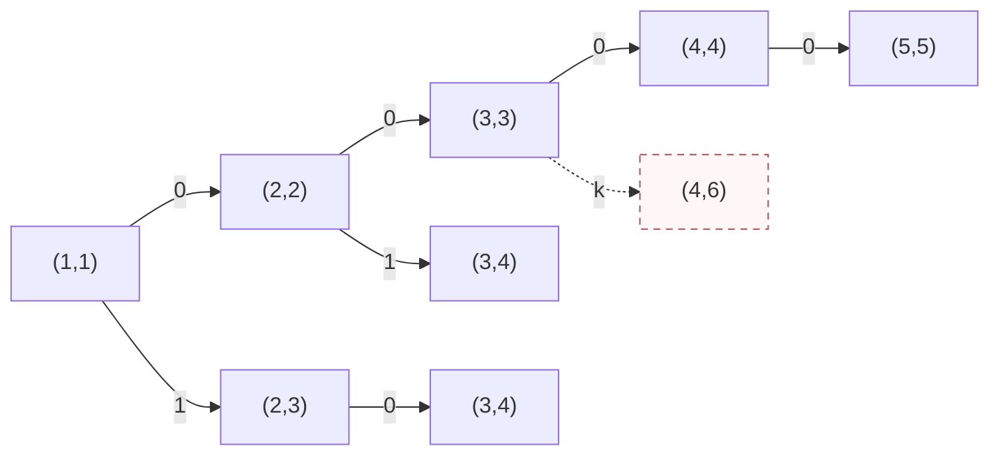
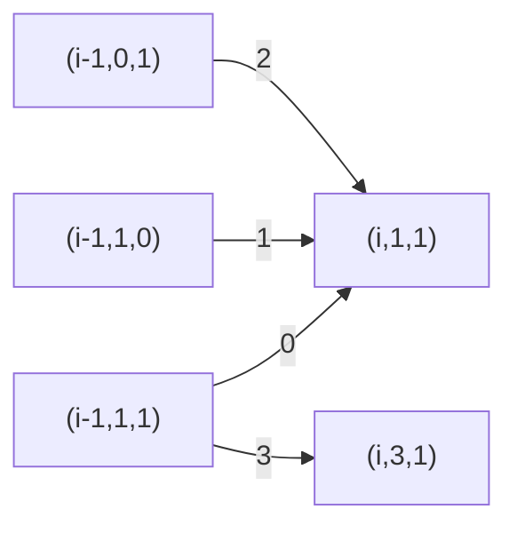

# T1 四段异或与最大连续和

---

## 题意简化

---

长度 $4\le n\le10^5$ 的有符号数组，必须从左到右选恰好四个互不相交的非空区间，分别把区间内的数异或 $b_1,b_2,b_3,b_4$；区间可相邻。随后在变换后的整个数组中选一个非空连续子数组，最大化其元素和。数组元素可负，异或按 32 位补码；答案需用 `long long`。

## 问题拆分

---

1. 确定四个区间，得到每个位置变换后的数。
2. 在变换后的数组中找到最大非空连续子数组和。
3. 在所有合法区间选择中取最大值。

## 20 分做法：枚举四段

---

**步骤 1、3。** 用 `dfs(j,start)` 表示正在选择第 $j$ 段，其左端点至少为 `start`。枚举 $l\ge start,r\ge l$，原地异或 $[l,r]$ 后递归下一段；返回时再异或一次恢复。四段都选完才进入步骤 2。合法四段的选择数是 $\binom{n+4}{8}$，比把每层都估作 $n^2$ 更准确。

**步骤 2。** 对每个完整方案用一次 Kadane 扫描，计算最大非空连续和，耗时 $O(n)$，额外空间 $O(1)$。合计时间 $O\!\left(n\binom{n+4}{8}\right)$，搜索深度 4，数组和调用栈共 $O(n)$ 空间。$n\le10$ 可用；$n=10^5$ 时远不能完成。

### 四段搜索小图

状态 `(j,s)` 表示下一段是第 $j$ 段，最早从 $s$ 开始；图示 $n=5$ 的局部选择。相同 `(j,s)` 若来自不同历史，数组已变换的部分可能不同，所以搜索树中保留两个节点。

**左上角图例**：`0` = 取本段 `[s,s]`；`1` = 取本段 `[s,s+1]`；`k` = 其它合法 `[l,r]`。条件：$j\le4$、区间非空且在 $1\ldots n$ 内；代价：异或该段元素；价值：此时不计和，四段完成后统一扫描。虚线箭头表示选择后无法凑齐四段，不进入合法答案。



**叶子**：$j=5$ 是合法四段终态，扫描数组并返回最大连续和；$j\le4$ 且 $s>n$ 是非法终态，不参与最大值。图中 `(4,6)` 是虚线非法叶子。

### 参考代码

```cpp
#include<bits/stdc++.h>
using namespace std;

const int N = 100005;
int n,x[N],b[5];
long long ans = -(1LL << 60);

void dfs(int j,int start){
	if(j == 5){
		long long best = -(1LL << 60),end = 0;
		for(int i = 1; i <= n; i++){
			end = max((long long)x[i],end + x[i]);
			best = max(best,end);
		}
		ans = max(ans,best);
		return;
	}
	for(int l = start; l <= n; l++){
		for(int r = l; r <= n; r++){
			for(int i = l; i <= r; i++) x[i] ^= b[j];
			dfs(j + 1,r + 1);
			for(int i = l; i <= r; i++) x[i] ^= b[j];
		}
	}
}

int main(){
	ios::sync_with_stdio(false);
	cin.tie(0);

	cin >> n;
	for(int j = 1; j <= 4; j++) cin >> b[j];
	for(int i = 1; i <= n; i++) cin >> x[i];
	dfs(1,1);
	cout << ans << '\n';
	return 0;
}
```

## 满分做法：区间阶段与最大子数组状态合并

---

**步骤 1。** 一个位置只需知道当前属于四段中的哪段或段间空白。用九个阶段 $p=0,1,\ldots,8$，异或掩码依次为

$$ (0,b_1,0,b_2,0,b_3,0,b_4,0). $$

奇数阶段是四个非空操作段，偶数阶段是未操作区。处理一个新位置时可留在原阶段，或前进一阶段；从奇数阶段还可直接前进两阶段，表示中间空白长度为零。每次前进都要消耗当前元素，所以进入过的奇数阶段自动非空。处理完 $n$ 个位置，只接受阶段 7 或 8，保证四段都选过。阶段 0 和 8 允许为空。

**步骤 2。** 最大子数组再用状态 $s=0,1,2$ 表示“尚未开始、正在延伸、已经结束”。若本位置变换后是 $v$，从 $s=0$ 可以继续等待或以 $v$ 开始；从 $s=1$ 可以加上 $v$ 或在本位置之前结束；$s=2$ 只能保持。正在延伸的值是当前子数组和，结束状态的值是已完成的和。答案只取 $s=1,2$，因此子数组非空。

**步骤 3。** `dp[p][s]` 保留已处理前缀中同一阶段、同一子数组状态的最大和。后续可选动作只由 `(p,s)` 决定，因此较小的和永远不会更优，可以合并。初态 `dp[0][0]=0`，其它状态为负无穷。按位置从左到右更新，每次使用上一轮数组；终态取 $p\in\{7,8\}$ 且 $s\in\{1,2\}$ 的最大值。

### DP 状态合流小图

节点 `(i,p,s)` 表示已处理 $i$ 个数后的状态。图只展示进入 `(i,1,1)` 及跳过第一、二段之间空白的局部转移；其余转移按上文同样更新。

**左上角图例**：`0` = 留在阶段 1，延伸子数组；`1` = 留在阶段 1，新开子数组；`2` = 从阶段 0 开始第一段并延伸子数组；`3` = 从阶段 1 直接进入阶段 3、空白长度为零。条件：源状态可达；代价：当前数的阶段掩码异或；价值：当前数的变换值。`1` 新开时不继承旧和。



**终态**：$i=n$、$p\in\{7,8\}$、$s\in\{1,2\}$ 才合法；其它状态不参加答案。箭头是从上一位置向下一位置的转移，多个路径到同一状态时取最大和。

每个位置只有 $9\times3$ 个状态，阶段最多三种走法，子数组状态最多两种走法；总时间 $O(9\cdot3\cdot3\cdot n)=O(n)$，两张 $9\times3$ 表只用 $O(1)$ 额外空间。$n=10^5$ 时转移数量为常数倍百万级。

### 参考代码

```cpp
#include<bits/stdc++.h>
using namespace std;

const long long NEG = -(1LL << 60);
long long dp[9][3],ndp[9][3];

int main(){
	ios::sync_with_stdio(false);
	cin.tie(0);

	int n,b[4],x;
	cin >> n >> b[0] >> b[1] >> b[2] >> b[3];
	int mask[9] = {0,b[0],0,b[1],0,b[2],0,b[3],0};
	for(int p = 0; p < 9; p++){
		for(int s = 0; s < 3; s++) dp[p][s] = NEG;
	}
	dp[0][0] = 0;
	for(int i = 1; i <= n; i++){
		cin >> x;
		for(int p = 0; p < 9; p++){
			for(int s = 0; s < 3; s++) ndp[p][s] = NEG;
		}
		for(int p = 0; p < 9; p++){
			for(int step = 0; step <= 2; step++){
				int q = p + step;
				if(q >= 9) continue;
				if(step == 2 && (p % 2 == 0 || p >= 7)) continue;
				int v = x ^ mask[q];
				if(dp[p][0] != NEG){
					ndp[q][0] = 0;
					ndp[q][1] = max(ndp[q][1],(long long)v);
				}
				if(dp[p][1] != NEG){
					ndp[q][1] = max(ndp[q][1],dp[p][1] + v);
					ndp[q][2] = max(ndp[q][2],dp[p][1]);
				}
				if(dp[p][2] != NEG){
					ndp[q][2] = max(ndp[q][2],dp[p][2]);
				}
			}
		}
		for(int p = 0; p < 9; p++){
			for(int s = 0; s < 3; s++) dp[p][s] = ndp[p][s];
		}
	}
	long long ans = NEG;
	for(int p = 7; p <= 8; p++){
		for(int s = 1; s <= 2; s++) ans = max(ans,dp[p][s]);
	}
	cout << ans << '\n';
	return 0;
}
```

## 知识点总结

---

多个有顺序的非空区间可以压成有限阶段；最大连续和可以压成“前、内、后”三态。两组状态作笛卡尔积，就能在一次从左到右扫描中同时决定操作段和答案子数组。

# T2 环上三点分组

---

## 题意简化

---

输入一张 $n\le2\times10^5$ 的连通简单基环图，恰有 $n$ 条编号边。删去一些边后，每个连通块都要恰有三个点，块内可有环。输出升序删除边编号的字典序最小序列；无解输出 $-1$。边数不作为第一目标，所以可能多删一条低编号环边而得到更小序列。

## 问题拆分

---

1. 确定不在唯一环上的树边必须怎样切，得到每个环点尚未闭合的点数。
2. 在环上把这些点数分成总和为 3 的连通组，并确定要切的环边。
3. 对全部合法删除序列排序并取字典序最小者。

## 20 分做法：枚举删边集合

---

**步骤 1、2。** 用一个二进制计数器遍历全部 $2^n$ 个删边集合。对当前方案把未删边加入并查集，再统计每个连通块的点数；所有非空连通块恰为 3 时方案合法。每个集合需要 $O(n\alpha(n))$ 时间和 $O(n)$ 空间。这里无需先求环，因为直接检查最终图。

**步骤 3。** 合法方案的删除边编号天然按升序收集，与当前最好方案作 $O(n)$ 的字典序比较。总时间 $O(n\alpha(n)2^n)$，空间 $O(n)$；$n\le12$ 很轻松，完整范围的指数规模不可行。代码中的二进制计数器对任意 $n$ 都有定义，没有靠超过阈值直接输出错误值。

### 参考代码

```cpp
#include<bits/stdc++.h>
using namespace std;

const int N = 200005;
int n,u[N],v[N],bit[N],fa[N],sizeD[N],cnt[N],cur[N],best[N],cn,bn = -1;

int findRoot(int x){
	int root = x;
	while(fa[root] != root) root = fa[root];
	while(fa[x] != x){
		int y = fa[x];
		fa[x] = root;
		x = y;
	}
	return root;
}

bool smaller(){
	if(bn == -1) return true;
	int m = min(cn,bn);
	for(int i = 1; i <= m; i++){
		if(cur[i] != best[i]) return cur[i] < best[i];
	}
	return cn < bn;
}

int main(){
	ios::sync_with_stdio(false);
	cin.tie(0);

	cin >> n;
	for(int i = 1; i <= n; i++) cin >> u[i] >> v[i];
	if(n % 3 != 0){
		cout << -1 << '\n';
		return 0;
	}
	while(true){
		for(int i = 1; i <= n; i++){
			fa[i] = i;
			sizeD[i] = 1;
			cnt[i] = 0;
		}
		cn = 0;
		for(int i = 1; i <= n; i++){
			if(bit[i]){
				cur[++cn] = i;
			}else{
				int a = findRoot(u[i]),b = findRoot(v[i]);
				if(a != b){
					if(sizeD[a] < sizeD[b]) swap(a,b);
					fa[b] = a;
					sizeD[a] += sizeD[b];
				}
			}
		}
		for(int i = 1; i <= n; i++) cnt[findRoot(i)]++;
		bool good = true;
		for(int i = 1; i <= n; i++){
			if(cnt[i] != 0 && cnt[i] != 3) good = false;
		}
		if(good && smaller()){
			bn = cn;
			for(int i = 1; i <= cn; i++) best[i] = cur[i];
		}
		int p = 1;
		while(p <= n && bit[p] == 1){
			bit[p] = 0;
			p++;
		}
		if(p > n) break;
		bit[p] = 1;
	}
	if(bn == -1){
		cout << -1 << '\n';
	}else{
		cout << bn << '\n';
		for(int i = 1; i <= bn; i++){
			if(i > 1) cout << ' ';
			cout << best[i];
		}
		cout << '\n';
	}
	return 0;
}
```

## 满分做法：剥叶子与三种环边界

---

**步骤 1。** 反复把度数为 1 的点从图上剥去，最后留下唯一的环。记录每个剥掉的点当时唯一还未剥掉的父点，再按剥除顺序自底向上处理。令 `sz[u]` 为向父点延伸、尚未闭合的块的点数，初始为 1。若 `sz[u]=3`，该块只能在父边处切断；若为 1 或 2，就把它加给父点；一旦超过 3 就无解。所有树边切法因此是强制的。队列剥除与累加各扫描边常数次，合计 $O(n)$ 时间、$O(n)$ 空间。

**步骤 2。** 按环的顺序列出环点，其 `sz` 值均在 1 到 3。记沿环的前缀点数为 $P_i$。任何两条相邻切边之间必须恰好有三个点，因此它们对应的 $P_i\bmod3$ 相同。环上可能的切边集合至多三种：对每个余数 $r=0,1,2$，把所有满足 $P_i\equiv r\pmod3$ 的边作为边界，然后逐组核查点数是否为 3。环长为 3、三个环点的 `sz` 都为 1 时，还有保留整个三点环、不切任何环边的方案。环长遍历和三次核查均为 $O(n)$。

**步骤 3。** 每种合法环切法与强制树边合并，按边编号排序后比较序列。最多四种方案，排序总计 $O(n\log n)$，辅助数组 $O(n)$。所有树边选择被步骤 1 强制，所有环边界被步骤 2 穷尽，所以比较得到的就是全局字典序最小答案；不需要特殊判题。

### 参考代码

```cpp
#include<bits/stdc++.h>
using namespace std;

const int N = 200005;
int head[N],to[2 * N],nxt[2 * N],eid[2 * N],ecnt;
int deg[N],que[N],par[N],pe[N],sz[N];
int cyc[N],ce[N],residue[N],forced[N],fcnt;
bool alive[N],mark[N];
int answer[N],acnt,candidate[N],ccnt;

void add(int u,int v,int id){
	ecnt++;
	to[ecnt] = v;
	eid[ecnt] = id;
	nxt[ecnt] = head[u];
	head[u] = ecnt;
	deg[u]++;
}

void consider(){
	sort(candidate + 1,candidate + ccnt + 1);
	if(acnt == -1 || lexicographical_compare(candidate + 1,candidate + ccnt + 1,answer + 1,answer + acnt + 1)){
		acnt = ccnt;
		for(int i = 1; i <= ccnt; i++) answer[i] = candidate[i];
	}
}

int main(){
	ios::sync_with_stdio(false);
	cin.tie(0);

	int n,u,v;
	cin >> n;
	for(int i = 1; i <= n; i++){
		cin >> u >> v;
		add(u,v,i);
		add(v,u,i);
	}
	if(n % 3 != 0){
		cout << -1 << '\n';
		return 0;
	}
	for(int i = 1; i <= n; i++){
		alive[i] = true;
		sz[i] = 1;
	}
	int front = 1,back = 0;
	for(int i = 1; i <= n; i++){
		if(deg[i] == 1) que[++back] = i;
	}
	while(front <= back){
		int x = que[front++];
		alive[x] = false;
		for(int e = head[x]; e; e = nxt[e]){
			int y = to[e];
			if(!alive[y]) continue;
			par[x] = y;
			pe[x] = eid[e];
			deg[y]--;
			if(deg[y] == 1) que[++back] = y;
		}
	}
	for(int i = 1; i <= back; i++){
		int x = que[i],y = par[x];
		if(sz[x] > 3){
			cout << -1 << '\n';
			return 0;
		}
		if(sz[x] == 3){
			forced[++fcnt] = pe[x];
		}else{
			sz[y] += sz[x];
			if(sz[y] > 3){
				cout << -1 << '\n';
				return 0;
			}
		}
	}
	int start = 0;
	for(int i = 1; i <= n; i++){
		if(alive[i]){
			start = i;
			break;
		}
	}
	int x = start,last = 0,len = 0;
	do{
		cyc[++len] = x;
		int next = 0,edge = 0;
		for(int e = head[x]; e; e = nxt[e]){
			int y = to[e];
			if(alive[y] && y != last){
				next = y;
				edge = eid[e];
				break;
			}
		}
		ce[len] = edge;
		last = x;
		x = next;
	}while(x != start);
	acnt = -1;
	if(len == 3 && sz[cyc[1]] == 1 && sz[cyc[2]] == 1 && sz[cyc[3]] == 1){
		ccnt = 0;
		for(int i = 1; i <= fcnt; i++) candidate[++ccnt] = forced[i];
		consider();
	}
	int prefix = 0;
	for(int i = 1; i <= len; i++){
		prefix += sz[cyc[i]];
		residue[i] = prefix % 3;
	}
	for(int r = 0; r < 3; r++){
		int first = 0;
		for(int i = 1; i <= len; i++){
			mark[i] = residue[i] == r;
			if(mark[i] && first == 0) first = i;
		}
		if(first == 0) continue;
		bool good = true;
		int sum = 0,i = first;
		do{
			i = i % len + 1;
			sum += sz[cyc[i]];
			if(mark[i]){
				if(sum != 3) good = false;
				sum = 0;
			}
		}while(i != first);
		if(!good) continue;
		ccnt = 0;
		for(int j = 1; j <= fcnt; j++) candidate[++ccnt] = forced[j];
		for(int j = 1; j <= len; j++){
			if(mark[j]) candidate[++ccnt] = ce[j];
		}
		consider();
	}
	if(acnt == -1){
		cout << -1 << '\n';
	}else{
		cout << acnt << '\n';
		for(int i = 1; i <= acnt; i++){
			if(i > 1) cout << ' ';
			cout << answer[i];
		}
		cout << '\n';
	}
	return 0;
}
```

## 知识点总结

---

基环图先剥叶子，把挂树压成环点权值。目标块大小固定为 3 时，树边由剩余块大小强制决定；环上的切边只剩三种前缀和余数，另检查三点环整体保留的情况。

# T3 两种连通关系

---

## 题意简化

---

输入一棵 $1\le n<2\times10^5$ 的树，点权是互异的 30 位非负整数。每个点在其余所有点中找异或值最小的唯一关联点。要选尽量多的点，使每个被选点的关联点也被选中，而且选点在**原树的诱导边**和**关联边**下分别都连成树；若无非空方案输出 0。$n=1$ 时答案为 1。两种连通条件都要检查。

## 问题拆分

---

1. 对每个点求关联点，得到一张每点指向一个点的图。
2. 确定关联图中可能保留的连通块，以及该块在原树中包含核心的区域。
3. 从该区域中去掉违反原树连通或关联闭包的点，取最大合法区域。

## 40 分做法：两两计算异或

---

**步骤 1。** 对每个 $u$ 扫描所有 $v\ne u$，选最小的 $a_u\mathbin{\mathrm{xor}}a_v$。异或值不会并列，因为权值互异。时间 $O(n^2)$、额外空间 $O(n)$ 存关联点。

**步骤 2。** 对每条 $u\to f(u)$ 用并查集合并，得到关联图的无向连通块，耗时 $O(n\alpha(n))$。在每块中找唯一的双向关联对 $(p,q)$，从 $p$ 沿原树边只走本关联块内的点，得到包含 $p$ 的原树区域 $B$；若 $q$ 不在 $B$，该块无法产生非空答案。遍历全部块总计 $O(n)$。

**步骤 3。** 先把 $B$ 内关联点不在 $B$ 的点标为坏点。坏点在以 $p$ 为根的原树中的后代也必须删，否则原树不连通；指向坏点的点也必须删，否则关联闭包不成立。用队列沿这两类反向关系传播，所有剩余点就是该块的最大合法集合。每点每边被处理常数次，合计 $O(n)$ 时间与空间。

总时间 $O(n^2+n\alpha(n))=O(n^2)$、空间 $O(n)$，可以处理 $n\le3000$。所谓“最高二进制位互不相同”在本题 30 位值域下最多只有 30 个正权值，它自然包含在小范围做法中，不另造一个大规模子任务；链和菊花仍须检查两种连通关系，不能只按权值求答案。

### 参考代码

```cpp
#include<bits/stdc++.h>
using namespace std;

const int N = 200005;
int a[N],f[N],dsu[N],sizeD[N],comp[N],core[N];
int head[N],to[2 * N],nxt[2 * N],ecnt;
int revHead[N],revNext[N];
int region[N],parentTree[N],bad[N],que[N],badQue[N];

void add(int u,int v){
	ecnt++;
	to[ecnt] = v;
	nxt[ecnt] = head[u];
	head[u] = ecnt;
}

int findRoot(int x){
	if(dsu[x] == x) return x;
	dsu[x] = findRoot(dsu[x]);
	return dsu[x];
}

void unite(int x,int y){
	x = findRoot(x);
	y = findRoot(y);
	if(x == y) return;
	if(sizeD[x] < sizeD[y]) swap(x,y);
	dsu[y] = x;
	sizeD[x] += sizeD[y];
}

int main(){
	ios::sync_with_stdio(false);
	cin.tie(0);

	int n,u,v;
	cin >> n;
	for(int i = 1; i <= n; i++){
		cin >> a[i];
		dsu[i] = i;
		sizeD[i] = 1;
	}
	for(int i = 1; i < n; i++){
		cin >> u >> v;
		add(u,v);
		add(v,u);
	}
	if(n == 1){
		cout << 1 << '\n';
		return 0;
	}
	for(int i = 1; i <= n; i++){
		int best = -1;
		for(int j = 1; j <= n; j++){
			if(i == j) continue;
			if(best == -1 || (a[i] ^ a[j]) < (a[i] ^ a[best])) best = j;
		}
		f[i] = best;
		unite(i,f[i]);
		revNext[i] = revHead[f[i]];
		revHead[f[i]] = i;
	}
	for(int i = 1; i <= n; i++) comp[i] = findRoot(i);
	for(int i = 1; i <= n; i++){
		if(i < f[i] && f[f[i]] == i) core[comp[i]] = i;
	}
	int ans = 0;
	for(int c = 1; c <= n; c++){
		int root = core[c];
		if(root == 0) continue;
		int front = 1,back = 1;
		que[1] = root;
		region[root] = root;
		parentTree[root] = 0;
		while(front <= back){
			int x = que[front++];
			for(int e = head[x]; e; e = nxt[e]){
				int y = to[e];
				if(comp[y] != c || region[y] == root) continue;
				region[y] = root;
				parentTree[y] = x;
				que[++back] = y;
			}
		}
		if(region[f[root]] != root) continue;
		int removed = 0;
		front = 1;
		int badCount = 0;
		for(int i = 1; i <= back; i++){
			int x = que[i];
			if(region[f[x]] != root){
				bad[x] = root;
				badQue[++badCount] = x;
			}
		}
		while(front <= badCount){
			int x = badQue[front++];
			removed++;
			for(int e = head[x]; e; e = nxt[e]){
				int y = to[e];
				if(region[y] == root && parentTree[y] == x && bad[y] != root){
					bad[y] = root;
					badQue[++badCount] = y;
				}
			}
			for(int y = revHead[x]; y; y = revNext[y]){
				if(region[y] == root && bad[y] != root){
					bad[y] = root;
					badQue[++badCount] = y;
				}
			}
		}
		ans = max(ans,back - removed);
	}
	cout << ans << '\n';
	return 0;
}
```

## 满分做法：字典树找关联点，双关系删点

---

先说明步骤 2、3 的依据。沿一条长度大于 2 的有向环走，每个点都严格认为下一个点比上一个点的异或距离小；由于距离对称，绕一圈会得到严格递减的环，矛盾。因此关联图的每个弱连通块恰有一个双向关联对，其余点的箭头最终指向这对点。关联闭合的非空点集必包含这对点；在单个关联块内，只要沿箭头闭合，它的关联边就自然连成一棵树。

**步骤 1。** 把全部 30 位权值插入二进制字典树。查询 $u$ 时，在尚未与 $a_u$ 分叉前，仅当相同位的子树有至少两个点才走相同位，否则走另一位并标记已经排除了自己；分叉后按异或最小原则优先走相同位。每点插入、查询各走 30 层，合计 $O(30n)$ 时间。字典树最多 $30n+1$ 个节点，空间 $O(30n)$。

**步骤 2。** 与 40 分做法相同，合并关联边，找每块的核心对 $(p,q)$，从 $p$ 在原树中走出同一关联块的区域 $B$。若 $q\notin B$，任何包含两者的原树连通点集都不存在。并查集和原树遍历合计 $O(n\alpha(n))$ 时间、$O(n)$ 额外空间。

**步骤 3。** 与 40 分做法相同，把关联点在 $B$ 外的点作为初始坏点，再沿原树父子关系向下、沿反向关联边传播坏标记。删掉坏点后，剩余点包含核心对、在原树中连通、对关联点闭合；任意合法集合也不能含坏点，所以它最大。取所有关联块的最大剩余数量即可。传播总计 $O(n)$ 时间、$O(n)$ 空间。

总时间 $O(30n+n\alpha(n))$，总空间 $O(30n)$。大链用队列沿树边遍历，不依赖深递归栈；字典树仅有固定的 30 层。

### 参考代码

```cpp
#include<bits/stdc++.h>
using namespace std;

const int N = 200005;
const int M = 6000005;
int trie[M][2],cnt[M],nodes = 1;
int a[N],f[N],dsu[N],sizeD[N],comp[N],core[N];
int head[N],to[2 * N],nxt[2 * N],ecnt;
int revHead[N],revNext[N];
int region[N],parentTree[N],bad[N],que[N],badQue[N];

void add(int u,int v){
	ecnt++;
	to[ecnt] = v;
	nxt[ecnt] = head[u];
	head[u] = ecnt;
}

void insertValue(int x,int id){
	int u = 1;
	cnt[u]++;
	for(int b = 29; b >= 0; b--){
		int t = (x >> b) & 1;
		if(!trie[u][t]) trie[u][t] = ++nodes;
		u = trie[u][t];
		if(b == 0) cnt[u] = -id;
		else cnt[u]++;
	}
}

int nearest(int x){
	int u = 1;
	bool different = false;
	for(int b = 29; b >= 0; b--){
		int t = (x >> b) & 1;
		int same = trie[u][t],other = trie[u][t ^ 1];
		if(!different){
			if(same && cnt[same] > 1){
				u = same;
			}else{
				u = other;
				different = true;
			}
		}else{
			u = same ? same : other;
		}
	}
	return -cnt[u];
}

int findRoot(int x){
	if(dsu[x] == x) return x;
	dsu[x] = findRoot(dsu[x]);
	return dsu[x];
}

void unite(int x,int y){
	x = findRoot(x);
	y = findRoot(y);
	if(x == y) return;
	if(sizeD[x] < sizeD[y]) swap(x,y);
	dsu[y] = x;
	sizeD[x] += sizeD[y];
}

int main(){
	ios::sync_with_stdio(false);
	cin.tie(0);

	int n,u,v;
	cin >> n;
	for(int i = 1; i <= n; i++){
		cin >> a[i];
		insertValue(a[i],i);
		dsu[i] = i;
		sizeD[i] = 1;
	}
	for(int i = 1; i < n; i++){
		cin >> u >> v;
		add(u,v);
		add(v,u);
	}
	if(n == 1){
		cout << 1 << '\n';
		return 0;
	}
	for(int i = 1; i <= n; i++){
		f[i] = nearest(a[i]);
		unite(i,f[i]);
		revNext[i] = revHead[f[i]];
		revHead[f[i]] = i;
	}
	for(int i = 1; i <= n; i++) comp[i] = findRoot(i);
	for(int i = 1; i <= n; i++){
		if(i < f[i] && f[f[i]] == i) core[comp[i]] = i;
	}
	int ans = 0;
	for(int c = 1; c <= n; c++){
		int root = core[c];
		if(root == 0) continue;
		int front = 1,back = 1;
		que[1] = root;
		region[root] = root;
		parentTree[root] = 0;
		while(front <= back){
			int x = que[front++];
			for(int e = head[x]; e; e = nxt[e]){
				int y = to[e];
				if(comp[y] != c || region[y] == root) continue;
				region[y] = root;
				parentTree[y] = x;
				que[++back] = y;
			}
		}
		if(region[f[root]] != root) continue;
		int removed = 0;
		front = 1;
		int badCount = 0;
		for(int i = 1; i <= back; i++){
			int x = que[i];
			if(region[f[x]] != root){
				bad[x] = root;
				badQue[++badCount] = x;
			}
		}
		while(front <= badCount){
			int x = badQue[front++];
			removed++;
			for(int e = head[x]; e; e = nxt[e]){
				int y = to[e];
				if(region[y] == root && parentTree[y] == x && bad[y] != root){
					bad[y] = root;
					badQue[++badCount] = y;
				}
			}
			for(int y = revHead[x]; y; y = revNext[y]){
				if(region[y] == root && bad[y] != root){
					bad[y] = root;
					badQue[++badCount] = y;
				}
			}
		}
		ans = max(ans,back - removed);
	}
	cout << ans << '\n';
	return 0;
}
```

## 知识点总结

---

互异权值的最近异或点可以用字典树逐位求出。最近邻箭头形成以双向对为核心的树形关联块；同时要求原树连通时，从核心区域出发，用“原树后代”和“反向关联依赖”两种规则传播必删点。

# T4 有限次精确均衡

---

## 题意简化

---

长度 $1\le n\le10^5$ 的正整数序列，最多做 $k\le n$ 次操作：把长度至少 2 的一个连续区间全部替换为它**操作前的精确有理数平均值**，区间可以重叠。先最大化最终序列的数值字典序，再最小化操作次数，最后最小化按执行顺序排列的区间对序列。输出次数、每个数的约分分数、全部区间。

## 问题拆分

---

1. 找出从左向右哪些连续块应该有相同平均值，以及这些平均值。
2. 在至多 $k$ 次操作下，决定优先完成哪些块。
3. 为最终序列给出操作次数最少、区间序列字典序最小的记录，并输出精确分数。

## 20 分做法：逐个扫描后缀的最大前缀平均值

---

**步骤 1。** 从尚未处理的最左位置 `start` 扫描到 $n$，用前缀和比较所有 $[start,r]$ 的平均值，选平均值最大的最长前缀作为一块；从该块之后重复。若两平均值相同，取更长者。这些块的平均值严格递减。每次扫描一个后缀，最坏可能有 $n$ 个块，例如严格递减数组，所以总时间 $O(n^2)$；只存数组与块结果，空间 $O(n)$。

**步骤 2。** 从左到右遇到原数并非全等于块平均值的块，就用一次操作把它变成平均值，直到用完 $k$ 次；原本已经全等的块不用操作。块的判定和赋值合计 $O(n)$。字典序首先比较最左不同位置，因此预算只能优先给更靠左的待改变块。

**步骤 3。** 对要操作的块 $[L,R]$，把左端点取为 $L$，右端点取该块最后一个原数不等于平均值的位置；后面已有正确值，无需放进区间。用最大公约数约分。记录与输出合计 $O(n)$ 时间、$O(n)$ 空间。总体 $O(n^2)$ 时间、$O(n)$ 空间，适用 $n\le10$；在完整范围的严格递减点，重复扫后缀会超时。

### 参考代码

```cpp
#include<bits/stdc++.h>
using namespace std;

const int N = 100005;
long long a[N],num[N];
int den[N],opL[N],opR[N];

bool lessEqual(long long x,int nx,long long y,int ny){
	long long qx = x / nx,qy = y / ny;
	if(qx != qy) return qx < qy;
	return x % nx * ny <= y % ny * nx;
}

long long gcdValue(long long x,long long y){
	while(y){
		long long z = x % y;
		x = y;
		y = z;
	}
	return x;
}

int main(){
	ios::sync_with_stdio(false);
	cin.tie(0);

	int n,k;
	cin >> n >> k;
	for(int i = 1; i <= n; i++){
		cin >> a[i];
		num[i] = a[i];
		den[i] = 1;
	}
	int used = 0,start = 1;
	while(start <= n){
		long long prefix = 0,bestSum = -1;
		int end = start,bestLen = 1;
		for(int i = start; i <= n; i++){
			prefix += a[i];
			int len = i - start + 1;
			if(bestSum == -1 || lessEqual(bestSum,bestLen,prefix,len)){
				bestSum = prefix;
				bestLen = len;
				end = i;
			}
		}
		int last = 0;
		for(int i = start; i <= end; i++){
			if(a[i] * bestLen != bestSum) last = i;
		}
		if(last != 0 && used < k){
			used++;
			opL[used] = start;
			opR[used] = last;
			long long g = gcdValue(bestSum,bestLen);
			for(int i = start; i <= end; i++){
				num[i] = bestSum / g;
				den[i] = bestLen / g;
			}
		}
		start = end + 1;
	}
	cout << used << '\n';
	for(int i = 1; i <= n; i++){
		if(i > 1) cout << ' ';
		cout << num[i] << '/' << den[i];
	}
	cout << '\n';
	for(int i = 1; i <= used; i++) cout << opL[i] << ' ' << opR[i] << '\n';
	return 0;
}
```

## 满分做法：前缀和上凸包与单调块栈

---

令 $P_0=0,\ P_i=\sum_{j=1}^i a_j$。对区间 $[l,r]$ 取平均，会把前缀和图上 $(l-1,P_{l-1})$ 到 $(r,P_r)$ 之间的点改到连接两个端点的直线上。设 $H$ 是原前缀和点的最小凹上界折线。一次操作前、后区间端点都不高于 $H$；由于 $H$ 凹，端点之间的直线也不高于 $H$，所以任意多次操作后的每个前缀和都不能超过 $H$。

若最终序列在位置 $i$ 之前已经达到 $H$ 的斜率，那么第 $i$ 项至多是 $H_i-H_{i-1}$。把 $H$ 的每条直线段对应的数组块一次性取平均，正好处处达到 $H$，因此这就是无限预算时的字典序最大序列。相邻块平均值严格递减；平均值相等的块合在一起。

**步骤 1。** 从左到右把每个数作为单元素块压栈。若栈顶前一块的平均值小于或等于后一块，就合并这两块，直到块平均值严格递减。这是相邻块合并算法，每个块只入栈、出栈常数次，合计 $O(n)$。比较平均值时可先比整数商，商相等再交叉比较余数，乘积不超过 $10^{10}$，用 `long long` 即可避免分数误差与大乘积溢出。

**步骤 2。** 在两块的严格下降边界处，$H$ 有折点。任何跨过该边界的平均操作都会使该边界处的前缀和低于 $H$，之后也无法补回。因此每个真正改变数值的块至少要一次独立操作；原本全等的块需要零次。有限预算时，若先完成前 $k$ 个待改变块，所有更早位置达到可能的字典序上界；任何跳过靠前块而处理后块的方案先在靠前位置变小。扫描全部块并按此规则选取，耗时 $O(n)$。

**步骤 3。** 一个待改变块的所有改变位置必须落在其一次操作区间内。把左端点取块首 $L$，右端点取最后一个改变位置，操作均值仍是该块均值；这样区间对字典序最小。各块按从左到右执行，记录唯一规定的最小序列。块和、块长至多 $10^{14},10^5$，约分后输出 $p/q$。扫描、约分和写出全部 $n$ 个值以及最多 $n/2$ 条区间，合计 $O(n)$ 时间、$O(n)$ 空间。

严格递减序列的每块都是原数，不需要操作；严格递增序列合成一个整块，$k\ge1$ 时只需一次操作。即使某个合并提高了靠前元素却降低了后面的元素，字典序仍由最先不同的位置决定，不能拿后面损失来否定前面的收益。

### 参考代码

```cpp
#include<bits/stdc++.h>
using namespace std;

const int N = 100005;
long long a[N],sum[N],num[N];
int leftEnd[N],rightEnd[N],length[N],den[N];
int opL[N],opR[N];

bool lessEqual(long long x,int nx,long long y,int ny){
	long long qx = x / nx,qy = y / ny;
	if(qx != qy) return qx < qy;
	return x % nx * ny <= y % ny * nx;
}

long long gcdValue(long long x,long long y){
	while(y){
		long long z = x % y;
		x = y;
		y = z;
	}
	return x;
}

int main(){
	ios::sync_with_stdio(false);
	cin.tie(0);

	int n,k;
	cin >> n >> k;
	for(int i = 1; i <= n; i++) cin >> a[i];
	int top = 0;
	for(int i = 1; i <= n; i++){
		top++;
		leftEnd[top] = rightEnd[top] = i;
		length[top] = 1;
		sum[top] = a[i];
		while(top > 1 && lessEqual(sum[top - 1],length[top - 1],sum[top],length[top])){
			sum[top - 1] += sum[top];
			length[top - 1] += length[top];
			rightEnd[top - 1] = rightEnd[top];
			top--;
		}
	}
	for(int i = 1; i <= n; i++){
		num[i] = a[i];
		den[i] = 1;
	}
	int used = 0;
	for(int b = 1; b <= top; b++){
		int l = leftEnd[b],r = rightEnd[b];
		int last = 0;
		for(int i = l; i <= r; i++){
			if(a[i] * length[b] != sum[b]) last = i;
		}
		if(last == 0 || used == k) continue;
		used++;
		opL[used] = l;
		opR[used] = last;
		long long g = gcdValue(sum[b],length[b]);
		for(int i = l; i <= r; i++){
			num[i] = sum[b] / g;
			den[i] = length[b] / g;
		}
	}
	cout << used << '\n';
	for(int i = 1; i <= n; i++){
		if(i > 1) cout << ' ';
		cout << num[i] << '/' << den[i];
	}
	cout << '\n';
	for(int i = 1; i <= used; i++) cout << opL[i] << ' ' << opR[i] << '\n';
	return 0;
}
```

## 知识点总结

---

精确区间平均把前缀和的一段改成直线；凹上界给每个靠前位置的可达上限。相邻块均值逆序时合并，可在线性时间构造上凸包；有限预算按块从左到右使用，等值块不花操作次数。
