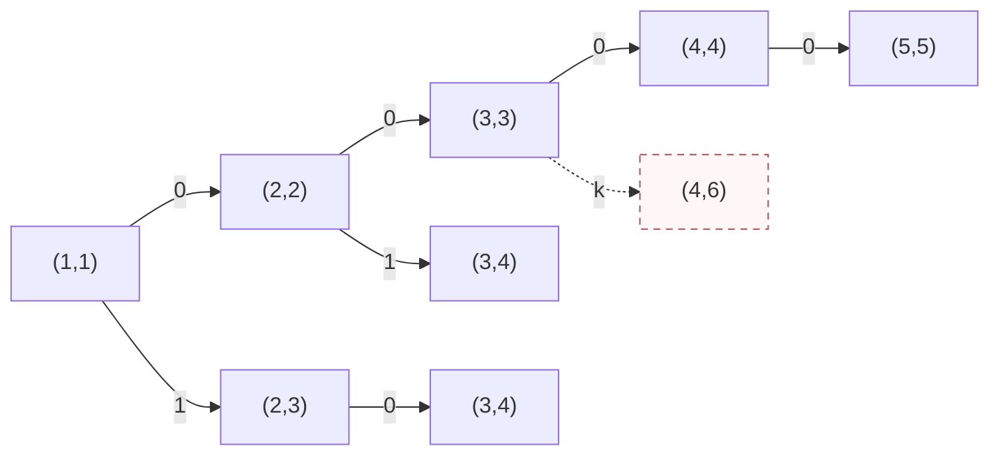
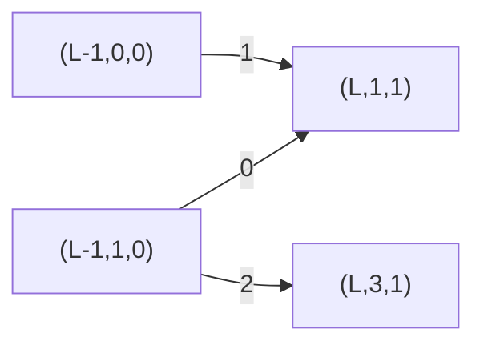
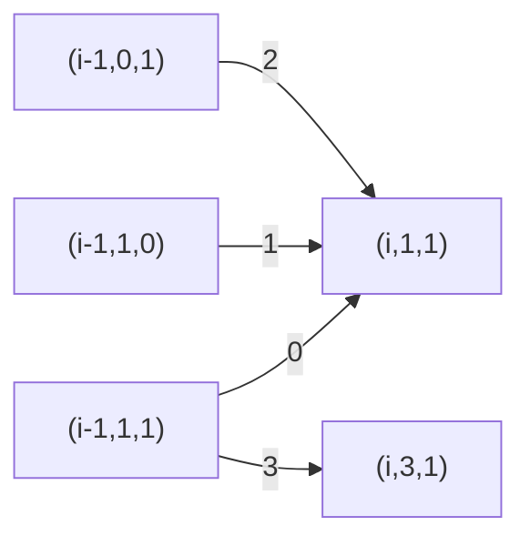

# T1 四段异或与最大连续和

---

## 题意简化

---

长度 $4\le n\le10^5$ 的有符号数组，必须从左到右选恰好四个互不相交的非空区间，分别把区间内的数异或 $b_1,b_2,b_3,b_4$；区间可相邻。随后在变换后的整个数组中选一个非空连续子数组，最大化其元素和。数组元素可负，异或按 32 位补码；答案需用 `long long`。

## 问题拆分

---

1. 确定四个区间，得到每个位置变换后的数。
2. 在变换后的数组中找到最大非空连续子数组和。
3. 在所有合法区间选择中取最大值。

## 20 分做法：枚举四段

---

**步骤 1、3。** 用 `dfs(j,start)` 表示正在选择第 $j$ 段，其左端点至少为 `start`。枚举 $l\ge start,r\ge l$，原地异或 $[l,r]$ 后递归下一段；返回时再异或一次恢复。四段都选完才进入步骤 2。合法四段的选择数是 $\binom{n+4}{8}$，比把每层都估作 $n^2$ 更准确。

**步骤 2。** 对每个完整方案用一次 Kadane 扫描，计算最大非空连续和，耗时 $O(n)$，额外空间 $O(1)$。合计时间 $O\!\left(n\binom{n+4}{8}\right)$，搜索深度 4，数组和调用栈共 $O(n)$ 空间。$n\le10$ 可用；$n=10^5$ 时远不能完成。

### 四段搜索小图

状态 `(j,s)` 表示下一段是第 $j$ 段，最早从 $s$ 开始；图示 $n=5$ 的局部选择。相同 `(j,s)` 若来自不同历史，数组已变换的部分可能不同，所以搜索树中保留两个节点。

**左上角图例**：`0` = 取本段 `[s,s]`；`1` = 取本段 `[s,s+1]`；`k` = 其它合法 `[l,r]`。条件：$j\le4$、区间非空且在 $1\ldots n$ 内；代价：异或该段元素；价值：此时不计和，四段完成后统一扫描。虚线箭头表示选择后无法凑齐四段，不进入合法答案。



**叶子**：$j=5$ 是合法四段终态，扫描数组并返回最大连续和；$j\le4$ 且 $s>n$ 是非法终态，不参与最大值。图中 `(4,6)` 是虚线非法叶子。

### 参考代码

```cpp
#include<bits/stdc++.h>
using namespace std;

const int N = 100005;
int n,x[N],b[5];
long long ans = -(1LL << 60);

void dfs(int j,int start){
	if(j == 5){
		long long best = -(1LL << 60),end = 0;
		for(int i = 1; i <= n; i++){
			end = max((long long)x[i],end + x[i]);
			best = max(best,end);
		}
		ans = max(ans,best);
		return;
	}
	for(int l = start; l <= n; l++){
		for(int r = l; r <= n; r++){
			for(int i = l; i <= r; i++) x[i] ^= b[j];
			dfs(j + 1,r + 1);
			for(int i = l; i <= r; i++) x[i] ^= b[j];
		}
	}
}

int main(){
	ios::sync_with_stdio(false);
	cin.tie(0);

	cin >> n;
	for(int j = 1; j <= 4; j++) cin >> b[j];
	for(int i = 1; i <= n; i++) cin >> x[i];
	dfs(1,1);
	cout << ans << '\n';
	return 0;
}
```

## 20 分做法：固定答案左端点的阶段 DP

---

**步骤 1。** 枚举最终最大子数组的左端点 $L$。四个操作段仍用九个阶段 $p=0,1,\ldots,8$ 表示，掩码依次是 $(0,b_1,0,b_2,0,b_3,0,b_4,0)$。留在当前阶段、前进一阶段、从奇数阶段越过空白前进两阶段，分别处理段内延续、开始下一段和相邻操作段。每次阶段前进都消耗一个位置，因此四段非空。枚举一个 $L$ 的阶段转移为 $O(9\cdot3n)=O(n)$，状态空间 $O(9)$。

**步骤 2。** 对固定的 $L$，用 $s=0,1,2$ 表示答案子数组尚未开始、正在延伸、已经结束。$i<L$ 时只能保持 $s=0$；$i=L$ 时必须把变换后的 $a_L$ 加入，转为 $s=1$；之后可以延伸、结束或保持结束。相同 $(p,s)$ 只保留最大的和，因为后续可选操作相同。到 $i=n$ 时只接受阶段 7、8 且 $s=1,2$，所以四段都完成、答案子数组非空。每个 $L$ 扫描 $n$ 个数，耗时 $O(n)$，两层状态表空间 $O(9\cdot3)$。

**步骤 3。** 在所有 $L$ 的合法终态中取最大值。总时间 $O(n^2)$，额外空间 $O(n)$（输入数组占主要部分）。$n\le2000$ 可用；$n=10^5$ 时需改用满分做法，把所有 $L$ 合并进“尚未开始”状态。

### 固定左端点的 DP 小图

节点 $(i,p,s)$ 表示处理完前 $i$ 个数的阶段与子数组状态；图示 $i=L$ 的合流。**左上角图例**：`0` = 当前阶段不变；`1` = 进入下一阶段；`2` = 从奇数阶段跳过零长度空白。条件：$i=L$，本位置必须开始答案子数组；代价：阶段掩码作用于 $a_L$；价值：把变换后的 $a_L$ 作为第一个加数。其他 $i$ 按上述 $s$ 规则转移。



**终态**：仅 $(n,7,1/2)$ 与 $(n,8,1/2)$ 合法。两条箭头合到同一状态时取较大的子数组和。

### 参考代码

```cpp
#include<bits/stdc++.h>
using namespace std;

const int N = 100005;
const long long NEG = -(1LL << 60);
int n,x[N],b[4],maskValue[9];
long long dp[9][3],nextDp[9][3];

int main(){
	ios::sync_with_stdio(false);
	cin.tie(0);

	cin >> n >> b[0] >> b[1] >> b[2] >> b[3];
	for(int i = 1; i <= n; i++) cin >> x[i];
	int temp[9] = {0,b[0],0,b[1],0,b[2],0,b[3],0};
	for(int p = 0; p < 9; p++) maskValue[p] = temp[p];
	long long ans = NEG;
	for(int left = 1; left <= n; left++){
		for(int p = 0; p < 9; p++){
			for(int s = 0; s < 3; s++) dp[p][s] = NEG;
		}
		dp[0][0] = 0;
		for(int i = 1; i <= n; i++){
			for(int p = 0; p < 9; p++){
				for(int s = 0; s < 3; s++) nextDp[p][s] = NEG;
			}
			for(int p = 0; p < 9; p++){
				for(int step = 0; step <= 2; step++){
					int q = p + step;
					if(q >= 9) continue;
					if(step == 2 && (p % 2 == 0 || p >= 7)) continue;
					int v = x[i] ^ maskValue[q];
					if(i < left && dp[p][0] != NEG) nextDp[q][0] = 0;
					if(i == left && dp[p][0] != NEG) nextDp[q][1] = max(nextDp[q][1],(long long)v);
					if(i > left){
						if(dp[p][1] != NEG){
							nextDp[q][1] = max(nextDp[q][1],dp[p][1] + v);
							nextDp[q][2] = max(nextDp[q][2],dp[p][1]);
						}
						if(dp[p][2] != NEG) nextDp[q][2] = max(nextDp[q][2],dp[p][2]);
					}
				}
			}
			for(int p = 0; p < 9; p++){
				for(int s = 0; s < 3; s++) dp[p][s] = nextDp[p][s];
			}
		}
		for(int p = 7; p <= 8; p++){
			for(int s = 1; s <= 2; s++) ans = max(ans,dp[p][s]);
		}
	}
	cout << ans << '\n';
	return 0;
}
```

## 满分做法：区间阶段与最大子数组状态合并

---

**步骤 1。** 一个位置只需知道当前属于四段中的哪段或段间空白。用九个阶段 $p=0,1,\ldots,8$，异或掩码依次为

$$ (0,b_1,0,b_2,0,b_3,0,b_4,0). $$

奇数阶段是四个非空操作段，偶数阶段是未操作区。处理一个新位置时可留在原阶段，或前进一阶段；从奇数阶段还可直接前进两阶段，表示中间空白长度为零。每次前进都要消耗当前元素，所以进入过的奇数阶段自动非空。处理完 $n$ 个位置，只接受阶段 7 或 8，保证四段都选过。阶段 0 和 8 允许为空。

**步骤 2。** 最大子数组再用状态 $s=0,1,2$ 表示“尚未开始、正在延伸、已经结束”。若本位置变换后是 $v$，从 $s=0$ 可以继续等待或以 $v$ 开始；从 $s=1$ 可以加上 $v$ 或在本位置之前结束；$s=2$ 只能保持。正在延伸的值是当前子数组和，结束状态的值是已完成的和。答案只取 $s=1,2$，因此子数组非空。

**步骤 3。** `dp[p][s]` 保留已处理前缀中同一阶段、同一子数组状态的最大和。后续可选动作只由 `(p,s)` 决定，因此较小的和永远不会更优，可以合并。初态 `dp[0][0]=0`，其它状态为负无穷。按位置从左到右更新，每次使用上一轮数组；终态取 $p\in\{7,8\}$ 且 $s\in\{1,2\}$ 的最大值。

### DP 状态合流小图

节点 `(i,p,s)` 表示已处理 $i$ 个数后的状态。图只展示进入 `(i,1,1)` 及跳过第一、二段之间空白的局部转移；其余转移按上文同样更新。

**左上角图例**：`0` = 留在阶段 1，延伸子数组；`1` = 留在阶段 1，新开子数组；`2` = 从阶段 0 开始第一段并延伸子数组；`3` = 从阶段 1 直接进入阶段 3、空白长度为零。条件：源状态可达；代价：当前数的阶段掩码异或；价值：当前数的变换值。`1` 新开时不继承旧和。



**终态**：$i=n$、$p\in\{7,8\}$、$s\in\{1,2\}$ 才合法；其它状态不参加答案。箭头是从上一位置向下一位置的转移，多个路径到同一状态时取最大和。

每个位置只有 $9\times3$ 个状态，阶段最多三种走法，子数组状态最多两种走法；总时间 $O(9\cdot3\cdot3\cdot n)=O(n)$，两张 $9\times3$ 表只用 $O(1)$ 额外空间。$n=10^5$ 时转移数量为常数倍百万级。

### 参考代码

```cpp
#include<bits/stdc++.h>
using namespace std;

const long long NEG = -(1LL << 60);
long long dp[9][3],ndp[9][3];

int main(){
	ios::sync_with_stdio(false);
	cin.tie(0);

	int n,b[4],x;
	cin >> n >> b[0] >> b[1] >> b[2] >> b[3];
	int mask[9] = {0,b[0],0,b[1],0,b[2],0,b[3],0};
	for(int p = 0; p < 9; p++){
		for(int s = 0; s < 3; s++) dp[p][s] = NEG;
	}
	dp[0][0] = 0;
	for(int i = 1; i <= n; i++){
		cin >> x;
		for(int p = 0; p < 9; p++){
			for(int s = 0; s < 3; s++) ndp[p][s] = NEG;
		}
		for(int p = 0; p < 9; p++){
			for(int step = 0; step <= 2; step++){
				int q = p + step;
				if(q >= 9) continue;
				if(step == 2 && (p % 2 == 0 || p >= 7)) continue;
				int v = x ^ mask[q];
				if(dp[p][0] != NEG){
					ndp[q][0] = 0;
					ndp[q][1] = max(ndp[q][1],(long long)v);
				}
				if(dp[p][1] != NEG){
					ndp[q][1] = max(ndp[q][1],dp[p][1] + v);
					ndp[q][2] = max(ndp[q][2],dp[p][1]);
				}
				if(dp[p][2] != NEG){
					ndp[q][2] = max(ndp[q][2],dp[p][2]);
				}
			}
		}
		for(int p = 0; p < 9; p++){
			for(int s = 0; s < 3; s++) dp[p][s] = ndp[p][s];
		}
	}
	long long ans = NEG;
	for(int p = 7; p <= 8; p++){
		for(int s = 1; s <= 2; s++) ans = max(ans,dp[p][s]);
	}
	cout << ans << '\n';
	return 0;
}
```

## 知识点总结

---

多个有顺序的非空区间可以压成有限阶段；最大连续和可以压成“前、内、后”三态。两组状态作笛卡尔积，就能在一次从左到右扫描中同时决定操作段和答案子数组。
