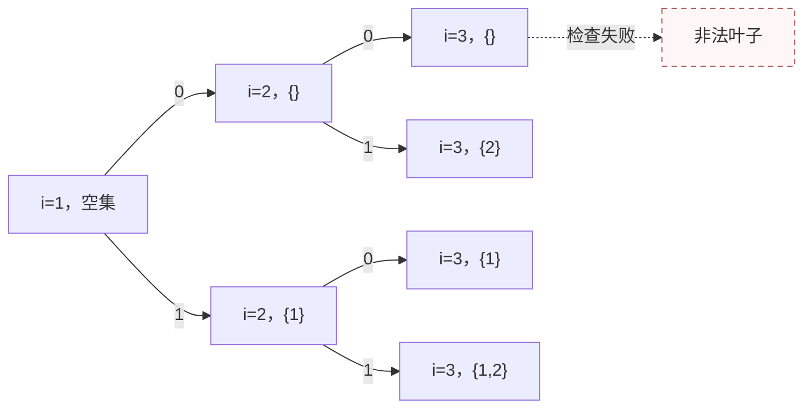

# T3 两种连通关系

---

## 题意简化

---

输入一棵 $1\le n<2\times10^5$ 的树，点权是互异的 30 位非负整数。每个点在其余所有点中找异或值最小的唯一关联点。要选尽量多的点，使每个被选点的关联点也被选中，而且选点在**原树的诱导边**和**关联边**下分别都连成树；若无非空方案输出 0。$n=1$ 时答案为 1。两种连通条件都要检查。

## 问题拆分

---

1. 对每个点求关联点，得到一张每点指向一个点的图。
2. 确定关联图中可能保留的连通块，以及该块在原树中包含核心的区域。
3. 从该区域中去掉违反原树连通或关联闭包的点，取最大合法区域。

## 20 分做法：枚举保留点集

---

**步骤 1。** 对每个点 $u$ 扫描其余点，找异或值最小的关联点 $f(u)$；权值互异，不会有并列。时间 $O(n^2)$，存储 $O(n)$。

**步骤 2。** 用二进制计数器遍历全部 $2^n$ 个点集。对每个非空集合，先查每个保留点的 $f(u)$ 是否也保留；若满足，再分别用原树诱导边和关联边建并查集，检查两张图中的保留点是否都连通。每个集合耗时 $O(n\alpha(n))$、额外空间 $O(n)$；整体 $O(n^2+n2^n\alpha(n))$ 时间、$O(n)$ 空间。$n\le15$ 可用。

**步骤 3。** 对全部合法集合取最大点数。空集不作为答案；$n=1$ 时单点合法，直接得到 1。

### 点集搜索小图

图示按编号决定保留点的前两层。**左上角图例**：`0` = 不保留当前点，`1` = 保留当前点；条件：处理到第 $i$ 个点；代价：本步常数，叶子检查两种连通性；价值：最终保留点数。虚线节点表示叶子未通过关联闭包或连通检查。



**终态**：决定完全部 $n$ 个点后，只有非空、关联闭合且两图都连通的叶子参加最大值。图中的第 3 层只是局部示意，实际在 $i=n+1$ 才检查完整点集。

### 参考代码

```cpp
#include<bits/stdc++.h>
using namespace std;

const int N = 200005;
int n,a[N],f[N],u[N],v[N],fa[N],chosen[N];

int findRoot(int x){
	if(fa[x] == x) return x;
	fa[x] = findRoot(fa[x]);
	return fa[x];
}

bool connected(bool association){
	for(int i = 1; i <= n; i++) fa[i] = i;
	if(association){
		for(int i = 1; i <= n; i++){
			if(chosen[i]){
				int x = findRoot(i),y = findRoot(f[i]);
				fa[x] = y;
			}
		}
	}else{
		for(int i = 1; i < n; i++){
			if(chosen[u[i]] && chosen[v[i]]){
				int x = findRoot(u[i]),y = findRoot(v[i]);
				fa[x] = y;
			}
		}
	}
	int first = 0;
	for(int i = 1; i <= n; i++){
		if(chosen[i]){
			if(first == 0) first = findRoot(i);
			else if(findRoot(i) != first) return false;
		}
	}
	return true;
}

int main(){
	ios::sync_with_stdio(false);
	cin.tie(0);

	cin >> n;
	for(int i = 1; i <= n; i++) cin >> a[i];
	for(int i = 1; i < n; i++) cin >> u[i] >> v[i];
	if(n == 1){
		cout << 1 << '\n';
		return 0;
	}
	for(int i = 1; i <= n; i++){
		int best = -1;
		for(int j = 1; j <= n; j++){
			if(i == j) continue;
			if(best == -1 || (a[i] ^ a[j]) < (a[i] ^ a[best])) best = j;
		}
		f[i] = best;
	}
	int ans = 0;
	while(true){
		int count = 0;
		for(int i = 1; i <= n; i++){
			if(chosen[i]) count++;
		}
		if(count > ans){
			bool closed = true;
			for(int i = 1; i <= n; i++){
				if(chosen[i] && !chosen[f[i]]) closed = false;
			}
			if(closed && connected(false) && connected(true)) ans = count;
		}
		int p = 1;
		while(p <= n && chosen[p]){
			chosen[p] = 0;
			p++;
		}
		if(p > n) break;
		chosen[p] = 1;
	}
	cout << ans << '\n';
	return 0;
}
```

## 20 分做法：两两计算异或

---

**步骤 1。** 对每个 $u$ 扫描所有 $v\ne u$，选最小的 $a_u\mathbin{\mathrm{xor}}a_v$。异或值不会并列，因为权值互异。时间 $O(n^2)$、额外空间 $O(n)$ 存关联点。

**步骤 2。** 对每条 $u\to f(u)$ 用并查集合并，得到关联图的无向连通块，耗时 $O(n\alpha(n))$。在每块中找唯一的双向关联对 $(p,q)$，从 $p$ 沿原树边只走本关联块内的点，得到包含 $p$ 的原树区域 $B$；若 $q$ 不在 $B$，该块无法产生非空答案。遍历全部块总计 $O(n)$。

**步骤 3。** 先把 $B$ 内关联点不在 $B$ 的点标为坏点。坏点在以 $p$ 为根的原树中的后代也必须删，否则原树不连通；指向坏点的点也必须删，否则关联闭包不成立。用队列沿这两类反向关系传播，所有剩余点就是该块的最大合法集合。每点每边被处理常数次，合计 $O(n)$ 时间与空间。

总时间 $O(n^2+n\alpha(n))=O(n^2)$、空间 $O(n)$，可以处理 $n\le3000$。所谓“最高二进制位互不相同”在本题 30 位值域下最多只有 30 个正权值，它自然包含在小范围做法中，不另造一个大规模子任务；链和菊花仍须检查两种连通关系，不能只按权值求答案。

### 参考代码

```cpp
#include<bits/stdc++.h>
using namespace std;

const int N = 200005;
int a[N],f[N],dsu[N],sizeD[N],comp[N],core[N];
int head[N],to[2 * N],nxt[2 * N],ecnt;
int revHead[N],revNext[N];
int region[N],parentTree[N],bad[N],que[N],badQue[N];

void add(int u,int v){
	ecnt++;
	to[ecnt] = v;
	nxt[ecnt] = head[u];
	head[u] = ecnt;
}

int findRoot(int x){
	if(dsu[x] == x) return x;
	dsu[x] = findRoot(dsu[x]);
	return dsu[x];
}

void unite(int x,int y){
	x = findRoot(x);
	y = findRoot(y);
	if(x == y) return;
	if(sizeD[x] < sizeD[y]) swap(x,y);
	dsu[y] = x;
	sizeD[x] += sizeD[y];
}

int main(){
	ios::sync_with_stdio(false);
	cin.tie(0);

	int n,u,v;
	cin >> n;
	for(int i = 1; i <= n; i++){
		cin >> a[i];
		dsu[i] = i;
		sizeD[i] = 1;
	}
	for(int i = 1; i < n; i++){
		cin >> u >> v;
		add(u,v);
		add(v,u);
	}
	if(n == 1){
		cout << 1 << '\n';
		return 0;
	}
	for(int i = 1; i <= n; i++){
		int best = -1;
		for(int j = 1; j <= n; j++){
			if(i == j) continue;
			if(best == -1 || (a[i] ^ a[j]) < (a[i] ^ a[best])) best = j;
		}
		f[i] = best;
		unite(i,f[i]);
		revNext[i] = revHead[f[i]];
		revHead[f[i]] = i;
	}
	for(int i = 1; i <= n; i++) comp[i] = findRoot(i);
	for(int i = 1; i <= n; i++){
		if(i < f[i] && f[f[i]] == i) core[comp[i]] = i;
	}
	int ans = 0;
	for(int c = 1; c <= n; c++){
		int root = core[c];
		if(root == 0) continue;
		int front = 1,back = 1;
		que[1] = root;
		region[root] = root;
		parentTree[root] = 0;
		while(front <= back){
			int x = que[front++];
			for(int e = head[x]; e; e = nxt[e]){
				int y = to[e];
				if(comp[y] != c || region[y] == root) continue;
				region[y] = root;
				parentTree[y] = x;
				que[++back] = y;
			}
		}
		if(region[f[root]] != root) continue;
		int removed = 0;
		front = 1;
		int badCount = 0;
		for(int i = 1; i <= back; i++){
			int x = que[i];
			if(region[f[x]] != root){
				bad[x] = root;
				badQue[++badCount] = x;
			}
		}
		while(front <= badCount){
			int x = badQue[front++];
			removed++;
			for(int e = head[x]; e; e = nxt[e]){
				int y = to[e];
				if(region[y] == root && parentTree[y] == x && bad[y] != root){
					bad[y] = root;
					badQue[++badCount] = y;
				}
			}
			for(int y = revHead[x]; y; y = revNext[y]){
				if(region[y] == root && bad[y] != root){
					bad[y] = root;
					badQue[++badCount] = y;
				}
			}
		}
		ans = max(ans,back - removed);
	}
	cout << ans << '\n';
	return 0;
}
```

## 满分做法：字典树找关联点，双关系删点

---

先说明步骤 2、3 的依据。沿一条长度大于 2 的有向环走，每个点都严格认为下一个点比上一个点的异或距离小；由于距离对称，绕一圈会得到严格递减的环，矛盾。因此关联图的每个弱连通块恰有一个双向关联对，其余点的箭头最终指向这对点。关联闭合的非空点集必包含这对点；在单个关联块内，只要沿箭头闭合，它的关联边就自然连成一棵树。

**步骤 1。** 把全部 30 位权值插入二进制字典树。查询 $u$ 时，在尚未与 $a_u$ 分叉前，仅当相同位的子树有至少两个点才走相同位，否则走另一位并标记已经排除了自己；分叉后按异或最小原则优先走相同位。每点插入、查询各走 30 层，合计 $O(30n)$ 时间。字典树最多 $30n+1$ 个节点，空间 $O(30n)$。

**步骤 2。** 与上一档做法相同，合并关联边，找每块的核心对 $(p,q)$，从 $p$ 在原树中走出同一关联块的区域 $B$。若 $q\notin B$，任何包含两者的原树连通点集都不存在。并查集和原树遍历合计 $O(n\alpha(n))$ 时间、$O(n)$ 额外空间。

**步骤 3。** 与上一档做法相同，把关联点在 $B$ 外的点作为初始坏点，再沿原树父子关系向下、沿反向关联边传播坏标记。删掉坏点后，剩余点包含核心对、在原树中连通、对关联点闭合；任意合法集合也不能含坏点，所以它最大。取所有关联块的最大剩余数量即可。传播总计 $O(n)$ 时间、$O(n)$ 空间。

总时间 $O(30n+n\alpha(n))$，总空间 $O(30n)$。大链用队列沿树边遍历，不依赖深递归栈；字典树仅有固定的 30 层。

### 参考代码

```cpp
#include<bits/stdc++.h>
using namespace std;

const int N = 200005;
const int M = 6000005;
int trie[M][2],cnt[M],nodes = 1;
int a[N],f[N],dsu[N],sizeD[N],comp[N],core[N];
int head[N],to[2 * N],nxt[2 * N],ecnt;
int revHead[N],revNext[N];
int region[N],parentTree[N],bad[N],que[N],badQue[N];

void add(int u,int v){
	ecnt++;
	to[ecnt] = v;
	nxt[ecnt] = head[u];
	head[u] = ecnt;
}

void insertValue(int x,int id){
	int u = 1;
	cnt[u]++;
	for(int b = 29; b >= 0; b--){
		int t = (x >> b) & 1;
		if(!trie[u][t]) trie[u][t] = ++nodes;
		u = trie[u][t];
		if(b == 0) cnt[u] = -id;
		else cnt[u]++;
	}
}

int nearest(int x){
	int u = 1;
	bool different = false;
	for(int b = 29; b >= 0; b--){
		int t = (x >> b) & 1;
		int same = trie[u][t],other = trie[u][t ^ 1];
		if(!different){
			if(same && cnt[same] > 1){
				u = same;
			}else{
				u = other;
				different = true;
			}
		}else{
			u = same ? same : other;
		}
	}
	return -cnt[u];
}

int findRoot(int x){
	if(dsu[x] == x) return x;
	dsu[x] = findRoot(dsu[x]);
	return dsu[x];
}

void unite(int x,int y){
	x = findRoot(x);
	y = findRoot(y);
	if(x == y) return;
	if(sizeD[x] < sizeD[y]) swap(x,y);
	dsu[y] = x;
	sizeD[x] += sizeD[y];
}

int main(){
	ios::sync_with_stdio(false);
	cin.tie(0);

	int n,u,v;
	cin >> n;
	for(int i = 1; i <= n; i++){
		cin >> a[i];
		insertValue(a[i],i);
		dsu[i] = i;
		sizeD[i] = 1;
	}
	for(int i = 1; i < n; i++){
		cin >> u >> v;
		add(u,v);
		add(v,u);
	}
	if(n == 1){
		cout << 1 << '\n';
		return 0;
	}
	for(int i = 1; i <= n; i++){
		f[i] = nearest(a[i]);
		unite(i,f[i]);
		revNext[i] = revHead[f[i]];
		revHead[f[i]] = i;
	}
	for(int i = 1; i <= n; i++) comp[i] = findRoot(i);
	for(int i = 1; i <= n; i++){
		if(i < f[i] && f[f[i]] == i) core[comp[i]] = i;
	}
	int ans = 0;
	for(int c = 1; c <= n; c++){
		int root = core[c];
		if(root == 0) continue;
		int front = 1,back = 1;
		que[1] = root;
		region[root] = root;
		parentTree[root] = 0;
		while(front <= back){
			int x = que[front++];
			for(int e = head[x]; e; e = nxt[e]){
				int y = to[e];
				if(comp[y] != c || region[y] == root) continue;
				region[y] = root;
				parentTree[y] = x;
				que[++back] = y;
			}
		}
		if(region[f[root]] != root) continue;
		int removed = 0;
		front = 1;
		int badCount = 0;
		for(int i = 1; i <= back; i++){
			int x = que[i];
			if(region[f[x]] != root){
				bad[x] = root;
				badQue[++badCount] = x;
			}
		}
		while(front <= badCount){
			int x = badQue[front++];
			removed++;
			for(int e = head[x]; e; e = nxt[e]){
				int y = to[e];
				if(region[y] == root && parentTree[y] == x && bad[y] != root){
					bad[y] = root;
					badQue[++badCount] = y;
				}
			}
			for(int y = revHead[x]; y; y = revNext[y]){
				if(region[y] == root && bad[y] != root){
					bad[y] = root;
					badQue[++badCount] = y;
				}
			}
		}
		ans = max(ans,back - removed);
	}
	cout << ans << '\n';
	return 0;
}
```

## 知识点总结

---

互异权值的最近异或点可以用字典树逐位求出。最近邻箭头形成以双向对为核心的树形关联块；同时要求原树连通时，从核心区域出发，用“原树后代”和“反向关联依赖”两种规则传播必删点。
