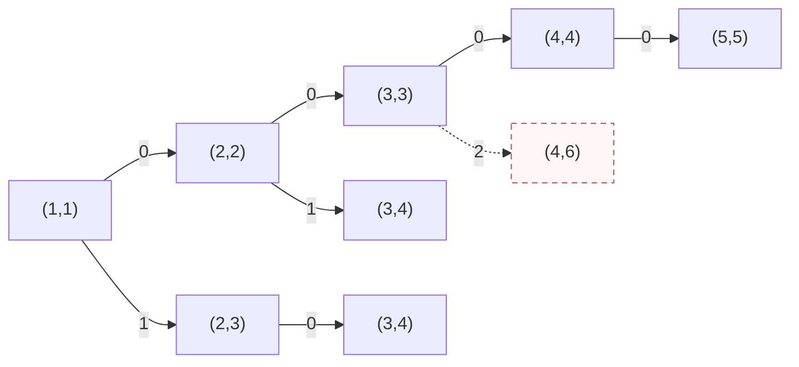
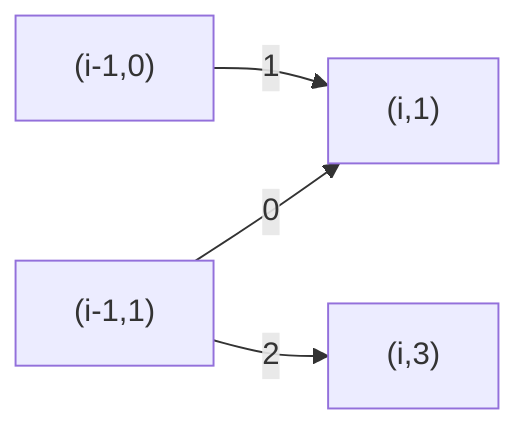
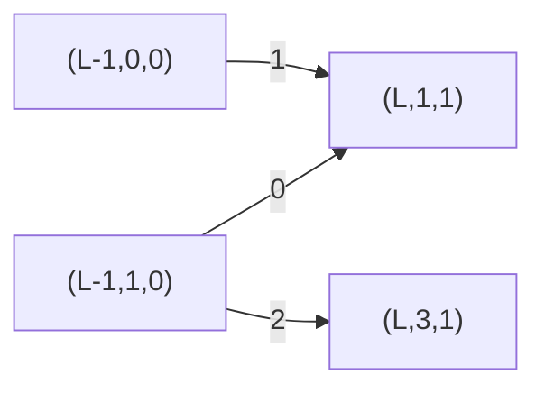
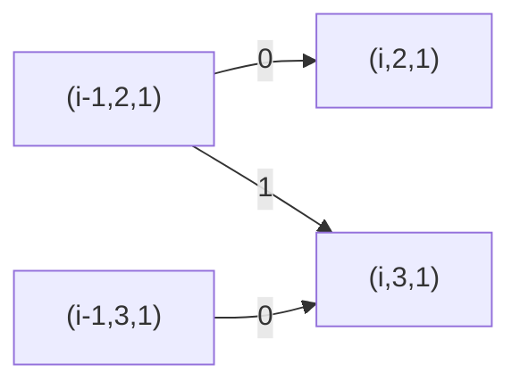
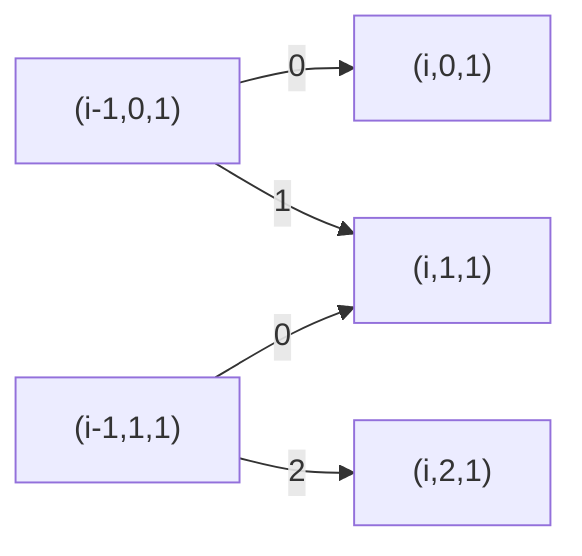
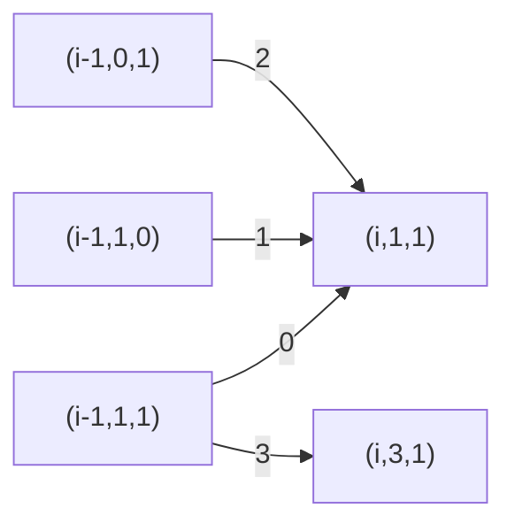

# T1 四段异或与最大连续和

---

## 题意简化

---

长度 $4\le n\le10^5$ 的有符号数组，必须从左到右选恰好四个互不相交的非空区间，分别把区间内的数异或 $b_1,b_2,b_3,b_4$；区间可相邻。随后在变换后的整个数组中选一个非空连续子数组，最大化其元素和。数组元素可负，异或按 32 位补码；答案需用 `long long`。

## 问题拆分

---

1. 确定四个区间，得到每个位置变换后的数。
2. 在变换后的数组中找到最大非空连续子数组和。
3. 在所有合法区间选择中取最大值。

| 测试点 | 对应解法 |
|---|---|
| 1～2、3～4、5～6、7～8 | 依次使用直接枚举、区间摘要枚举、固定答案两端点的 DP、固定答案左端点的 DP |
| 9～14 | 依次使用零掩码、单点操作、全覆盖、不相交、仅第四掩码非零、非负零掩码的简化算法 |
| 15～20 | 九阶段与最大子数组三态合并 |

## 1～2 点（10 分）：直接枚举

---

**步骤 1、3。** 用 `dfs(j,start)` 表示正在选择第 $j$ 段，其左端点至少为 `start`。枚举 $l\ge start,r\ge l$，原地异或 $[l,r]$ 后递归下一段；返回时再异或一次恢复。四段都选完才进入步骤 2。合法四段的选择数是 $\binom{n+4}{8}$，比把每层都估作 $n^2$ 更准确。

**步骤 2。** 对每个完整方案再枚举答案子数组的左右端点，逐个累加其中的数，单方案 $O(n^3)$。总时间 $O\!\left(n^3\binom{n+4}{8}\right)$，搜索栈与数组共 $O(n)$ 空间。$n\le10$ 可用；第 3～4 点 $n=30$ 时实测超时。

### 四段搜索小图

状态 `(j,s)` 表示下一段是第 $j$ 段，最早从 $s$ 开始；图示 $n=5$ 的局部选择。相同 `(j,s)` 若来自不同历史，数组已变换的部分可能不同，所以搜索树中保留两个节点。

**左上角图例**：`0` = 取本段 `[s,s]`；`1` = 取本段 `[s,s+1]`；`2` = 其它合法 `[l,r]`。条件：$j\le4$、区间非空且在 $1\ldots n$ 内；代价：异或该段元素；价值：此时不计和，四段完成后统一扫描。虚线箭头表示选择后无法凑齐四段，不进入合法答案。

**叶子**：$j=5$ 是合法四段终态，扫描数组并返回最大连续和；$j\le4$ 且 $s>n$ 是非法终态，不参与最大值。图中 `(4,6)` 是虚线非法叶子。

### 参考代码

{{DIRECT}}

## 3～4 点（10 分）：预处理区间摘要后枚举四段

---

**步骤 1。** 对每个掩码 $0,b_1,b_2,b_3,b_4$ 和每个原数组区间预处理四个值：区间和、最大前缀和、最大后缀和、最大非空子数组和。两个相邻区间的摘要可在 $O(1)$ 合并，跨边界的最优子数组为左区间最大后缀加右区间最大前缀。代码直接扫描每个区间求摘要，时间 $O(5n^3)$、空间 $O(5n^2)$；$n\le30$ 时很小。

**步骤 2。** 沿用上面的四段搜索图。选择一个操作段时把之前的零掩码空白和本段摘要依次合并；四段选完再合并尾部空白。每个搜索分支只做常数次摘要合并，不再逐个枚举答案子数组。总时间 $O\!\left(n^3+\binom{n+4}{8}\right)$，空间 $O(n^2)$。第 5～6 点 $n=100$ 时搜索方案数仍过大，实测超时。

### 参考代码

{{ENUM}}

## 5～6 点（10 分）：固定答案两端点的阶段 DP

---

**步骤 1。** 枚举答案子数组 $[L,R]$，共有 $O(n^2)$ 种。四个操作段用九阶段 $p=0,1,\ldots,8$ 表示，掩码依次为 $(0,b_1,0,b_2,0,b_3,0,b_4,0)$。每次处理一个位置，可以留在阶段、前进一阶段，或从奇数阶段越过零长度空白前进两阶段。进入奇数阶段必消耗一个元素，所以四段非空。

**步骤 2。** 对固定 $[L,R]$，`dp[p]` 表示当前阶段能得到的 $[L,R]$ 内最大和。位置在 $[L,R]$ 外时本次加零，在其中时加异或后的值；枚举 9 个源阶段和 9 个目标阶段检查合法转移。处理完所有数后只接受阶段 7、8。每个 $[L,R]$ 耗时 $O(9^2n)$，合计 $O(9^2n^3)$ 时间，输入数组以外只需 $O(1)$ DP 空间；$n\le100$ 可用。

### 固定两端点的 DP 小图

节点 $(i,p)$ 表示处理完 $i$ 个位置、当前位于阶段 $p$。**左上角图例**：`0` = 留在原阶段；`1` = 前进一阶段；`2` = 从奇数阶段直接前进两阶段。条件：阶段前进必须消耗当前元素；代价：在 $[L,R]$ 内加 $x_i\mathbin{\mathrm{xor}}\mathrm{mask}[p]$，区间外加零；价值：当前累计和。

**终态**：$i=n$ 且 $p=7$ 或 $8$；合流时取较大和。第 7～8 点 $n=500$ 时该程序实测超时。

### 参考代码

{{CUBE}}

## 7～8 点（10 分）：固定答案左端点的阶段 DP

---

**步骤 1。** 枚举最终最大子数组的左端点 $L$。四个操作段仍用九个阶段 $p=0,1,\ldots,8$ 表示，掩码依次是 $(0,b_1,0,b_2,0,b_3,0,b_4,0)$。留在当前阶段、前进一阶段、从奇数阶段越过空白前进两阶段，分别处理段内延续、开始下一段和相邻操作段。每次阶段前进都消耗一个位置，因此四段非空。枚举一个 $L$ 的阶段转移为 $O(9\cdot3n)=O(n)$，状态空间 $O(9)$。

**步骤 2。** 对固定的 $L$，用 $s=0,1,2$ 表示答案子数组尚未开始、正在延伸、已经结束。$i<L$ 时只能保持 $s=0$；$i=L$ 时必须把变换后的 $a_L$ 加入，转为 $s=1$；之后可以延伸、结束或保持结束。相同 $(p,s)$ 只保留最大的和，因为后续可选操作相同。到 $i=n$ 时只接受阶段 7、8 且 $s=1,2$，所以四段都完成、答案子数组非空。每个 $L$ 扫描 $n$ 个数，耗时 $O(n)$，两层状态表空间 $O(9\cdot3)$。

**步骤 3。** 在所有 $L$ 的合法终态中取最大值。总时间 $O(n^2)$，额外空间 $O(n)$（输入数组占主要部分）。$n\le500$ 可用；完整范围需把所有 $L$ 合并进“尚未开始”状态。第 15～20 点的十万规模输入使该程序实测超时。

### 固定左端点的 DP 小图

节点 $(i,p,s)$ 表示处理完前 $i$ 个数的阶段与子数组状态；图示 $i=L$ 的合流。**左上角图例**：`0` = 当前阶段不变；`1` = 进入下一阶段；`2` = 从奇数阶段跳过零长度空白。条件：$i=L$，本位置必须开始答案子数组；代价：阶段掩码作用于 $a_L$；价值：把变换后的 $a_L$ 作为第一个加数。其他 $i$ 按上述 $s$ 规则转移。

**终态**：仅 $(n,7,1/2)$ 与 $(n,8,1/2)$ 合法。两条箭头合到同一状态时取较大的子数组和。

### 参考代码

{{MID}}

## 第 9 点（5 分）：四个掩码均为零

---

**步骤 1。** 异或零不改变数组，四段只需存在即可；由于 $n\ge4$，可以任选四个单点段。

**步骤 2～3。** 用 Kadane 扫描最大非空连续和，当前位置的最优结尾和是“只取当前数”与“延续前一段”二者的较大值。时间 $O(n)$、额外空间 $O(1)$；全负数组也要输出最大的负数。

### 参考代码

{{ZERO}}

## 第 10 点（5 分）：最优四段都可取单点

---

**步骤 1。** 按保证，只需依次选四个不同位置，分别异或 $b_1,b_2,b_3,b_4$。令 $j$ 为已经选中的单点数，本位置可不操作，或作为第 $j+1$ 个单点；每个状态最多两种选择。

**步骤 2～3。** 叠加最大子数组的三态 $s=0,1,2$（未开始、正在延伸、已结束）。`dp[j][s]` 记录同状态下最大的和，最后只取 $j=4,s\in\{1,2\}$。每位置 $5\times3$ 个状态，时间 $O(n)$、额外空间 $O(1)$。该保证不限制一般测试点的合法区间。

### 单点选择 DP 小图

节点 $(i,j,s)$ 表示已处理 $i$ 个数、用了 $j$ 个单点和当前子数组状态。**左上角图例**：`0` = 本位置不操作；`1` = 本位置作为下一个单点。条件：`1` 需要 $j<4$；代价：分别取 $x_i$ 或 $x_i\mathbin{\mathrm{xor}}b_{j+1}$；价值：若 $s=1$，加入当前子数组和。

**终态**：$i=n,j=4,s=1/2$，多条路径合到同状态时取较大和。

### 参考代码

{{SINGLETON}}

## 第 11 点（5 分）：最优四段可覆盖全序列

---

**步骤 1。** 按保证，四段把位置 $1\ldots n$ 分成四个相邻非空块。当前位置只能继续当前块，或从第二个位置起进入下一块；没有未操作位置。

**步骤 2～3。** 用块号 $j=1,2,3,4$ 与最大子数组三态做 DP。每次用本块的掩码异或当前数，终态必须在第 4 块且子数组非空。总时间 $O(4\cdot3n)=O(n)$，额外空间 $O(1)$。

### 覆盖全序列的 DP 小图

节点 $(i,j,s)$ 中 $j$ 是当前块。**左上角图例**：`0` = 留在第 $j$ 块；`1` = 当前数开始第 $j+1$ 块。条件：`1` 只在 $j<4$ 时可用；代价：当前数异或目标块的掩码；价值：最大子数组当前和。

**终态**：$i=n,j=4,s=1/2$；与上一图的节点形状相似，但这里每个位置都属于某个操作块，`0` 的含义不是“不操作”。

### 参考代码

{{COVER}}

## 第 12 点（5 分）：存在与操作段不相交的最优子数组

---

**步骤 1。** 若答案子数组为 $[L,R]$，四个非空操作段与它不相交，当且仅当区间外至少有四个位置，即 $R-L+1\le n-4$。充分性是从区间外按顺序选四个单点作操作段。答案子数组中的数不会改变。

**步骤 2～3。** 因题目保证存在这样的最优方案，求原数组中长度不超过 $n-4$ 的最大非空子数组和即可。令前缀和为 $P_i$，对每个右端点 $r$，在 $j\in[r-(n-4),r-1]$ 中找最小 $P_j$。用单调队列维护这个滑动窗口，时间与空间均为 $O(n)$。

### 参考代码

{{DISJOINT}}

## 第 13 点（5 分）：仅第四个掩码可能非零

---

**步骤 1。** 前三段异或零，不改变数值。第四段左端点 $l\ge4$ 是必要且充分的：位置 $1,2,3$ 可以分别充当前三段。所以只需决定一个从第 4 个位置或更后开始的非空异或段。

**步骤 2～3。** 用三个阶段“异或前、异或中、异或后”和最大子数组三态做 DP；异或前进入异或中只允许 $i\ge4$。终态处于异或中或异或后，子数组已开始。时间 $O(n)$、额外空间 $O(1)$。

### 单个有效操作段的 DP 小图

节点 $(i,p,s)$ 中 $p=0,1,2$ 分别表示异或前、中、后。**左上角图例**：`0` = 维持阶段；`1` = 开始第四段；`2` = 结束第四段。条件：`1` 仅当 $i\ge4$；代价：阶段 1 的当前数异或 $b_4$；价值：答案子数组当前和。

**终态**：$i=n,p=1/2,s=1/2$。

### 参考代码

{{ONLYFOURTH}}

## 第 14 点（5 分）：所有数非负且掩码全零

---

**步骤 1。** 操作不改变任何数。

**步骤 2～3。** 非负数组的最大非空连续和就是整数组的和，线性累加并用 `long long` 输出。时间 $O(n)$，额外空间 $O(1)$。这档包含在第 9 点的零掩码性质内，但可用更直接的求和程序。

### 参考代码

{{SUM}}

## 满分做法（15～20 点，30 分）：区间阶段与最大子数组状态合并

---

**步骤 1。** 一个位置只需知道当前属于四段中的哪段或段间空白。用九个阶段 $p=0,1,\ldots,8$，异或掩码依次为

$$ (0,b_1,0,b_2,0,b_3,0,b_4,0). $$

奇数阶段是四个非空操作段，偶数阶段是未操作区。处理一个新位置时可留在原阶段，或前进一阶段；从奇数阶段还可直接前进两阶段，表示中间空白长度为零。每次前进都要消耗当前元素，所以进入过的奇数阶段自动非空。处理完 $n$ 个位置，只接受阶段 7 或 8，保证四段都选过。阶段 0 和 8 允许为空。

**步骤 2。** 最大子数组再用状态 $s=0,1,2$ 表示“尚未开始、正在延伸、已经结束”。若本位置变换后是 $v$，从 $s=0$ 可以继续等待或以 $v$ 开始；从 $s=1$ 可以加上 $v$ 或在本位置之前结束；$s=2$ 只能保持。正在延伸的值是当前子数组和，结束状态的值是已完成的和。答案只取 $s=1,2$，因此子数组非空。

**步骤 3。** `dp[p][s]` 保留已处理前缀中同一阶段、同一子数组状态的最大和。后续可选动作只由 `(p,s)` 决定，因此较小的和永远不会更优，可以合并。初态 `dp[0][0]=0`，其它状态为负无穷。按位置从左到右更新，每次使用上一轮数组；终态取 $p\in\{7,8\}$ 且 $s\in\{1,2\}$ 的最大值。

### DP 状态合流小图

节点 `(i,p,s)` 表示已处理 $i$ 个数后的状态。图只展示进入 `(i,1,1)` 及跳过第一、二段之间空白的局部转移；其余转移按上文同样更新。

**左上角图例**：`0` = 留在阶段 1，延伸子数组；`1` = 留在阶段 1，新开子数组；`2` = 从阶段 0 开始第一段并延伸子数组；`3` = 从阶段 1 直接进入阶段 3、空白长度为零。条件：源状态可达；代价：当前数的阶段掩码异或；价值：当前数的变换值。`1` 新开时不继承旧和。

**终态**：$i=n$、$p\in\{7,8\}$、$s\in\{1,2\}$ 才合法；其它状态不参加答案。箭头是从上一位置向下一位置的转移，多个路径到同一状态时取最大和。

每个位置只有 $9\times3$ 个状态，阶段最多三种走法，子数组状态最多两种走法；总时间 $O(9\cdot3\cdot3\cdot n)=O(n)$，两张 $9\times3$ 表只用 $O(1)$ 额外空间。$n=10^5$ 时转移数量为常数倍百万级。

### 参考代码

{{STD}}

## 知识点总结

---

多个有顺序的非空区间可以压成有限阶段；最大连续和可以压成“前、内、后”三态。两组状态作笛卡尔积，就能在一次从左到右扫描中同时决定操作段和答案子数组。
