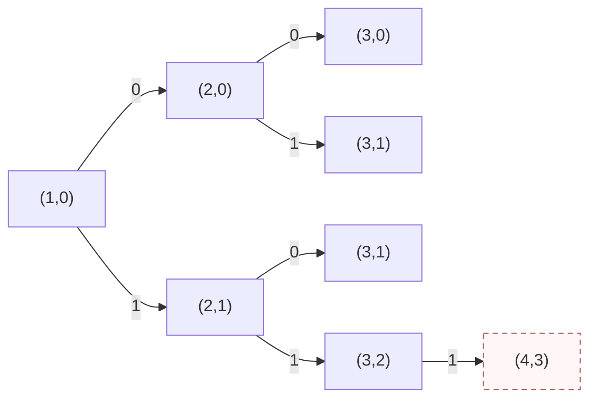

# T2 环上三点分组

---

## 题意简化

---

输入一张 $n\le2\times10^5$ 的连通简单基环图，恰有 $n$ 条编号边。删去一些边后，每个连通块都要恰有三个点，块内可有环。输出升序删除边编号的字典序最小序列；无解输出 $-1$。边数不作为第一目标，所以可能多删一条低编号环边而得到更小序列。

## 问题拆分

---

1. 确定不在唯一环上的树边必须怎样切，得到每个环点尚未闭合的点数。
2. 在环上把这些点数分成总和为 3 的连通组，并确定要切的环边。
3. 对全部合法删除序列排序并取字典序最小者。

| 测试点 | 对应解法 |
|---|---|
| 1～2、3～4、5～8 | 依次枚举全部边集、只枚举环边集、逐条尝试环切边 |
| 9～14 | 不可行判定、纯环、每环点一条二边挂链、三点环、交替叶子、全环点一叶子 |
| 15～20 | 剥叶后只试前三条环边为起始切边 |

## 1～2 点（10 分）：枚举删边集合

---

**步骤 1、2。** 用一个二进制计数器遍历全部 $2^n$ 个删边集合。对当前方案把未删边加入并查集，再统计每个连通块的点数；所有非空连通块恰为 3 时方案合法。每个集合需要 $O(n\alpha(n))$ 时间和 $O(n)$ 空间。这里无需先求环，因为直接检查最终图。

**步骤 3。** 合法方案的删除边编号天然按升序收集，与当前最好方案作 $O(n)$ 的字典序比较。总时间 $O(n\alpha(n)2^n)$，空间 $O(n)$；$n\le12$ 可用，第 3～4 点已超时。代码中的二进制计数器对任意 $n$ 都有定义。

### 删边搜索小图

节点 $(i,d)$ 表示前 $i-1$ 条边已决定，其中删掉 $d$ 条。**左上角图例**：`0` = 保留第 $i$ 条边，`1` = 删除第 $i$ 条边；条件：$1\le i\le n$；代价：叶子用并查集检查连通块；价值：合法时的删除编号序列。虚线节点表示检查失败。

**终态**：决定完全部边后，只有每个连通块大小为 3 的叶子参加字典序比较；图示三点环上 `(4,3)` 删去全部三条边，留下三个单点，是虚线非法叶子。

### 参考代码

{{PARTIAL}}

## 3～4 点（10 分）：只枚举环边集合

---

**步骤 1。** 剥叶并自底向上确定所有树边的强制切法，得到每个环点未闭合的点数。队列和数组耗时、占用均为 $O(n)$。

**步骤 2。** 环长 $c\le15$，只对 $c$ 条环边用二进制计数器枚举保留/删除，共 $2^c$ 种。以一条删除的环边为起点沿环扫描，每遇到下一条删除边时检查其间点数是否恰好为 3；不删环边时只允许整个环块恰有 3 点。这沿用上方编号为 `0/1` 的搜索选择，只是决策对象换成环边。每集合扫描 $O(c)$。

**步骤 3。** 合法环方案与强制树边合并，按编号排序比较。保守时间 $O(n+2^c(c+n\log n))$、空间 $O(n)$。$n\le300,c\le15$ 可用；环长达到第 5～8 点规模时实测超时。

### 参考代码

{{SUBSET}}

## 5～8 点（20 分）：逐条尝试环上的起始切边

---

**步骤 1。** 与满分做法一样，剥去叶子并自底向上计算每个环点附带的未闭合块大小。大小达到 3 时树边必须切断；超过 3 则无解。每个点和边处理常数次，时间、空间均为 $O(n)$。

**步骤 2。** 设环长为 $c$。枚举一条环边作为起始切边，从它的下一环点顺时针累加附带点数；和为 3 就切下一条环边并清零，超过 3 则本次失败。扫描回起始切边时必须恰好清零。这样枚举了所有至少切一条环边的解，时间 $O(c^2)$、额外空间 $O(c)$。环恰有三个点且三个附带大小均为 1 时，另试“不切环边”的方案。

**步骤 3。** 每个合法方案与强制树边合并，按边编号排序后比较删除序列。最多 $c+1$ 个方案，每次排序 $O(n\log n)$，故保守总时间 $O(n+c^2+cn\log n)=O(n^2\log n)$，空间 $O(n)$。$n\le3000$ 可用；第 15～20 点的大环实测超时。

### 参考代码

{{MID}}

## 第 9 点（5 分）：点数不是 3 的倍数

---

**步骤 1～2。** 若全部连通块各有三个点，总点数必是 3 的倍数。题面保证 $3\nmid n$，直接无解。

**步骤 3。** 输出 `-1`，时间与额外空间均为 $O(1)$。第 14 点也可复用同一输出程序，但依据不同。

### 参考代码

{{IMPOSSIBLE}}

## 第 10 点（5 分）：图本身是一个环

---

**步骤 1。** 无挂树，沿环记录顺序及每条环边编号。遍历耗时 $O(n)$。

**步骤 2。** $n>3$ 时每组恰是连续三个环点，环切边只有按位置模 3 的三种偏移；$n=3$ 时不切边的空序列字典序最小。

**步骤 3。** 对三种偏移按编号扫描得到升序删除序列并比较，时间 $O(n)$、空间 $O(n)$。

### 参考代码

{{PURE}}

## 第 11 点（5 分）：每个环点挂一条长度为 2 的路径

---

**步骤 1。** 剥叶识别环点与环边，时间、空间均为 $O(n)$。

**步骤 2。** 每个环点连同自己的两点挂链已是三点块，不能再与另一环点连通，因此必须切去全部环边，挂链上的边全部保留。

**步骤 3。** 顺着输入边编号输出所有环边，时间 $O(n)$，不存在其它合法删除序列。

### 参考代码

{{TRIPLES}}

## 第 12 点（5 分）：唯一环只有三个点

---

**步骤 1。** 按 5～8 点的代码剥叶并确定树边，时间 $O(n)$。

**步骤 2～3。** 环只有三条边，逐条试起始切边；再检查不切边的三点环特例。最多三次环扫描和四次排序，时间 $O(n\log n)$、空间 $O(n)$。直接使用上方“逐条尝试环切边”的完整代码，无需复制第二遍。

## 第 13 点（5 分）：环点交替挂零或一片叶子

---

**步骤 1。** 剥叶得到环顺序；原度数 2、3 分别给环点权值 1、2，时间 $O(n)$。

**步骤 2。** 每组三点必须由相邻的一权环点与二权环点组成，因此环上只有两种配对方向。分别从前两条环边出发累加到 3 时切边。

**步骤 3。** 按边编号扫描比较两套升序删除序列。时间、空间均为 $O(n)$。

### 参考代码

{{ALTERNATING}}

## 第 14 点（5 分）：每个环点挂一片叶子

---

**步骤 1～2。** 每个环点携带自己和一片叶子，大小为 2。任何块必须包含至少一个环点；若只含一个环点则块大小不足 3，若含两个环点则已有至少 4 个点。因此无解。

**步骤 3。** 输出 `-1`，复用第 9 点的完整代码，时间与额外空间均为 $O(1)$。

## 满分做法（15～20 点，30 分）：剥叶后尝试前三条环边

---

**步骤 1。** 反复把度数为 1 的点从图上剥去，最后留下唯一的环。记录每个剥掉的点当时唯一还未剥掉的父点，再按剥除顺序自底向上处理。令 `sz[u]` 为向父点延伸、尚未闭合的块的点数，初始为 1。若 `sz[u]=3`，该块只能在父边处切断；若为 1 或 2，就把它加给父点；一旦超过 3 就无解。所有树边切法因此是强制的。队列剥除与累加各扫描边常数次，合计 $O(n)$ 时间、$O(n)$ 空间。

**步骤 2。** 按环顺序列出环点，其 `sz` 均在 1 到 3。若要切环，任意连续三个环点的点数和至少为 3，因此任意合法切法在前三条环边中必有一条切边。分别假设前三条环边之一是切边，从下一环点开始累加；和到 3 就切下一条环边，超过 3 则失败。这样至多三次扫描就穷尽所有切法。环长为 3 且三个 `sz` 都为 1 时，另检查保留整个三点环、不切任何环边的方案。时间 $O(n)$。

**步骤 3。** 每种合法环切法与强制树边合并，按边编号排序后比较序列。最多四种方案，排序总计 $O(n\log n)$，辅助数组 $O(n)$。所有树边选择被步骤 1 强制，前三条环边已覆盖每种合法环边界，所以得到全局字典序最小答案；不需要特殊判题。

### 参考代码

{{STD}}

## 知识点总结

---

基环图先剥叶子，把挂树压成环点权值。目标块大小固定为 3 时，树边由剩余块大小强制决定；任何合法环划分在前三条环边内必有切边，另检查三点环整体保留的情况。
