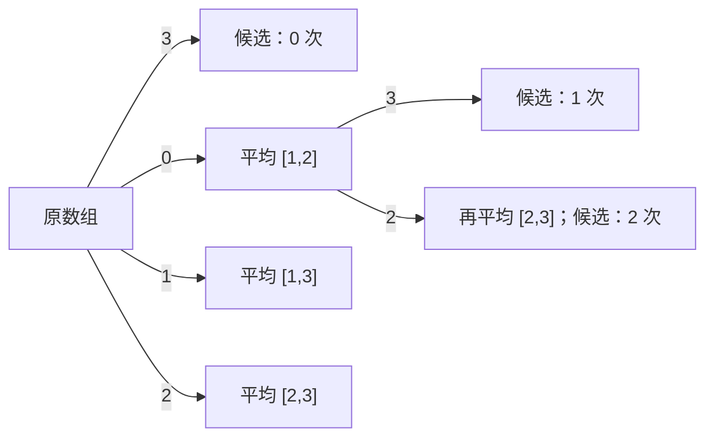

# T4 有限次精确均衡

---

## 题意简化

---

长度 $1\le n\le10^5$ 的正整数序列，最多做 $k\le n$ 次操作：把长度至少 2 的一个连续区间全部替换为它**操作前的精确有理数平均值**，区间可以重叠。先最大化最终序列的数值字典序，再最小化操作次数，最后最小化按执行顺序排列的区间对序列。输出次数、每个数的约分分数、全部区间。

## 问题拆分

---

1. 找出从左向右哪些连续块应该有相同平均值，以及这些平均值。
2. 在至多 $k$ 次操作下，决定优先完成哪些块。
3. 为最终序列给出操作次数最少、区间序列字典序最小的记录，并输出精确分数。

| 测试点 | 对应解法 |
|---|---|
| 1～2、3～8 | 直接枚举操作序列；逐个扫描后缀的最大前缀平均值 |
| 9～11、12、13、14 | 原数组不变；严格递增整段平均；一次操作的最优前缀；下降均值的相邻数对 |
| 15～20 | 单调块栈 |

## 1～2 点（10 分）：枚举操作序列

---

**步骤 1。** 从原数组开始深搜。每层可选任意 $1\le l<r\le n$，按当前数组的精确分数平均值替换 $[l,r]$，递归后恢复原值。搜索深度至多 $k$，每个节点也作为“现在停止”的候选。若区间数 $I=\binom n2$，搜索节点至多 $1+I+\cdots+I^k$；每次求平均与比较答案用 $O(n)$ 时间，故保守时间 $O\!\left(n\sum_{t=0}^k I^t\right)$，递归备份区间值用 $O(nk)$ 空间。$n\le10,k\le2$ 可用。

**步骤 2。** 对每个搜索节点，依次比较最终序列的数值字典序、操作次数和区间对序列的字典序。分数约分后用整数交叉相乘比较，避免浮点误差。最后输出最优的分数序列及其操作记录。比较每个节点耗时 $O(n+k)$，已包含在上面的时间界中。

### 操作搜索小图

图示 $n=3,k=2$ 的局部搜索。**左上角图例**：`0`、`1`、`2` 分别选区间 $[1,2]$、$[1,3]$、$[2,3]$；`3` = 在当前数组停止并参与比较。条件：操作次数未超过 $k$；代价：每次操作做精确平均；价值：最终分数序列。不同操作历史即使到达同一序列，也要保留以比较次数和区间记录。

**终态**：任意深度都可停止；到 $k$ 次后不能继续。图中只画出第二层的一条分支，其余分支同样枚举。

### 参考代码

{{BRUTE}}

## 3～8 点（30 分）：逐个扫描后缀的最大前缀平均值

---

**步骤 1。** 从尚未处理的最左位置 `start` 扫描到 $n$，用前缀和比较所有 $[start,r]$ 的平均值，选平均值最大的最长前缀作为一块；从该块之后重复。若两平均值相同，取更长者。这些块的平均值严格递减。每次扫描一个后缀，最坏可能有 $n$ 个块，例如严格递减数组，所以总时间 $O(n^2)$；只存数组与块结果，空间 $O(n)$。

**步骤 2。** 从左到右遇到原数并非全等于块平均值的块，就用一次操作把它变成平均值，直到用完 $k$ 次；原本已经全等的块不用操作。块的判定和赋值合计 $O(n)$。字典序首先比较最左不同位置，因此预算只能优先给更靠左的待改变块。

**步骤 3。** 对要操作的块 $[L,R]$，把左端点取为 $L$，右端点取该块最后一个原数不等于平均值的位置；后面已有正确值，无需放进区间。用最大公约数约分。记录与输出合计 $O(n)$ 时间、$O(n)$ 空间。总体 $O(n^2)$ 时间、$O(n)$ 空间，适用 $n\le2000$；在完整范围的严格递减点，重复扫后缀会超时。

### 参考代码

{{MID}}

## 第 9～11 点（各 5 分）：最终数组不变

---

**第 9 点，$k=0$。** 没有可用操作，输出原数组和 0 次。

**第 10 点，所有数相等。** 任意区间的平均值都等于原值，所有方案得到同一序列；按第二目标选 0 次。

**第 11 点，严格递减。** 任取一段，其首项大于该段平均值；从最左发生变化的位置看，做操作只会把字典序变小。原数组最优，仍选 0 次。

三个性质共用一份输出程序：扫描 $n$ 个数，逐个写作 `$a_i/1$`，时间 $O(n)$，额外空间 $O(1)$。这里“每个数都直接输出”是因为题目要求完整的最终数组。

### 参考代码

{{UNCHANGED}}

## 第 12 点（5 分）：严格递增序列

---

**步骤 1。** 严格递增时，相邻块均值总是不降；相邻块合并算法会把整个序列合为一块。$n\ge2,k\ge1$，一次操作 $[1,n]$ 即可达到无限预算的字典序上界。

**步骤 2～3。** 把全数组和约分为平均值，输出一次操作和 $n$ 个相同分数。时间 $O(n)$、额外空间 $O(1)$；最少次数为 1。

### 参考代码

{{INCREASING}}

## 第 13 点（5 分）：只有一次操作且首项严格最小

---

**步骤 1。** $a_1<a_i$ 对所有 $i>1$ 成立，所以最优序列的第一项必须通过包含位置 1 的一次平均操作提高。枚举前缀 $[1,r]$，取平均值最大的最长前缀；若两个前缀平均值相同，较长者在第一个新增位置处更优或相同。扫描前缀和并用整数商、余数比较平均值，时间 $O(n)$。

**步骤 2～3。** 对选中前缀，右端点缩到最后一个原值不等于平均值的位置，避免无效覆盖并使区间对最小；按平均值输出前缀，其余位置输出原值。约分、生成答案总时间 $O(n)$，存储数组 $O(n)$。

### 参考代码

{{FIRST}}

## 第 14 点（5 分）：相邻数对的均值严格下降

---

**步骤 1。** 每对 $a_{2j-1}<a_{2j}$ 是一个上升块，需平均；各对平均值严格下降，跨对无需再合并。因此无限预算最优块恰是这些相邻数对。

**步骤 2～3。** 按字典序从左到右，预算优先用于前 $\min(k,n/2)$ 对；每对一次操作，输出该对的精确平均分数和区间。时间 $O(n)$、空间 $O(n)$（保存输入和输出）。

### 参考代码

{{PAIR}}

## 满分做法（15～20 点，30 分）：前缀和上凸包与单调块栈

---

令 $P_0=0,\ P_i=\sum_{j=1}^i a_j$。对区间 $[l,r]$ 取平均，会把前缀和图上 $(l-1,P_{l-1})$ 到 $(r,P_r)$ 之间的点改到连接两个端点的直线上。设 $H$ 是原前缀和点的最小凹上界折线。一次操作前、后区间端点都不高于 $H$；由于 $H$ 凹，端点之间的直线也不高于 $H$，所以任意多次操作后的每个前缀和都不能超过 $H$。

若最终序列在位置 $i$ 之前已经达到 $H$ 的斜率，那么第 $i$ 项至多是 $H_i-H_{i-1}$。把 $H$ 的每条直线段对应的数组块一次性取平均，正好处处达到 $H$，因此这就是无限预算时的字典序最大序列。相邻块平均值严格递减；平均值相等的块合在一起。

**步骤 1。** 从左到右把每个数作为单元素块压栈。若栈顶前一块的平均值小于或等于后一块，就合并这两块，直到块平均值严格递减。这是相邻块合并算法，每个块只入栈、出栈常数次，合计 $O(n)$。比较平均值时可先比整数商，商相等再交叉比较余数，乘积不超过 $10^{10}$，用 `long long` 即可避免分数误差与大乘积溢出。

**步骤 2。** 在两块的严格下降边界处，$H$ 有折点。任何跨过该边界的平均操作都会使该边界处的前缀和低于 $H$，之后也无法补回。因此每个真正改变数值的块至少要一次独立操作；原本全等的块需要零次。有限预算时，若先完成前 $k$ 个待改变块，所有更早位置达到可能的字典序上界；任何跳过靠前块而处理后块的方案先在靠前位置变小。扫描全部块并按此规则选取，耗时 $O(n)$。

**步骤 3。** 一个待改变块的所有改变位置必须落在其一次操作区间内。把左端点取块首 $L$，右端点取最后一个改变位置，操作均值仍是该块均值；这样区间对字典序最小。各块按从左到右执行，记录唯一规定的最小序列。块和、块长至多 $10^{14},10^5$，约分后输出 $p/q$。扫描、约分和写出全部 $n$ 个值以及最多 $n/2$ 条区间，合计 $O(n)$ 时间、$O(n)$ 空间。

严格递减序列的每块都是原数，不需要操作；严格递增序列合成一个整块，$k\ge1$ 时只需一次操作。即使某个合并提高了靠前元素却降低了后面的元素，字典序仍由最先不同的位置决定，不能拿后面损失来否定前面的收益。

### 参考代码

{{STD}}

## 知识点总结

---

精确区间平均把前缀和的一段改成直线；凹上界给每个靠前位置的可达上限。相邻块均值逆序时合并，可在线性时间构造上凸包；有限预算按块从左到右使用，等值块不花操作次数。
