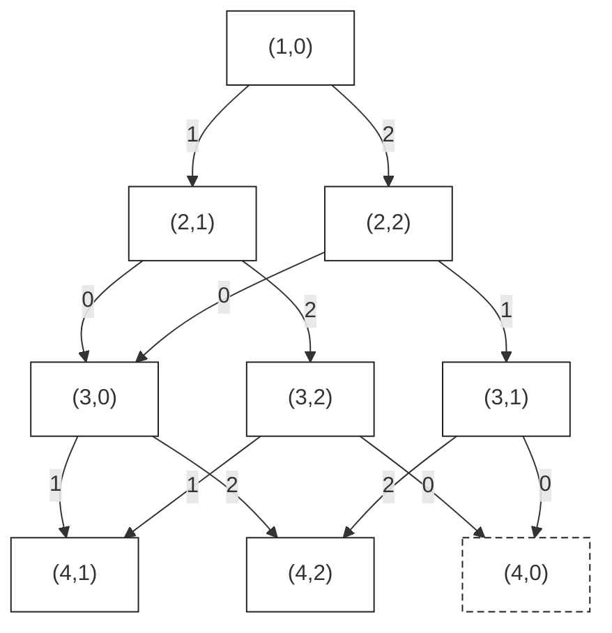

# T3 彩彩的三彩项链

---

## 题意简化

---

把环形字符串的每个字符按 `r → g → b → r` 循环修改，使相邻字符不同，包括首尾两个字符。每前进一步花费一次点击，求总点击次数最小值。

## 问题拆分

---

1. 决定每个位置的最终颜色，并计算这个选择的点击次数。
2. 保证当前颜色与前一个位置不同，最后再检查首尾不同。
3. 在所有合法的最终颜色方案中取最小费用。

## 部分分（独立 10 分，$n=10$）：搜索最终颜色

---

把 `r,g,b` 编号为 $0,1,2$。将原色 $a_i$ 变成颜色 $c$ 的最少点击数是 $(c-a_i+3)\bmod3$，多转一整圈只会增加费用。

从左往右搜索，参数记录下一个位置、上一种颜色、第一种颜色和累计费用。第一颗有三种选择，之后只选不同于前一颗的两种颜色；到 $n+1$ 时，只有末色与首色不同才是合法叶子，此时用累计费用更新答案。

最多搜索 $3\times2^{n-1}$ 条完整决策路径。$n=10$ 时只有 $1536$ 条，直接搜索足够；$n=10^6$ 时则不能枚举所有方案。

时间复杂度为 $O(2^n)$，空间复杂度为 $O(n)$。

### 参考代码

```cpp
#include<bits/stdc++.h>
using namespace std;

int n,a[20],c[20],ans = 1e9;

void dfs(int x,int sum){
	if(x > n){
		if(c[n] != c[1]) ans = min(ans,sum);
		return;
	}
	for(int j = 0; j < 3; j++){
		if(x > 1 && c[x - 1] == j) continue;
		c[x] = j;
		dfs(x + 1,sum + (j - a[x] + 3) % 3);
	}
}

int main(){
	string s;
	cin >> n >> s;
	for(int i = 1; i <= n; i++){
		if(s[i - 1] == 'r') a[i] = 0;
		else if(s[i - 1] == 'g') a[i] = 1;
		else a[i] = 2;
	}
	dfs(1,0);
	cout << ans << '\n';
	return 0;
}
```

## 部分分（独立 10 分，$n=1000$）：合并搜索状态

---

固定第一种颜色后，不同的历史只要“已处理位置、最后一种颜色”相同，剩下的选择就相同，保留较小费用即可。状态只有 $3n$ 个，不必保存整段配色历史。

这一优化已经能处理完整数据，状态图、转移和代码统一放在下面的“满分做法：固定首色的动态规划”中。

## 部分分（独立 10 分）：只含一种颜色

---

设原色为 $c$。当 $n$ 为偶数时，交替使用 $c$ 和它的下一种颜色，点击 $n/2$ 次即可；任何相邻两个位置至少要改一个，所以不能更少。

当 $n$ 为奇数时，两色交替无法在环上闭合，至少要出现一次第三种颜色。最多保留 $(n-1)/2$ 个原色，至少修改 $(n+1)/2$ 颗，其中一颗至少点击两次，因此答案为 $(n+3)/2$。交替放置两色并在最后使用第三色可以达到这个值。

读入时间复杂度为 $O(n)$，除输入字符串外的额外空间为 $O(1)$。

### 参考代码

```cpp
#include<bits/stdc++.h>
using namespace std;

int main(){
	int n;
	string s;
	cin >> n >> s;
	if(n % 2 == 0) cout << n / 2 << '\n';
	else cout << (n + 3) / 2 << '\n';
	return 0;
}
```

## 部分分（独立 10 分）：只含两种颜色

---

原串只含两色，不代表最优结果也只含两色：例如奇数长度的环必须使用三种颜色。仍然使用下面的三色 DP，不删掉任何目标颜色。该做法为 $O(n)$，同一份满分代码可以通过这一档。

## 满分做法：固定首色的动态规划

---

沿用前面的搜索，固定第一颗最终颜色为 $s$。定义 $F(i,c)$ 为“前 $i$ 颗已确定、末色为 $c$ 时，后面还需要的最少点击数”。同一个 $(i,c)$ 的后续选择相同，因此可以合并不同的搜索分支。

下图取原串 `rrrr`，首色固定为 `r`，初态为 $(1,0)$；第一颗的费用为 $0$。

<!-- graph:s4t3 -->
<div class="dp-figure">
<div class="dp-legend">

**图例（左上角）**  
`0 = 下一颗选 r；代价 0；价值 0`  
`1 = 下一颗选 g；代价 1；价值 0`  
`2 = 下一颗选 b；代价 2；价值 0`  
共同条件：$i<4$，且选择的颜色编号不等于当前末色 $c$。本例原串为 `rrrr`。

</div>



<div class="dp-leaves">

合法叶子：$i=4$ 且 $c\ne0$，返回 $F=0$，节点为实线轮廓。  
非法叶子：$i=4$ 且 $c=0$，返回 $F=+\infty$，节点为虚线轮廓。

</div>
</div>

箭头表示搜索决策，每次令 $i$ 增加 $1$；剩余费用 $F$ 按逆拓扑序求值。

<details>
<summary>文字兼容图（不支持 Mermaid 时查看）</summary>

```text
编号与条件见上方图例。
(1,0) --1--> (2,1)      (1,0) --2--> (2,2)
(2,1) --0--> (3,0)      (2,1) --2--> (3,2)
(2,2) --0--> (3,0)      (2,2) --1--> (3,1)
(3,0) --1--> (4,1)      (3,0) --2--> (4,2)
(3,2) --0--> ╌(4,0)╌    (3,2) --1--> (4,1)
(3,1) --0--> ╌(4,0)╌    (3,1) --2--> (4,2)
同名状态为同一节点；╌(4,0)╌ 表示虚线轮廓的非法叶子。
```

</details>

代码改用前向状态 `f[i][c]`，表示前 $i$ 颗的最小**已付费用**。初始化 `f[1][s]` 为第一颗的修改费用，其他状态为无穷大；随后按 $i$ 递增更新：

$$f[i][c]=\min_{p\ne c}\left(f[i-1][p]+(c-a_i+3)\bmod3\right).$$

最后只接受 $c\ne s$，再对三种首色取最小值。固定首色的目的是把“首尾相邻”留到终点检查；它不是省略首尾限制。

每个位置只有常数种颜色转移，时间复杂度为 $O(n)$，空间复杂度为 $O(n)$。

### 参考代码

```cpp
#include<bits/stdc++.h>
using namespace std;

const int N = 1e6 + 10;
const int inf = 1e9;
int a[N],f[N][3];

int main(){
	ios::sync_with_stdio(false);
	cin.tie(0);
	int n;
	string s;
	cin >> n >> s;
	for(int i = 1; i <= n; i++){
		if(s[i - 1] == 'r') a[i] = 0;
		else if(s[i - 1] == 'g') a[i] = 1;
		else a[i] = 2;
	}
	int ans = inf;
	for(int x = 0; x < 3; x++){
		for(int j = 0; j < 3; j++) f[1][j] = inf;
		f[1][x] = (x - a[1] + 3) % 3;
		for(int i = 2; i <= n; i++){
			for(int j = 0; j < 3; j++){
				f[i][j] = inf;
				for(int k = 0; k < 3; k++){
					if(j == k) continue;
					int w = (j - a[i] + 3) % 3;
					f[i][j] = min(f[i][j],f[i - 1][k] + w);
				}
			}
		}
		for(int j = 0; j < 3; j++){
			if(j != x) ans = min(ans,f[n][j]);
		}
	}
	cout << ans << '\n';
	return 0;
}
```

## 知识点总结

---

- 环上的首尾约束可以先枚举首端的有限状态，转为链上处理，最后检查闭合条件。
- 搜索中，未来只依赖位置和末状态时，可以合并不同历史；累计费用取最优值，不必放进状态下标。

