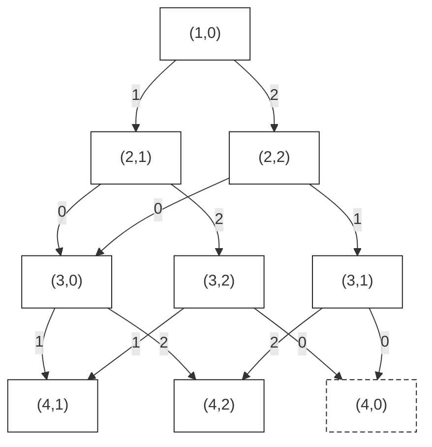

# T1 接龙

---

## 题意简化

---

任意重排 $n$ 张牌，依次放到桌面。每次可以用两张相同数字 $x$ 的牌作端点，收走中间整段，得到 $x\times$ 段长的分数。每张牌只能被收走一次，求最大总分。

## 问题拆分

---

1. 找出哪些数字能够充当一次收牌的两个端点。
2. 确定一张牌至多能贡献多少分，从而得到总分上界。
3. 安排放牌顺序，判断能否让所有牌都达到这个上界。

## 最直接的想法：先确定应该寻找什么

---

直接枚举放牌排列，再搜索每轮是否收牌，会产生至少 $n!$ 种排列，$n\le10^5$ 时不可行。慢的地方是反复寻找最好的排列，而不是一次收牌的计算。

设出现至少两次的最大数字为 $x$。任何收牌操作的端点数字都不超过 $x$，每张牌又只被计分一次，因此总分不超过 $nx$。

这个上界可以取到：选两张 $x$，分别放在整列的最前面和最后面，其余牌全放中间；前面不收牌，最后一次收走全部 $n$ 张，得到 $nx$。如果所有数字都只出现一次，就无法收牌，答案为 $0$。

所以不需要搜索排列，只需找到“最大的重复数字”。

## 部分分（独立 20 分，$n\le100$）：枚举两张牌

---

用数组保存牌面，枚举 $i<j$。若 $a_i=a_j$，就用该值更新最大的重复数字，最后乘以 $n$。最多比较 $\binom n2\le4950$ 对，直接枚举足够。

时间复杂度为 $O(n^2)$，空间复杂度为 $O(n)$。

### 参考代码

```cpp
#include<bits/stdc++.h>
using namespace std;

const int N = 1e5 + 10;
int a[N];

int main(){
	int n,ans = 0;
	cin >> n;
	for(int i = 1; i <= n; i++) cin >> a[i];
	for(int i = 1; i <= n; i++){
		for(int j = i + 1; j <= n; j++){
			if(a[i] == a[j]) ans = max(ans,a[i]);
		}
	}
	cout << 1LL * ans * n << '\n';
	return 0;
}
```

## 部分分（独立 20 分）：所有牌相同

---

若 $n\ge2$，直接以两端的牌收走整列，答案为 $na_1$；若 $n=1$，凑不出两个端点，答案为 $0$。

读入时间复杂度为 $O(n)$，额外空间复杂度为 $O(1)$。

### 参考代码

```cpp
#include<bits/stdc++.h>
using namespace std;

int main(){
	int n,x;
	cin >> n;
	for(int i = 1; i <= n; i++) cin >> x;
	long long ans = 0;
	if(n >= 2) ans = 1LL * x * n;
	cout << ans << '\n';
	return 0;
}
```

## 部分分（独立 30 分，$a_i\le1000$）：按数字计数

---

开计数数组记录每个数字出现几次，扫描 $1\sim1000$，保留出现至少两次的最大值。只替换“枚举所有牌对”这一步，得分结论不变。

时间复杂度为 $O(n+1000)$。实现与下面的满分代码相同，扫描范围扩大到完整值域即可。

## 满分做法：计数数组

---

完整数据的牌面也只有 $1\sim10^5$。用 `c[x]` 统计数字 $x$ 的张数，再按从小到大的顺序扫描；遇到 `c[x] >= 2` 就更新 `ans`。最后用 `1LL * ans * n` 计算分数，避免乘法先在 `int` 中溢出。

令 $V=10^5$，时间复杂度为 $O(n+V)$，空间复杂度为 $O(V)$。

### 参考代码

```cpp
#include<bits/stdc++.h>
using namespace std;

const int N = 1e5 + 10;
int c[N];

int main(){
	int n,ans = 0;
	cin >> n;
	for(int i = 1; i <= n; i++){
		int x;
		cin >> x;
		c[x]++;
		if(c[x] >= 2) ans = max(ans,x);
	}
	cout << 1LL * ans * n << '\n';
	return 0;
}
```

## 知识点总结

---

- 可以任意重排时，先找答案上界，再尝试用排列达到它，往往可以省去排列搜索。
- “找最大的重复值”在小值域中可以直接计数，不必两两比较。

# T2 平方和

---

## 题意简化

---

从 $n$ 个正整数中选择两个不同位置，使平方和能被 $k$ 整除，求最大的合法平方和。允许两个位置上的数相同，输入保证有解。

## 问题拆分

---

1. 判断一对数的平方和是否能被 $k$ 整除。
2. 对每个当前数，找到能与它配对的、平方最大的另一个数。
3. 对所有配对结果取最大值，并保证没有重复使用同一位置。

## 部分分（独立 20 分，$n\le2000$）：枚举数对

---

最直接的办法是枚举 $i<j$，计算 $a_i^2+a_j^2$，检查余数并更新答案。共有 $\binom n2$ 次常数时间检查；$n=2000$ 时不到两百万对，可以通过，但完整数据会达到约两百亿对。

$a_i\le10^9$，平方可能达到 $10^{18}$，平方和可能达到 $2\times10^{18}$，都应使用 `long long`。

时间复杂度为 $O(n^2)$，空间复杂度为 $O(n)$。

### 参考代码

```cpp
#include<bits/stdc++.h>
using namespace std;

const int N = 2e5 + 10;
long long a[N];

int main(){
	int n,k;
	cin >> n >> k;
	for(int i = 1; i <= n; i++) cin >> a[i];
	long long ans = 0;
	for(int i = 1; i <= n; i++){
		for(int j = i + 1; j <= n; j++){
			long long sum = a[i] * a[i] + a[j] * a[j];
			if(sum % k == 0) ans = max(ans,sum);
		}
	}
	cout << ans << '\n';
	return 0;
}
```

## 部分分（独立 30 分，$k\le10^5$）：按平方余数分组

---

只优化第二步。设当前平方为 $x$，$r=x\bmod k$，另一个平方必须满足

$$y\bmod k=(k-r)\bmod k.$$

同一余数组中，较大的平方永远不会更差。因此用 `f[r]` 记录已经读入的数中，该余数对应的最大平方。读入当前数后，先查询互补组并更新答案，再把当前平方放进自己的组。

“先查询、后放入”保证另一个数来自更早的位置，尤其在余数为 $0$ 或 $k/2$ 时不会选中自己。所有平方为正，所以可以用 $0$ 表示某组尚未出现。

时间复杂度为 $O(n+k)$，空间复杂度为 $O(k)$。

### 参考代码

```cpp
#include<bits/stdc++.h>
using namespace std;

const int N = 1e5 + 10;
long long f[N];

int main(){
	ios::sync_with_stdio(false);
	cin.tie(0);
	int n,k;
	cin >> n >> k;
	long long ans = 0;
	for(int i = 1; i <= n; i++){
		long long x;
		cin >> x;
		x = x * x;
		int r = x % k,t = (k - r) % k;
		// 先查询此前元素，再加入当前元素，保证下标不同。
		if(f[t] > 0) ans = max(ans,x + f[t]);
		f[r] = max(f[r],x);
	}
	cout << ans << '\n';
	return 0;
}
```

## 满分做法：用 map 保存实际出现的余数组

---

完整数据中 $k$ 可达 $10^9$，不能按 $k$ 开数组；但实际读入的数只有 $n$ 个。将上面的数组换成 `map<int,long long>`，只保存用到的余数组即可，配对条件和处理顺序完全不变。

每次读入进行常数次查找和更新，映射中至多有 $O(n)$ 个键。时间复杂度为 $O(n\log(n+1))$，空间复杂度为 $O(n)$。

### 参考代码

```cpp
#include<bits/stdc++.h>
using namespace std;

map<int,long long> f;

int main(){
	ios::sync_with_stdio(false);
	cin.tie(0);
	int n,k;
	cin >> n >> k;
	long long ans = 0;
	for(int i = 1; i <= n; i++){
		long long x;
		cin >> x;
		x = x * x;
		int r = x % k,t = (k - r) % k;
		// 先查询此前元素，再加入当前元素，保证下标不同。
		if(f[t] > 0) ans = max(ans,x + f[t]);
		f[r] = max(f[r],x);
	}
	cout << ans << '\n';
	return 0;
}
```

## 知识点总结

---

- 两数之和需要整除 $k$，可以转成两个余数互补；同组只保留对目标最有利的代表。
- 不能使用同一位置两次时，边扫描边配对，先查询历史再加入当前元素。

# T3 彩彩的三彩项链

---

## 题意简化

---

把环形字符串的每个字符按 `r → g → b → r` 循环修改，使相邻字符不同，包括首尾两个字符。每前进一步花费一次点击，求总点击次数最小值。

## 问题拆分

---

1. 决定每个位置的最终颜色，并计算这个选择的点击次数。
2. 保证当前颜色与前一个位置不同，最后再检查首尾不同。
3. 在所有合法的最终颜色方案中取最小费用。

## 部分分（独立 10 分，$n=10$）：搜索最终颜色

---

把 `r,g,b` 编号为 $0,1,2$。将原色 $a_i$ 变成颜色 $c$ 的最少点击数是 $(c-a_i+3)\bmod3$，多转一整圈只会增加费用。

从左往右搜索，参数记录下一个位置、上一种颜色、第一种颜色和累计费用。第一颗有三种选择，之后只选不同于前一颗的两种颜色；到 $n+1$ 时，只有末色与首色不同才是合法叶子，此时用累计费用更新答案。

最多搜索 $3\times2^{n-1}$ 条完整决策路径。$n=10$ 时只有 $1536$ 条，直接搜索足够；$n=10^6$ 时则不能枚举所有方案。

时间复杂度为 $O(2^n)$，空间复杂度为 $O(n)$。

### 参考代码

```cpp
#include<bits/stdc++.h>
using namespace std;

int n,a[20],c[20],ans = 1e9;

void dfs(int x,int sum){
	if(x > n){
		if(c[n] != c[1]) ans = min(ans,sum);
		return;
	}
	for(int j = 0; j < 3; j++){
		if(x > 1 && c[x - 1] == j) continue;
		c[x] = j;
		dfs(x + 1,sum + (j - a[x] + 3) % 3);
	}
}

int main(){
	string s;
	cin >> n >> s;
	for(int i = 1; i <= n; i++){
		if(s[i - 1] == 'r') a[i] = 0;
		else if(s[i - 1] == 'g') a[i] = 1;
		else a[i] = 2;
	}
	dfs(1,0);
	cout << ans << '\n';
	return 0;
}
```

## 部分分（独立 10 分，$n=1000$）：合并搜索状态

---

固定第一种颜色后，不同的历史只要“已处理位置、最后一种颜色”相同，剩下的选择就相同，保留较小费用即可。状态只有 $3n$ 个，不必保存整段配色历史。

这一优化已经能处理完整数据，状态图、转移和代码统一放在下面的“满分做法：固定首色的动态规划”中。

## 部分分（独立 10 分）：只含一种颜色

---

设原色为 $c$。当 $n$ 为偶数时，交替使用 $c$ 和它的下一种颜色，点击 $n/2$ 次即可；任何相邻两个位置至少要改一个，所以不能更少。

当 $n$ 为奇数时，两色交替无法在环上闭合，至少要出现一次第三种颜色。最多保留 $(n-1)/2$ 个原色，至少修改 $(n+1)/2$ 颗，其中一颗至少点击两次，因此答案为 $(n+3)/2$。交替放置两色并在最后使用第三色可以达到这个值。

读入时间复杂度为 $O(n)$，除输入字符串外的额外空间为 $O(1)$。

### 参考代码

```cpp
#include<bits/stdc++.h>
using namespace std;

int main(){
	int n;
	string s;
	cin >> n >> s;
	if(n % 2 == 0) cout << n / 2 << '\n';
	else cout << (n + 3) / 2 << '\n';
	return 0;
}
```

## 部分分（独立 10 分）：只含两种颜色

---

原串只含两色，不代表最优结果也只含两色：例如奇数长度的环必须使用三种颜色。仍然使用下面的三色 DP，不删掉任何目标颜色。该做法为 $O(n)$，同一份满分代码可以通过这一档。

## 满分做法：固定首色的动态规划

---

沿用前面的搜索，固定第一颗最终颜色为 $s$。定义 $F(i,c)$ 为“前 $i$ 颗已确定、末色为 $c$ 时，后面还需要的最少点击数”。同一个 $(i,c)$ 的后续选择相同，因此可以合并不同的搜索分支。

下图取原串 `rrrr`，首色固定为 `r`，初态为 $(1,0)$；第一颗的费用为 $0$。

<!-- graph:s4t3 -->
<div class="dp-figure">
<div class="dp-legend">

**图例（左上角）**  
`0 = 下一颗选 r；代价 0；价值 0`  
`1 = 下一颗选 g；代价 1；价值 0`  
`2 = 下一颗选 b；代价 2；价值 0`  
共同条件：$i<4$，且选择的颜色编号不等于当前末色 $c$。本例原串为 `rrrr`。

</div>



<div class="dp-leaves">

合法叶子：$i=4$ 且 $c\ne0$，返回 $F=0$，节点为实线轮廓。  
非法叶子：$i=4$ 且 $c=0$，返回 $F=+\infty$，节点为虚线轮廓。

</div>
</div>

箭头表示搜索决策，每次令 $i$ 增加 $1$；剩余费用 $F$ 按逆拓扑序求值。

<details>
<summary>文字兼容图（不支持 Mermaid 时查看）</summary>

```text
编号与条件见上方图例。
(1,0) --1--> (2,1)      (1,0) --2--> (2,2)
(2,1) --0--> (3,0)      (2,1) --2--> (3,2)
(2,2) --0--> (3,0)      (2,2) --1--> (3,1)
(3,0) --1--> (4,1)      (3,0) --2--> (4,2)
(3,2) --0--> ╌(4,0)╌    (3,2) --1--> (4,1)
(3,1) --0--> ╌(4,0)╌    (3,1) --2--> (4,2)
同名状态为同一节点；╌(4,0)╌ 表示虚线轮廓的非法叶子。
```

</details>

代码改用前向状态 `f[i][c]`，表示前 $i$ 颗的最小**已付费用**。初始化 `f[1][s]` 为第一颗的修改费用，其他状态为无穷大；随后按 $i$ 递增更新：

$$f[i][c]=\min_{p\ne c}\left(f[i-1][p]+(c-a_i+3)\bmod3\right).$$

最后只接受 $c\ne s$，再对三种首色取最小值。固定首色的目的是把“首尾相邻”留到终点检查；它不是省略首尾限制。

每个位置只有常数种颜色转移，时间复杂度为 $O(n)$，空间复杂度为 $O(n)$。

### 参考代码

```cpp
#include<bits/stdc++.h>
using namespace std;

const int N = 1e6 + 10;
const int inf = 1e9;
int a[N],f[N][3];

int main(){
	ios::sync_with_stdio(false);
	cin.tie(0);
	int n;
	string s;
	cin >> n >> s;
	for(int i = 1; i <= n; i++){
		if(s[i - 1] == 'r') a[i] = 0;
		else if(s[i - 1] == 'g') a[i] = 1;
		else a[i] = 2;
	}
	int ans = inf;
	for(int x = 0; x < 3; x++){
		for(int j = 0; j < 3; j++) f[1][j] = inf;
		f[1][x] = (x - a[1] + 3) % 3;
		for(int i = 2; i <= n; i++){
			for(int j = 0; j < 3; j++){
				f[i][j] = inf;
				for(int k = 0; k < 3; k++){
					if(j == k) continue;
					int w = (j - a[i] + 3) % 3;
					f[i][j] = min(f[i][j],f[i - 1][k] + w);
				}
			}
		}
		for(int j = 0; j < 3; j++){
			if(j != x) ans = min(ans,f[n][j]);
		}
	}
	cout << ans << '\n';
	return 0;
}
```

## 知识点总结

---

- 环上的首尾约束可以先枚举首端的有限状态，转为链上处理，最后检查闭合条件。
- 搜索中，未来只依赖位置和末状态时，可以合并不同历史；累计费用取最优值，不必放进状态下标。

# T4 表达式（eval）

---

## 题意简化

---

在由正整数、`+`、`*` 组成的表达式中添加括号，不改变数字与运算符的顺序，求最大值。数值与答案可能很长，必须输出完整十进制结果。

## 问题拆分

---

1. 从字符串中识别完整的整数和运算符，不能把多位数拆开。
2. 选择运算顺序，使表达式值最大。
3. 按选定顺序完成大整数加法与乘法。

## 部分分（10 分，$|S|\le10$）：枚举最后一次运算

---

解析后用 `a[]` 保存整数，`op[]` 保存相邻运算符。搜索 `dfs(l,r)` 求第 $l\sim r$ 个数能组成的最大值：枚举最后执行的运算符 $i$，分别递归计算左右两部分，再按 `op[i]` 合并并取最大。

只有一个数时直接返回该数。因为全部数为正，加法和乘法都随操作数增大而增大，因此固定最后一个运算符后，左右两侧各取最大值就是最优组合。

本档最多 $5$ 个数；不做记忆化的直接递归已经足够。设整数个数为 $q$，时间复杂度为 $O(3^q+|S|)$，空间复杂度为 $O(q+|S|)$。

### 参考代码

```cpp
#include<bits/stdc++.h>
using namespace std;

long long a[20];
char op[20];

long long dfs(int l,int r){
	if(l == r) return a[l];
	long long ans = 0;
	for(int i = l; i < r; i++){
		long long x = dfs(l,i),y = dfs(i + 1,r);
		if(op[i] == '+') ans = max(ans,x + y);
		else ans = max(ans,x * y);
	}
	return ans;
}

int main(){
	freopen("eval.in","r",stdin);
	freopen("eval.out","w",stdout);
	string s;
	cin >> s;
	int n = 1;
	for(int i = 0; i < (int)s.size(); i++){
		if(s[i] >= '0' && s[i] <= '9') a[n] = a[n] * 10 + s[i] - '0';
		else{
			op[n] = s[i];
			n++;
		}
	}
	cout << dfs(1,n) << '\n';
	return 0;
}
```

## 部分分（10 分）：所有整数均为 1

---

不需要枚举每一层括号。先把相邻的加法尽量合成一段，再把各段相乘。例如 `1+1*1+1` 可以取 $(1+1)(1+1)=4$。

这个处理也是后面满分结论的特殊情况。各加法段的和就是该段中 $1$ 的个数，但所有段相乘仍可能超出普通整数范围；使用满分代码中的大整数乘法。

## 部分分（10 分）：所有整数不超过 9

---

每个数虽只有一位，最终结果仍可能很大。解析时每次只读一个数字，运算顺序和大整数处理仍使用下面的满分方法；不能因为输入数小就用 `long long` 保存整个结果。参考代码见满分做法。

## 部分分（10 分）：只有加法且每个整数小于 $10^9$

---

加法结合顺序不影响结果，直接累加所有数。整数个数不超过 $2500$，本档总和小于 $2.5\times10^{12}$，`long long` 已够用；满分代码只形成一个加法段，也能直接处理这一档。参考代码见满分做法。

## 部分分（10 分）：只有加法，整数位数不限

---

仍然直接累加，但现在单个数就可能超出 `long long`。用低位在前的数位数组逐位相加并进位即可，不需要乘法或括号搜索。满分代码中的 `add` 负责这一操作。

## 部分分（10 分）：只有乘法

---

乘法结合顺序不影响结果，依次将所有数相乘。用两个数位数组的每对数位相乘，累加到下标之和对应的位置，最后统一进位。完整实现见满分代码中的 `mul`。

## 部分分（10 分，$|S|\le1000$）

---

运算符和整数类型已与完整数据相同，只是输入更短。下面的“加法段求和后相乘”算法直接覆盖这一档，不需要另一套状态或程序。

## 满分做法：加法段求和，再做高精度乘法

---

递归枚举的慢处是选择最后一次运算。观察正整数的限制：在若干连续加法之间加括号，再乘起来，总能得到最优值。

将表达式按 `*` 分成若干段，每段内部只有 `+`。设这些段的和为 $s_1,s_2,\ldots$，候选答案为 $G=s_1s_2\cdots$。它显然可以通过给每段加括号得到。

还要说明其他括号不会更好。对任意一段表达式作归纳，考虑最后一个运算符：若为 `*`，左右两边的候选值相乘正好是这整段的候选值；若为 `+`，写成左边候选值 $Ax$、右边候选值 $yB$，其中 $x,y$ 是相邻的加法段之和，$A,B\ge1$。合并这两段后的候选值满足

$$A(x+y)B=AxB+AyB\ge Ax+yB.$$

所以无论最后做哪次运算，结果都不超过 $G$。这一步用到了所有整数为正，不能直接推广到含 $0$ 或负数的情况。

程序顺序如下：读一个完整整数并加入当前段和 `sum`；遇到 `*`，就令 `ans *= sum` 并把 `sum` 清零。给字符串末尾补一个 `*`，可以统一结算最后一段。

`vector<int>` 按低位到高位保存十进制数位。加法逐位进位，乘法先累加所有数位乘积再进位。设 $D=|S|$，总数位规模为 $O(D)$，这里的朴素高精度实现时间为 $O(D^2)$，空间为 $O(D)$。文件输入输出仍使用 `eval.in`、`eval.out`。

### 参考代码

```cpp
#include<bits/stdc++.h>
using namespace std;

// 各位从低到高存放，只处理非负整数。
vector<int> add(vector<int> a,vector<int> b){
	vector<int> c;
	int n = max(a.size(),b.size()),t = 0;
	for(int i = 0; i < n || t; i++){
		if(i < (int)a.size()) t += a[i];
		if(i < (int)b.size()) t += b[i];
		c.push_back(t % 10);
		t /= 10;
	}
	return c;
}

vector<int> mul(vector<int> a,vector<int> b){
	int n = a.size(),m = b.size();
	vector<int> c(n + m + 1,0);
	for(int i = 0; i < n; i++){
		for(int j = 0; j < m; j++){
			c[i + j] += a[i] * b[j];
		}
	}
	for(int i = 0; i < n + m; i++){
		c[i + 1] += c[i] / 10;
		c[i] %= 10;
	}
	while(c.size() > 1 && c.back() == 0) c.pop_back();
	return c;
}

int main(){
	freopen("eval.in","r",stdin);
	freopen("eval.out","w",stdout);
	string s;
	cin >> s;
	s += '*'; // 最后一段也在遇到乘号时结算。
	vector<int> ans(1,1),sum(1,0);
	int i = 0;
	while(i < (int)s.size()){
		int j = i;
		while(s[j] >= '0' && s[j] <= '9') j++;
		vector<int> a;
		for(int k = j - 1; k >= i; k--) a.push_back(s[k] - '0');
		sum = add(sum,a);
		if(s[j] == '*'){
			ans = mul(ans,sum);
			sum.assign(1,0);
		}
		i = j + 1;
	}
	for(int j = (int)ans.size() - 1; j >= 0; j--) cout << ans[j];
	cout << '\n';
	return 0;
}
```

## 知识点总结

---

- 表达式优化先检查操作数的正负条件；单调性可以使左右子问题独立取最大，也可能进一步消除括号搜索。
- 数字位数大时，先确定真正需要的运算，再实现对应的高精度加法、乘法，不必引入通用大整数框架。
